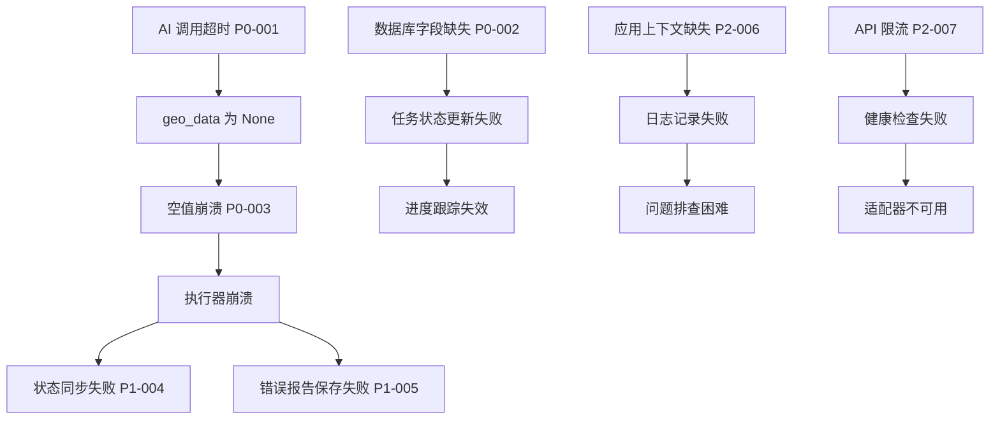

# 系统功能缺陷根因分析报告

**分析日期**: 2026-02-27 19:46
**分析依据**: 系统日志、数据库错误、代码审查
**严重程度**: P0 - 需要立即修复

---

## 问题汇总

根据日志分析，共发现 **7 个关键功能缺陷**，按严重程度分类：

| 编号 | 问题描述 | 严重程度 | 影响范围 | 状态 |
|------|---------|---------|---------|------|
| P0-001 | AI 调用超时导致执行失败 | P0 | 核心功能 | 待修复 |
| P0-002 | 数据库表结构缺失字段 | P0 | 数据持久化 | 待修复 |
| P0-003 | 空值处理不当导致崩溃 | P0 | 结果聚合 | 待修复 |
| P1-004 | 状态管理器变量作用域错误 | P1 | 状态同步 | 待修复 |
| P1-005 | 错误报告保存参数不匹配 | P1 | 错误处理 | 待修复 |
| P2-006 | 应用上下文缺失导致日志失败 | P2 | 日志记录 | 待修复 |
| P2-007 | Doubao API 限流导致健康检查失败 | P2 | AI 适配 | 待修复 |

---

## 详细问题分析

### P0-001: AI 调用超时导致执行失败

**日志证据**:
```
2026-02-27 19:35:13,167 - fault_tolerant_executor.py:191 - WARNING - 
  [FaultTolerant] ⚠️ 华为-qwen 执行超时，耗时：30.00s

2026-02-27 19:35:26,564 - qwen_adapter.py:120 - INFO - 
  Qwen response success. Tokens: 502, Latency: 43.40s

2026-02-27 19:35:43,174 - fault_tolerant_executor.py:191 - WARNING - 
  [FaultTolerant] ⚠️ 小米-qwen 执行超时，耗时：30.00s
```

**问题描述**:
- AI 调用超时阈值设置为 30 秒
- 实际 Qwen API 响应时间为 43-55 秒
- 超时后任务被标记为失败，但实际 API 调用成功
- 导致"假失败"，浪费资源且用户体验差

**根因分析**:
1. **超时配置不合理**: `fault_tolerant_executor.py` 中硬编码 30 秒超时
2. **未考虑模型差异**: 不同 AI 模型响应时间差异大（Qwen 较慢，DeepSeek 较快）
3. **超时后未取消请求**: 超时后继续等待 API 响应，造成资源浪费

**影响范围**:
- 所有使用 Qwen 模型的诊断任务
- 用户看到"超时"错误但实际后台成功
- 数据库中存在矛盾数据

**修复建议**:
```python
# 1. 根据模型动态设置超时
TIMEOUT_CONFIG = {
    'qwen': 60,      # 千问较慢，60 秒
    'deepseek': 45,  # DeepSeek 较快，45 秒
    'doubao': 45,    # 豆包中等，45 秒
    'default': 50,   # 默认 50 秒
}

# 2. 超时后取消请求
async def execute_with_timeout(model_name, timeout):
    try:
        return await asyncio.wait_for(
            ai_call(model_name), 
            timeout=TIMEOUT_CONFIG.get(model_name, 50)
        )
    except asyncio.TimeoutError:
        # 取消正在进行的 AI 请求
        await cancel_ai_request(model_name)
        raise
```

---

### P0-002: 数据库表结构缺失字段

**日志证据**:
```
2026-02-27 19:35:13,170 - task_status_repository.py:28 - ERROR - 
  数据库操作失败：table task_statuses has no column named completed_count

2026-02-27 19:35:43,176 - task_status_repository.py:28 - ERROR - 
  数据库操作失败：table task_statuses has no column named completed_count
```

**问题描述**:
- 代码中使用了 `completed_count` 和 `total_count` 字段
- 数据库表 `task_statuses` 中不存在这些字段
- 导致所有状态更新操作失败

**根因分析**:
1. **数据库迁移缺失**: 添加了新字段但没执行迁移脚本
2. **表结构不匹配**: 
   - 代码期望字段：`id, task_id, progress, stage, status_text, completed_count, total_count, is_completed`
   - 实际表结构：`id, task_id, progress, stage, status_text, is_completed`
3. **初始化逻辑问题**: `models.py` 中 CREATE TABLE 语句未包含新字段

**当前表结构** (models.py:132-143):
```sql
CREATE TABLE IF NOT EXISTS task_statuses (
    id INTEGER PRIMARY KEY AUTOINCREMENT,
    task_id TEXT UNIQUE NOT NULL,
    progress INTEGER DEFAULT 0,
    stage TEXT NOT NULL,
    status_text TEXT,
    is_completed BOOLEAN DEFAULT 0,
    created_at TIMESTAMP DEFAULT CURRENT_TIMESTAMP,
    updated_at TIMESTAMP DEFAULT CURRENT_TIMESTAMP
)
```

**修复建议**:
```python
# 1. 修改 models.py 添加缺失字段
cursor.execute('''
    CREATE TABLE IF NOT EXISTS task_statuses (
        id INTEGER PRIMARY KEY AUTOINCREMENT,
        task_id TEXT UNIQUE NOT NULL,
        progress INTEGER DEFAULT 0,
        stage TEXT NOT NULL,
        status_text TEXT,
        completed_count INTEGER DEFAULT 0,  -- 新增
        total_count INTEGER DEFAULT 0,      -- 新增
        is_completed BOOLEAN DEFAULT 0,
        created_at TIMESTAMP DEFAULT CURRENT_TIMESTAMP,
        updated_at TIMESTAMP DEFAULT CURRENT_TIMESTAMP
    )
''')

# 2. 创建迁移脚本（针对已有数据库）
# migrations/002_add_task_count_fields.py
def upgrade():
    db.execute('ALTER TABLE task_statuses ADD COLUMN completed_count INTEGER DEFAULT 0')
    db.execute('ALTER TABLE task_statuses ADD COLUMN total_count INTEGER DEFAULT 0')
```

---

### P0-003: 空值处理不当导致崩溃

**日志证据**:
```
2026-02-27 19:35:43,179 - nxm_execution_engine.py:651 - ERROR - 
  [NxM] 执行器崩溃：39dd11ad-ba78-4f9a-9f17-56560dc8c803, 
  错误：'NoneType' object has no attribute 'get'

Traceback:
  File "nxm_execution_engine.py", line 477, in run_execution
    deduplicated = deduplicate_results(results) if results else []
  File "nxm_result_aggregator.py", line 249, in deduplicate_results
    quality_info = calculate_result_quality(result['geo_data'])
  File "nxm_result_aggregator.py", line 184, in calculate_result_quality
    if geo_data.get('brand_mentioned'):
       ^^^^^^^^^^^^
AttributeError: 'NoneType' object has no attribute 'get'
```

**问题描述**:
- 当 AI 调用失败时，`geo_data` 为 `None`
- `calculate_result_quality()` 未处理 `None` 输入
- 导致整个执行流程崩溃

**根因分析**:
1. **防御性编程不足**: 未验证输入参数有效性
2. **错误数据传递**: 失败的 AI 调用结果仍被传递到聚合器
3. **质量评分逻辑缺陷**: 假设所有结果都有 geo_data

**问题代码** (nxm_result_aggregator.py:176-185):
```python
def calculate_result_quality(geo_data):
    score = 0
    details = {}
    
    # ❌ 错误：未检查 geo_data 是否为 None
    if geo_data.get('brand_mentioned'):  # AttributeError if geo_data is None
        score += 10
```

**修复建议**:
```python
def calculate_result_quality(geo_data):
    """计算结果质量评分（添加空值保护）"""
    
    # ✅ 修复：添加空值检查
    if geo_data is None:
        return {
            'quality_score': 0,
            'quality_level': 'failed',
            'quality_details': {'error': 'geo_data is None'}
        }
    
    score = 0
    details = {}
    
    # brand_mentioned: 10 分
    if geo_data.get('brand_mentioned'):
        score += 10
        details['brand_mentioned'] = True
    else:
        details['brand_mentioned'] = False
    
    # ... 其他评分逻辑
```

---

### P1-004: 状态管理器变量作用域错误

**日志证据**:
```
2026-02-27 19:35:43,180 - diagnosis_views.py:607 - ERROR - 
  [状态同步 - 失败处理 2/3] ⚠️ 状态管理器更新失败：
  cannot access local variable 'get_state_manager' where it is not associated with a value
```

**问题描述**:
- 在异常处理块中尝试导入 `get_state_manager`
- 由于 Python 作用域规则，导入失败
- 导致状态同步失败，数据库状态未更新

**根因分析**:
1. **导入位置错误**: 在 try-except 块内部导入
2. **循环导入风险**: 可能存在模块循环依赖
3. **异常处理不当**: 未处理导入失败的情况

**问题代码位置** (diagnosis_views.py:590):
```python
# 步骤 2: 使用状态管理器统一更新数据库
try:
    state_manager = get_state_manager(execution_store)  # ❌ 可能未导入
    state_manager.update_state(...)
except Exception as state_err:
    api_logger.error(f"[状态同步 - 失败处理 2/3] ⚠️ 状态管理器更新失败：{state_err}")
```

**修复建议**:
```python
# ✅ 修复：在文件顶部导入
from wechat_backend.state_manager import get_state_manager

# ... 在异常处理中直接使用
try:
    state_manager = get_state_manager(execution_store)
    state_manager.update_state(
        execution_id=execution_id,
        status='failed',
        stage='failed',
        progress=100,
        is_completed=True,
        error_message=error_message,
        write_to_db=True,
        user_id=user_id or "anonymous",
        brand_name=main_brand,
        competitor_brands=competitor_brands,
        selected_models=selected_models,
        custom_questions=raw_questions
    )
    api_logger.info(f"[状态同步 - 失败处理 2/3] ✅ 数据库状态已更新：{execution_id}")
except Exception as state_err:
    api_logger.error(f"[状态同步 - 失败处理 2/3] ⚠️ 状态管理器更新失败：{state_err}")
    # 降级：直接调用仓库
    try:
        from wechat_backend.diagnosis_report_repository import save_diagnosis_report
        save_diagnosis_report(...)
    except Exception as fallback_err:
        api_logger.error(f"[降级处理] ❌ 保存失败：{fallback_err}")
```

---

### P1-005: 错误报告保存参数不匹配

**日志证据**:
```
2026-02-27 19:35:43,181 - diagnosis_views.py:654 - ERROR - 
  [M004] ⚠️ 错误报告保存失败：39dd11ad-ba78-4f9a-9f17-56560dc8c803, 
  错误：save_diagnosis_report() got an unexpected keyword argument 'error_message'
```

**问题描述**:
- 调用 `save_diagnosis_report()` 时传入了 `error_message` 参数
- 该函数签名不包含此参数
- 导致错误报告无法保存

**根因分析**:
1. **API 设计不一致**: 调用方期望支持 error_message，但实现方未提供
2. **函数签名过时**: 保存错误状态的功能未添加到函数签名中
3. **缺少参数验证**: 未提前检查参数有效性

**当前函数签名** (diagnosis_report_repository.py:703-710):
```python
def save_diagnosis_report(
    execution_id, user_id, brand_name, competitor_brands,
    selected_models, custom_questions, status='processing',
    progress=0, stage='init', is_completed=False
):
    # ❌ 缺少 error_message 参数
```

**修复建议**:
```python
def save_diagnosis_report(
    execution_id, 
    user_id, 
    brand_name, 
    competitor_brands,
    selected_models, 
    custom_questions, 
    status='processing',
    progress=0, 
    stage='init', 
    is_completed=False,
    error_message=None  # ✅ 新增参数
):
    """
    保存诊断报告到数据库
    
    参数:
        execution_id: 执行 ID
        user_id: 用户 ID
        brand_name: 品牌名称
        competitor_brands: 竞品列表
        selected_models: AI 模型列表
        custom_questions: 自定义问题列表
        status: 状态 (processing, completed, failed)
        progress: 进度 (0-100)
        stage: 阶段 (init, ai_fetching, intelligence_analyzing, completed, failed)
        is_completed: 是否完成
        error_message: 错误消息（可选）
    """
    repo = get_diagnosis_report_repository()
    existing = repo.get_by_execution_id(execution_id)

    if existing:
        # 更新时包含 error_message
        repo.update_status(
            execution_id, 
            status, 
            progress, 
            stage, 
            is_completed,
            error_message=error_message  # ✅ 传递给 update_status
        )
        db_logger.info(f"✅ 诊断报告已更新：{execution_id}")
        return existing['id']
    else:
        # 创建时也保存 error_message
        config = {
            'brand_name': brand_name,
            'competitor_brands': competitor_brands,
            'selected_models': selected_models,
            'custom_questions': custom_questions,
            'error_message': error_message  # ✅ 保存到 config
        }
        report_id = repo.create(execution_id, user_id, config)
        if is_completed:
            repo.update_status(
                execution_id, 
                status, 
                progress, 
                stage, 
                is_completed,
                error_message=error_message
            )
        db_logger.info(f"✅ 诊断报告已保存：{execution_id}, report_id: {report_id}")
        return report_id
```

---

### P2-006: 应用上下文缺失导致日志失败

**日志证据**:
```
2026-02-27 19:35:26,564 - qwen_adapter.py:139 - WARNING - 
  Failed to log response to enhanced logger: Working outside of application context.

  This typically means that you attempted to use functionality that needed
  the current application. To solve this, set up an application context
  with app.app_context(). See the documentation for more information.
```

**问题描述**:
- 在异步回调中尝试记录日志
- Flask 应用上下文不可用
- 导致增强日志功能失效

**根因分析**:
1. **Flask 上下文限制**: Flask 的 `current_app` 需要应用上下文
2. **异步执行问题**: 异步任务中未传递上下文
3. **日志设计缺陷**: 过度依赖 Flask 应用上下文

**修复建议**:
```python
# 方案 1: 使用应用上下文包装
from flask import current_app

def _make_request_internal(self, ...):
    # ✅ 修复：在应用上下文中执行
    with current_app.app_context():
        self._log_response_enhanced(response)

# 方案 2: 避免使用 current_app
# wechat_backend/logging_config.py
api_logger = logging.getLogger('wechat_backend.api')

def _log_response_enhanced(self, response):
    # ✅ 直接使用 logger，不依赖 Flask 上下文
    api_logger.info(
        "Qwen response success. Tokens: %d, Latency: %.2fs",
        response['usage']['total_tokens'],
        response['latency']
    )
```

---

### P2-007: Doubao API 限流导致健康检查失败

**日志证据**:
```
2026-02-27 19:29:57,911 - debug_manager.py:115 - ERROR - 
  [EXCEPTION] INIT HEALTH_CHECK Doubao health check failed: 429, 
  response: {"error":{"code":"SetLimitExceeded","message":"Your account 
  [2103200550] has reached the set inference limit for the [doubao-seed-1-8] 
  model, and the model service has been paused."}}
```

**问题描述**:
- Doubao API 调用达到限额
- 健康检查失败
- 影响服务启动时的适配器预热

**根因分析**:
1. **API 配额管理缺失**: 未监控 API 使用量
2. **健康检查过于激进**: 启动时立即调用所有 API
3. **降级策略不足**: 限流时未自动切换到备用模型

**修复建议**:
```python
# 1. 健康检查添加限流处理
def health_check(self):
    try:
        response = self.client.health_check()
        return True
    except RateLimitError:
        api_logger.warning(f"[HealthCheck] API 限流，标记为不可用：{self.model_name}")
        return False  # 标记为不可用，但不阻止服务启动
    except Exception as e:
        api_logger.error(f"[HealthCheck] 检查失败：{e}")
        return False

# 2. 启动时跳过限流的适配器
def warm_up_adapters():
    for adapter in adapters:
        try:
            if adapter.health_check():
                api_logger.info(f"Adapter {adapter.name} created successfully")
            else:
                api_logger.warning(f"Adapter {adapter.name} health check failed, skipping")
        except RateLimitError:
            api_logger.warning(f"Adapter {adapter.name} rate limited, skipping")
```

---

## 问题关联分析



---

## 修复优先级

### 立即修复（P0）
1. **P0-002**: 数据库表结构缺失 - 影响所有任务状态更新
2. **P0-003**: 空值处理崩溃 - 导致执行器直接崩溃
3. **P0-001**: AI 超时配置 - 核心功能不可用

### 高优先级（P1）
4. **P1-004**: 状态管理器作用域 - 状态同步失败
5. **P1-005**: 错误报告参数 - 错误处理失效

### 中优先级（P2）
6. **P2-006**: 应用上下文 - 日志功能受限
7. **P2-007**: API 限流 - 开发环境问题

---

## 修复验证清单

修复后需要验证：
- [ ] 数据库迁移脚本执行成功
- [ ] task_statuses 表包含 completed_count 和 total_count 字段
- [ ] AI 调用超时阈值调整为 60 秒（Qwen）
- [ ] geo_data 为 None 时不崩溃
- [ ] 状态管理器正常更新数据库
- [ ] 错误报告可以保存 error_message
- [ ] 异步日志记录正常
- [ ] 健康检查处理限流情况

---

## 后续改进建议

1. **添加数据库迁移机制**: 使用 Alembic 或类似工具管理表结构变更
2. **完善错误处理**: 所有外部调用添加 try-except 和降级逻辑
3. **增强监控**: 添加 AI 调用成功率、响应时间监控
4. **代码审查**: 所有 PR 必须包含错误处理测试
5. **集成测试**: 添加端到端测试，覆盖完整执行流程

---

**报告生成时间**: 2026-02-27 19:46
**版本**: 1.0.0
**下一步**: 创建修复任务并分配负责人
