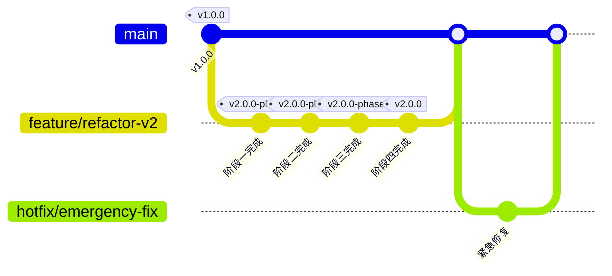
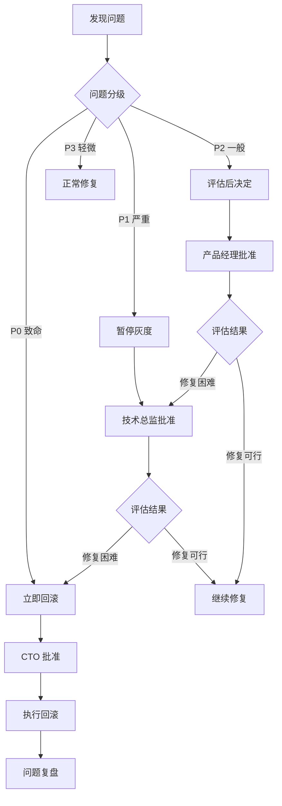
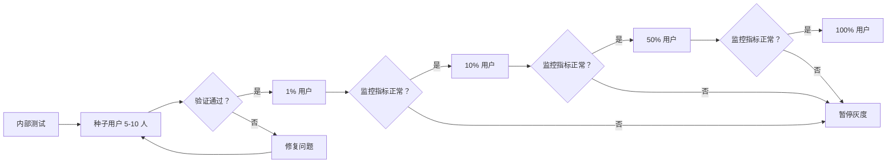

# 品牌诊断系统重构实施路线图

**基于**: 2026-02-27-重构基线  
**版本**: 1.0.0  
**制定日期**: 2026-02-27  
**首席架构师**: 系统架构组  

---

## 执行摘要

本实施路线图基于"重构基线"报告的深度分析，采用**渐进式重构策略**，在**4 个阶段、8 周时间**内完成系统重构。核心原则是**用户第一、安全第一、业务导向**，确保每个阶段都可独立交付、可验证、有业务价值。

### 核心指标

| 指标 | 当前状态 | 阶段一目标 | 阶段二目标 | 阶段三目标 | 阶段四目标 |
|------|---------|-----------|-----------|-----------|-----------|
| 诊断卡死率 | >60% | <5% | <2% | <1% | 0% |
| 空报告率 | >80% | <30% | <5% | <2% | 0% |
| 用户满意度 | <20% | >40% | >60% | >80% | >90% |
| 系统可用性 | <50% | >90% | >95% | >99% | >99.5% |

### 时间规划

```
Week 1-2: 阶段一（基础能力加固）
Week 3-5: 阶段二（核心业务功能实现）
Week 6-7: 阶段三（体验与可靠性优化）
Week 8:   阶段四（历史数据修复与收尾）
```

---

## 1. 总体策略与原则

### 1.1 重构哲学

#### 1.1.1 绞杀者模式 (Strangler Fig Pattern)

**核心思想**: 不直接替换现有系统，而是在其周围逐步构建新功能，最终"绞杀"旧系统。

**实施策略**:

```
┌─────────────────────────────────────────────────────────┐
│                    现有系统 (Legacy)                      │
│  ┌─────────────┐  ┌─────────────┐  ┌─────────────┐       │
│  │ 诊断 API    │  │ 状态管理    │  │ 报告生成    │       │
│  │ (问题多)    │  │ (卡死)      │  │ (空数据)    │       │
│  └─────────────┘  └─────────────┘  └─────────────┘       │
└─────────────────────────────────────────────────────────┘
         ↓ 阶段一：包裹现有功能，添加保护层
┌─────────────────────────────────────────────────────────┐
│                  新功能层 (v2)                            │
│  ┌─────────────────────────────────────────────────┐     │
│  │  状态保护器 (超时/重试/死信)                      │     │
│  └─────────────────────────────────────────────────┘     │
│                    现有系统 (Legacy)                      │
└─────────────────────────────────────────────────────────┘
         ↓ 阶段二：逐步替换核心功能
┌─────────────────────────────────────────────────────────┐
│                  新功能层 (v2)                            │
│  ┌─────────────┐  ┌─────────────┐  ┌─────────────┐       │
│  │ 诊断 API v2 │  │ 状态管理 v2 │  │ 报告生成 v2 │       │
│  └─────────────┘  └─────────────┘  └─────────────┘       │
│                    现有系统 (Legacy)                      │
│              (仅保留未迁移功能作为后备)                     │
└─────────────────────────────────────────────────────────┘
         ↓ 阶段三/四：完全替换，移除旧系统
┌─────────────────────────────────────────────────────────┐
│                  新系统 (v2) - 生产就绪                    │
│  ┌─────────────┐  ┌─────────────┐  ┌─────────────┐       │
│  │ 诊断 API v2 │  │ 状态管理 v2 │  │ 报告生成 v2 │       │
│  │ + 监控告警  │  │ + 实时推送  │  │ + 统计分析  │       │
│  └─────────────┘  └─────────────┘  └─────────────┘       │
└─────────────────────────────────────────────────────────┘
```

**具体实施**:

1. **不修改旧代码**: 现有 `diagnosis_views.py` (3056 行) 保持不动
2. **新建 v2 模块**: 创建 `wechat_backend/v2/` 目录，全新实现
3. **流量路由**: 通过特性开关控制流量走向 (旧/新)
4. **逐步迁移**: 每个功能点独立迁移，验证后再迁移下一个

#### 1.1.2 特性开关 (Feature Flags)

**开关设计**:

```python
# 特性开关配置
FEATURE_FLAGS = {
    # 诊断 v2 功能开关
    'diagnosis_v2_enabled': False,           # 总开关
    'diagnosis_v2_state_manager': False,     # 新状态管理器
    'diagnosis_v2_storage': False,           # 新存储层
    'diagnosis_v2_statistics': False,        # 统计分析模块
    'diagnosis_v2_realtime_push': False,     # 实时推送
    
    # 灰度控制
    'diagnosis_v2_gray_users': [],           # 灰度用户列表 (OpenID)
    'diagnosis_v2_gray_percentage': 0,       # 灰度百分比 (0-100)
    
    # 降级开关
    'diagnosis_v2_fallback_to_v1': True,     # v2 失败时降级到 v1
}

# 开关使用示例
def should_use_v2(user_id: str) -> bool:
    """判断用户是否使用 v2 版本"""
    if not FEATURE_FLAGS['diagnosis_v2_enabled']:
        return False
    
    # 灰度用户优先
    if user_id in FEATURE_FLAGS['diagnosis_v2_gray_users']:
        return True
    
    # 按百分比灰度
    if random.randint(0, 99) < FEATURE_FLAGS['diagnosis_v2_gray_percentage']:
        return True
    
    return False
```

**开关管理工具**:

```python
# 特性开关管理 API
@wechat_bp.route('/api/admin/feature-flags', methods=['GET', 'POST'])
@admin_required
def manage_feature_flags():
    """管理特性开关"""
    if request.method == 'POST':
        data = request.get_json()
        # 更新开关配置
        update_feature_flags(data)
        return jsonify({'status': 'success'})
    else:
        return jsonify(FEATURE_FLAGS)
```

#### 1.1.3 并行运行 (Parallel Run)

**策略**: 新旧系统同时运行，对比结果，确保一致性。

```python
class ParallelExecutionStrategy:
    """并行执行策略"""
    
    def execute_diagnosis(self, request_data: Dict) -> Dict:
        """并行执行新旧诊断逻辑"""
        
        # 1. 同时执行新旧版本
        with ThreadPoolExecutor(max_workers=2) as executor:
            future_v1 = executor.submit(self.execute_v1, request_data)
            future_v2 = executor.submit(self.execute_v2, request_data)
            
            # 2. 等待两个结果
            try:
                result_v1 = future_v1.result(timeout=600)
            except Exception as e:
                result_v1 = {'error': str(e), 'version': 'v1'}
            
            try:
                result_v2 = future_v2.result(timeout=600)
            except Exception as e:
                result_v2 = {'error': str(e), 'version': 'v2'}
        
        # 3. 对比结果（用于验证）
        if not result_v1.get('error') and not result_v2.get('error'):
            comparison = self.compare_results(result_v1, result_v2)
            if not comparison['is_consistent']:
                logger.warning(f"结果不一致：{comparison['differences']}")
        
        # 4. 返回 v2 结果（如果可用），否则降级到 v1
        if not result_v2.get('error'):
            return result_v2
        elif FEATURE_FLAGS['diagnosis_v2_fallback_to_v1']:
            return result_v1
        else:
            return result_v2
```

### 1.2 版本管理策略

#### 1.2.1 Git 分支模型



**分支规则**:

| 分支 | 命名规则 | 用途 | 保护级别 |
|------|---------|------|---------|
| **主分支** | `main` | 生产环境代码，随时可部署 | 严格保护，需 2 人 Review |
| **开发分支** | `develop` | 日常开发集成分支 | 保护，需 1 人 Review |
| **特性分支** | `feature/阶段 X-功能名` | 单个功能开发 | 开发者自行管理 |
| **发布分支** | `release/v2.0.0-phaseX` | 发布准备、测试 | 保护，冻结新功能 |
| **热修复分支** | `hotfix/问题描述` | 生产紧急修复 | 严格保护，快速通道 |

**版本命名规范**:

```
主版本。次版本。修订版本 - 阶段标识

示例:
- v1.0.0: 当前生产版本（重构前）
- v2.0.0-phase1: 重构阶段一版本
- v2.0.0-phase2: 重构阶段二版本
- v2.0.0: 重构完成版本
- v2.0.1: 重构完成后的第一个补丁版本
```

#### 1.2.2 发布流程

```
1. 功能开发完成 (feature 分支)
         ↓
2. 创建发布分支 (release/v2.0.0-phaseX)
         ↓
3. 集成测试 (自动化 + 人工)
         ↓
4. 预发布环境验证 (Staging)
         ↓
5. 灰度发布 (1% -> 10% -> 50% -> 100%)
         ↓
6. 合并到 main，打标签
         ↓
7. 部署生产环境
```

### 1.3 回滚机制

#### 1.3.1 数据库兼容性设计

**原则**: 数据库变更必须**向后兼容**，确保旧代码能读取新数据结构。

**策略 1: 增量添加字段**

```sql
-- ✅ 正确做法：添加新字段，保留旧字段
ALTER TABLE diagnosis_reports ADD COLUMN should_stop_polling BOOLEAN DEFAULT 0;
ALTER TABLE diagnosis_reports ADD COLUMN data_schema_version TEXT DEFAULT '1.0';

-- ❌ 错误做法：删除或修改现有字段
-- ALTER TABLE diagnosis_reports DROP COLUMN old_column;  -- 禁止！
-- ALTER TABLE diagnosis_reports MODIFY COLUMN status TEXT;  -- 禁止！
```

**策略 2: 双写迁移**

```python
class DataMigration:
    """数据迁移（双写模式）"""
    
    def migrate_report_schema(self, execution_id: str):
        """报告 Schema 迁移"""
        
        # 阶段 1: 同时写入新旧格式
        old_format = self.build_old_format()
        new_format = self.build_new_format()
        
        # 写入新表
        self.db.execute('INSERT INTO diagnosis_reports_v2 ...', new_format)
        
        # 同时写入旧表（保持兼容）
        self.db.execute('INSERT INTO diagnosis_reports ...', old_format)
        
        # 阶段 2: 验证新格式稳定后，停止写入旧表
        # 阶段 3: 读取切换到新表
        
        # 阶段 4: 删除旧表（确认无需回滚后）
```

**策略 3: 版本化表结构**

```sql
-- 新旧表共存
CREATE TABLE diagnosis_reports_v1 (...);  -- 旧表
CREATE TABLE diagnosis_reports_v2 (...);  -- 新表

-- 通过视图统一访问
CREATE VIEW diagnosis_reports_current AS
    SELECT * FROM diagnosis_reports_v2
    UNION ALL
    SELECT * FROM diagnosis_reports_v1 WHERE execution_id NOT IN (SELECT execution_id FROM diagnosis_reports_v2);
```

#### 1.3.2 API 版本兼容

**URL 版本化**:

```python
# 旧 API（保留）
@wechat_bp.route('/api/perform-brand-test', methods=['POST'])
def perform_brand_test_v1():
    """v1 API - 保留用于回滚"""
    pass

# 新 API（v2）
@wechat_bp.route('/api/v2/diagnostic/tasks', methods=['POST'])
def create_diagnostic_task_v2():
    """v2 API - 新实现"""
    pass

# API 路由层决定使用哪个版本
@wechat_bp.route('/api/diagnostic/tasks', methods=['POST'])
def create_diagnostic_task():
    """统一入口，根据特性开关路由"""
    if should_use_v2(get_user_id()):
        return create_diagnostic_task_v2()
    else:
        return perform_brand_test_v1()
```

**响应兼容层**:

```python
class ResponseCompatibilityLayer:
    """响应兼容层"""
    
    def adapt_v2_to_v1(self, v2_response: Dict) -> Dict:
        """将 v2 响应转换为 v1 格式（兼容旧前端）"""
        return {
            'status': 'success',
            'execution_id': v2_response['execution_id'],
            'task_id': v2_response['execution_id'],  # 字段映射
            'estimated_duration': '30s',
            # ... 其他 v1 字段
        }
    
    def adapt_v1_to_v2(self, v1_response: Dict) -> Dict:
        """将 v1 响应转换为 v2 格式（兼容新前端）"""
        return {
            'execution_id': v1_response['execution_id'],
            'report_id': v1_response.get('report_id'),
            'status': 'success',
            # ... 其他 v2 字段
        }
```

#### 1.3.3 前端灰度发布

**小程序灰度策略**:

```javascript
// 前端版本检测
const APP_VERSION = '2.0.0';

// 灰度用户标识
const isGrayUser = wx.getStorageSync('is_gray_user') || false;

// 功能开关
const featureFlags = {
  useNewDiagnosis: isGrayUser || APP_VERSION >= '2.0.0',
  useRealtimePush: isGrayUser || APP_VERSION >= '2.0.0-phase3',
};

// API 调用适配
function callDiagnosisAPI(data) {
  if (featureFlags.useNewDiagnosis) {
    return request.post('/api/v2/diagnostic/tasks', data);
  } else {
    return request.post('/api/perform-brand-test', data);
  }
}
```

**灰度发布流程**:

```
1. 内部测试 (开发团队 + 测试团队)
         ↓
2. 种子用户 (5-10 个友好用户)
         ↓
3. 小范围灰度 (1% 用户)
         ↓
4. 中范围灰度 (10% 用户)
         ↓
5. 大范围灰度 (50% 用户)
         ↓
6. 全量发布 (100% 用户)
```

**快速回滚脚本**:

```bash
#!/bin/bash
# rollback.sh - 快速回滚脚本

echo "🚨 开始回滚到 v1.0.0..."

# 1. 切换特性开关到 v1
curl -X POST http://localhost:5000/api/admin/feature-flags \
  -H "Content-Type: application/json" \
  -d '{"diagnosis_v2_enabled": false, "diagnosis_v2_fallback_to_v1": true}'

echo "✅ 特性开关已切换"

# 2. 重启应用（如有必要）
systemctl restart wechat-backend

echo "✅ 应用已重启"

# 3. 验证回滚
sleep 5
curl http://localhost:5000/api/health

echo "✅ 回滚完成，请验证系统状态"
```

#### 1.3.4 回滚决策矩阵

| 问题严重程度 | 影响范围 | 决策人 | 响应时间 | 回滚策略 |
|-------------|---------|--------|---------|---------|
| **P0 - 致命** | >50% 用户无法使用 | CTO | <5 分钟 | 立即回滚 |
| **P1 - 严重** | 20-50% 用户体验受损 | 技术总监 | <15 分钟 | 暂停灰度，评估后回滚 |
| **P2 - 一般** | 5-20% 用户轻微影响 | 产品经理 | <1 小时 | 修复优先，必要时回滚 |
| **P3 - 轻微** | <5% 用户无感知 | 开发负责人 | <4 小时 | 正常修复流程 |

---

## 2. 分阶段实施计划

### 阶段一：基础能力加固

**目标**: 解决"卡死"和"空报告"问题  
**时间**: Week 1-2 (2 周)  
**人力**: 2 后端 + 1 前端 + 1 测试 = 4 人  
**估算**: 40 人日

#### 2.1.1 核心任务清单

| 任务 ID | 任务名称 | 负责人 | 优先级 | 估算 (人日) | 依赖 |
|--------|---------|--------|--------|------------|------|
| **P1-T1** | 重构诊断任务状态机 | 后端 A | P0 | 3 | 无 |
| **P1-T2** | 实现超时管理机制 | 后端 A | P0 | 2 | P1-T1 |
| **P1-T3** | 实现重试机制 | 后端 A | P0 | 2 | P1-T1 |
| **P1-T4** | 实现死信队列 | 后端 A | P1 | 2 | P1-T1 |
| **P1-T5** | API 调用日志持久化 | 后端 B | P0 | 2 | 无 |
| **P1-T6** | 原始数据持久化机制 | 后端 B | P0 | 3 | P1-T5 |
| **P1-T7** | 报告存根实现 | 后端 B | P0 | 2 | P1-T6 |
| **P1-T8** | 前端状态轮询优化 | 前端 | P0 | 2 | P1-T1 |
| **P1-T9** | 集成测试 | 测试 | P0 | 3 | 所有开发任务 |
| **P1-T10** | 预发布验证 | 全体 | P0 | 1 | P1-T9 |

#### 2.1.2 详细设计

##### P1-T1: 重构诊断任务状态机

**文件结构**:

```
wechat_backend/v2/
├── __init__.py
├── state_machine/
│   ├── __init__.py
│   ├── diagnosis_state_machine.py    # 状态机核心
│   ├── states.py                      # 状态定义
│   └── transitions.py                 # 状态流转定义
├── services/
│   ├── diagnosis_service.py           # 诊断服务
│   └── timeout_service.py             # 超时服务
└── repositories/
    └── diagnosis_repository.py        # 数据仓库
```

**状态机实现**:

```python
# wechat_backend/v2/state_machine/diagnosis_state_machine.py

from enum import Enum
from typing import Optional, Dict, Any
from datetime import datetime, timedelta

class DiagnosisState(Enum):
    """诊断状态枚举"""
    INITIALIZING = 'initializing'
    AI_FETCHING = 'ai_fetching'
    ANALYZING = 'analyzing'
    COMPLETED = 'completed'
    PARTIAL_SUCCESS = 'partial_success'
    FAILED = 'failed'
    TIMEOUT = 'timeout'


class DiagnosisStateMachine:
    """诊断状态机"""
    
    # 状态流转定义
    TRANSITIONS = {
        DiagnosisState.INITIALIZING: {
            'succeed': DiagnosisState.AI_FETCHING,
            'fail': DiagnosisState.FAILED,
        },
        DiagnosisState.AI_FETCHING: {
            'all_complete': DiagnosisState.ANALYZING,
            'partial_complete': DiagnosisState.ANALYZING,
            'all_fail': DiagnosisState.FAILED,
            'timeout': DiagnosisState.TIMEOUT,
        },
        DiagnosisState.ANALYZING: {
            'succeed': DiagnosisState.COMPLETED,
            'partial_succeed': DiagnosisState.PARTIAL_SUCCESS,
            'fail': DiagnosisState.FAILED,
        },
        # 终态，无流转
        DiagnosisState.COMPLETED: {},
        DiagnosisState.PARTIAL_SUCCESS: {},
        DiagnosisState.FAILED: {},
        DiagnosisState.TIMEOUT: {},
    }
    
    def __init__(self, execution_id: str):
        self.execution_id = execution_id
        self.current_state = DiagnosisState.INITIALIZING
        self.progress = 0
        self.metadata: Dict[str, Any] = {}
    
    def transition(self, event: str, **kwargs) -> bool:
        """执行状态流转"""
        allowed_transitions = self.TRANSITIONS.get(self.current_state, {})
        
        if event not in allowed_transitions:
            logger.warning(f"非法状态流转：{self.current_state} -> {event}")
            return False
        
        next_state = allowed_transitions[event]
        
        # 更新状态
        old_state = self.current_state
        self.current_state = next_state
        
        # 更新进度
        if 'progress' in kwargs:
            self.progress = kwargs['progress']
        
        # 更新元数据
        self.metadata.update(kwargs)
        
        logger.info(f"状态流转：{self.execution_id}, "
                   f"{old_state.value} -> {next_state.value} (event={event})")
        
        # 持久化状态
        self.persist_state()
        
        return True
    
    def persist_state(self):
        """持久化状态到数据库"""
        from wechat_backend.v2.repositories.diagnosis_repository import DiagnosisRepository
        
        repo = DiagnosisRepository()
        repo.update_state(
            execution_id=self.execution_id,
            status=self.current_state.value,
            progress=self.progress,
            stage=self.current_state.value,
            is_completed=self.current_state in [
                DiagnosisState.COMPLETED,
                DiagnosisState.PARTIAL_SUCCESS,
                DiagnosisState.FAILED,
                DiagnosisState.TIMEOUT,
            ],
            should_stop_polling=self.current_state in [
                DiagnosisState.COMPLETED,
                DiagnosisState.PARTIAL_SUCCESS,
                DiagnosisState.FAILED,
                DiagnosisState.TIMEOUT,
            ],
            metadata=self.metadata,
        )
```

##### P1-T2: 超时管理机制

```python
# wechat_backend/v2/services/timeout_service.py

import threading
from datetime import datetime, timedelta
from typing import Callable, Dict

class TimeoutManager:
    """超时管理器"""
    
    MAX_EXECUTION_TIME = 600  # 10 分钟
    CHECK_INTERVAL = 30  # 30 秒检查一次
    
    def __init__(self):
        self.timers: Dict[str, threading.Timer] = {}
        self.start_times: Dict[str, datetime] = {}
    
    def start_timer(self, execution_id: str, on_timeout: Callable[[str], None]):
        """启动超时计时器"""
        self.start_times[execution_id] = datetime.now()
        
        def timeout_handler():
            logger.warning(f"任务超时：{execution_id}")
            on_timeout(execution_id)
            # 从计时器中移除
            if execution_id in self.timers:
                del self.timers[execution_id]
        
        timer = threading.Timer(self.MAX_EXECUTION_TIME, timeout_handler)
        self.timers[execution_id] timer.start()
        
        logger.info(f"超时计时器已启动：{execution_id}, 超时时间={self.MAX_EXECUTION_TIME}秒")
    
    def cancel_timer(self, execution_id: str):
        """取消超时计时器"""
        if execution_id in self.timers:
            self.timers[execution_id].cancel()
            del self.timers[execution_id]
            logger.info(f"超时计时器已取消：{execution_id}")
    
    def get_remaining_time(self, execution_id: str) -> int:
        """获取剩余时间（秒）"""
        if execution_id not in self.start_times:
            return 0
        
        elapsed = (datetime.now() - self.start_times[execution_id]).total_seconds()
        remaining = max(0, self.MAX_EXECUTION_TIME - elapsed)
        return int(remaining)
```

##### P1-T5 & P1-T6: API 调用日志与原始数据持久化

```python
# wechat_backend/v2/repositories/api_call_log_repository.py

import json
from datetime import datetime
from typing import Dict, Any, List

class APICallLogRepository:
    """API 调用日志仓库"""
    
    def log_api_call(
        self,
        execution_id: str,
        brand: str,
        question: str,
        model: str,
        request_data: Dict[str, Any],
        response_data: Optional[Dict[str, Any]],
        error: Optional[str],
        latency_ms: int,
        timestamp: datetime = None,
    ):
        """记录 API 调用日志"""
        timestamp = timestamp or datetime.now()
        
        # 写入数据库
        db.execute('''
            INSERT INTO api_call_logs (
                execution_id, brand, question, model,
                request_data, response_data, error,
                latency_ms, timestamp
            ) VALUES (?, ?, ?, ?, ?, ?, ?, ?, ?)
        ''', (
            execution_id, brand, question, model,
            json.dumps(request_data),
            json.dumps(response_data) if response_data else None,
            error,
            latency_ms,
            timestamp.isoformat(),
        ))
        
        # 同时写入文件（双重保险）
        self._write_to_file(execution_id, {
            'brand': brand,
            'question': question,
            'model': model,
            'request': request_data,
            'response': response_data,
            'error': error,
            'latency_ms': latency_ms,
            'timestamp': timestamp.isoformat(),
        })
    
    def _write_to_file(self, execution_id: str, data: Dict[str, Any]):
        """写入文件备份"""
        import os
        log_dir = f'/data/diagnosis/logs/{execution_id[:8]}'
        os.makedirs(log_dir, exist_ok=True)
        
        log_file = os.path.join(log_dir, f'{execution_id}.jsonl')
        with open(log_file, 'a') as f:
            f.write(json.dumps(data, ensure_ascii=False) + '\n')
    
    def get_all_calls(self, execution_id: str) -> List[Dict[str, Any]]:
        """获取某次诊断的所有 API 调用记录"""
        cursor = db.execute('''
            SELECT * FROM api_call_logs
            WHERE execution_id = ?
            ORDER BY timestamp ASC
        ''', (execution_id,))
        
        return [dict(row) for row in cursor.fetchall()]
```

##### P1-T7: 报告存根实现

```python
# wechat_backend/v2/services/report_stub_service.py

class ReportStubService:
    """报告存根服务"""
    
    def create_stub(self, execution_id: str) -> Dict[str, Any]:
        """创建报告存根（即使没有完整数据也能返回）"""
        
        # 从数据库获取基本信息
        report_info = self.get_report_info(execution_id)
        
        # 获取 API 调用记录
        api_calls = self.get_api_call_logs(execution_id)
        
        # 构建存根报告
        stub_report = {
            'report': {
                'execution_id': execution_id,
                'brand_name': report_info.get('brand_name', ''),
                'status': report_info.get('status', 'unknown'),
                'created_at': report_info.get('created_at'),
                'completed_at': report_info.get('completed_at'),
            },
            'results': [],
            'analysis': {
                'brand_distribution': {},
                'sentiment_distribution': {},
                'keywords': [],
            },
            'meta': {
                'is_stub': True,  # 标记为存根报告
                'data_completeness': self.calculate_completeness(api_calls),
                'api_call_count': len(api_calls),
                'success_rate': self.calculate_success_rate(api_calls),
            },
            'checksum_verified': False,
        }
        
        # 如果有部分数据，填充到 results
        if api_calls:
            for call in api_calls:
                if call.get('response_data'):
                    stub_report['results'].append({
                        'brand': call['brand'],
                        'question': call['question'],
                        'model': call['model'],
                        'response': call['response_data'],
                        'geo_data': call['response_data'].get('geo_data', {}),
                        'quality_score': None,  # 待计算
                        'quality_level': 'unknown',
                    })
        
        return stub_report
    
    def calculate_completeness(self, api_calls: List[Dict]) -> float:
        """计算数据完整度"""
        if not api_calls:
            return 0.0
        
        successful_calls = sum(1 for call in api_calls if call.get('response_data'))
        return successful_calls / len(api_calls) * 100
    
    def calculate_success_rate(self, api_calls: List[Dict]) -> float:
        """计算成功率"""
        if not api_calls:
            return 0.0
        
        successful_calls = sum(1 for call in api_calls if not call.get('error'))
        return successful_calls / len(api_calls) * 100
```

#### 2.1.3 交付标准

**功能验收**:

- [ ] 诊断任务不再卡死（超时机制生效）
- [ ] 所有 API 调用都有日志记录
- [ ] 即使诊断失败，也能返回存根报告
- [ ] 历史记录页面显示"有数据"标识
- [ ] 前端轮询在任务完成后正确停止

**质量验收**:

- [ ] 单元测试覆盖率 > 80%
- [ ] 集成测试通过率 100%
- [ ] 预发布环境验证通过
- [ ] 性能测试：单任务执行时间 < 10 分钟

**文档验收**:

- [ ] API 文档更新
- [ ] 部署文档更新
- [ ] 运维手册更新

#### 2.1.4 风险评估与应对

| 风险 | 可能性 | 影响 | 应对措施 |
|------|-------|------|---------|
| 状态机与现有代码不兼容 | 中 | 高 | 保留 v1 代码，通过特性开关隔离 |
| 数据库写入性能下降 | 低 | 中 | 使用连接池，批量写入优化 |
| 前端轮询逻辑变更引入 Bug | 中 | 中 | 充分测试，灰度发布 |
| 超时时间设置不合理 | 中 | 低 | 监控实际执行时间，动态调整 |

**回滚方案**:

```bash
# 阶段一回滚脚本
./rollback.sh --target v1.0.0 --reason "阶段一问题"

# 回滚后验证
curl http://localhost:5000/api/health
curl http://localhost:5000/api/diagnosis/history?user_id=test
```

---

### 阶段二：核心业务功能实现

**目标**: 交付真实的统计分析报告  
**时间**: Week 3-5 (3 周)  
**人力**: 2 后端 + 1 数据 + 1 前端 + 1 测试 = 5 人  
**估算**: 60 人日

#### 2.2.1 核心任务清单

| 任务 ID | 任务名称 | 负责人 | 优先级 | 估算 (人日) | 依赖 |
|--------|---------|--------|--------|------------|------|
| **P2-T1** | AI 平台标准化数据交互层 | 后端 A | P0 | 4 | 无 |
| **P2-T2** | 数据清洗管道实现 | 后端 B | P0 | 3 | P2-T1 |
| **P2-T3** | 频段分布统计算法 | 数据 | P0 | 3 | P2-T2 |
| **P2-T4** | 情感分析统计算法 | 数据 | P0 | 3 | P2-T2 |
| **P2-T5** | 关键词提取算法 | 数据 | P1 | 4 | P2-T2 |
| **P2-T6** | 趋势对比分析算法 | 数据 | P1 | 4 | P2-T2 |
| **P2-T7** | 报告数据结构设计 | 后端 A | P0 | 2 | 无 |
| **P2-T8** | 前端报告渲染逻辑 | 前端 | P0 | 5 | P2-T7 |
| **P2-T9** | 数据兼容性处理 | 后端 B | P0 | 3 | P2-T7 |
| **P2-T10** | 集成测试 | 测试 | P0 | 5 | 所有开发任务 |
| **P2-T11** | 预发布验证 | 全体 | P0 | 2 | P2-T10 |

#### 2.2.2 详细设计

##### P2-T1: AI 平台标准化数据交互层

```python
# wechat_backend/v2/adapters/ai_adapter_interface.py

from abc import ABC, abstractmethod
from typing import Dict, Any, Optional
from dataclasses import dataclass

@dataclass
class AIRequest:
    """AI 请求标准化结构"""
    prompt: str
    temperature: float = 0.7
    max_tokens: int = 2000
    timeout: int = 60


@dataclass
class AIResponse:
    """AI 响应标准化结构"""
    content: str
    latency_ms: int
    model: str
    usage: Optional[Dict[str, int]] = None  # token 使用情况
    raw_response: Optional[Dict[str, Any]] = None  # 原始响应
    error: Optional[str] = None


class AIAdapter(ABC):
    """AI 适配器接口"""
    
    @abstractmethod
    async def send(self, request: AIRequest) -> AIResponse:
        """发送请求并获取响应"""
        pass
    
    @abstractmethod
    def validate_response(self, response: AIResponse) -> bool:
        """验证响应有效性"""
        pass
    
    @abstractmethod
    def parse_geo_data(self, response: AIResponse) -> Dict[str, Any]:
        """解析 GEO 数据"""
        pass


# 适配器工厂
class AIAdapterFactory:
    """AI 适配器工厂"""
    
    _adapters: Dict[str, AIAdapter] = {}
    
    @classmethod
    def register(cls, model_name: str, adapter: AIAdapter):
        """注册适配器"""
        cls._adapters[model_name] = adapter
    
    @classmethod
    def get_adapter(cls, model_name: str) -> AIAdapter:
        """获取适配器"""
        if model_name not in cls._adapters:
            raise ValueError(f"未知的 AI 模型：{model_name}")
        return cls._adapters[model_name]
```

##### P2-T3: 频段分布统计算法

```python
# wechat_backend/v2/analytics/brand_distribution_analyzer.py

from typing import List, Dict
from collections import defaultdict

class BrandDistributionAnalyzer:
    """品牌分布分析器"""
    
    def analyze(self, results: List[Dict[str, Any]]) -> Dict[str, float]:
        """
        分析品牌频段分布
        
        参数:
            results: 诊断结果列表，每项包含 brand 字段
        
        返回:
            品牌分布字典，key 为品牌名，value 为占比（0-100）
        """
        if not results:
            return {}
        
        # 统计各品牌出现次数
        brand_counts = defaultdict(int)
        for result in results:
            brand = result.get('brand', 'unknown')
            brand_counts[brand] += 1
        
        # 计算占比
        total = sum(brand_counts.values())
        distribution = {}
        for brand, count in brand_counts.items():
            distribution[brand] = round(count / total * 100, 2)
        
        return distribution
    
    def analyze_by_model(
        self,
        results: List[Dict[str, Any]]
    ) -> Dict[str, Dict[str, float]]:
        """
        按 AI 模型分析品牌分布
        
        返回:
            嵌套字典，外层 key 为模型名，内层为品牌分布
        """
        model_brand_counts = defaultdict(lambda: defaultdict(int))
        
        for result in results:
            model = result.get('model', 'unknown')
            brand = result.get('brand', 'unknown')
            model_brand_counts[model][brand] += 1
        
        # 计算每个模型的分布
        distribution = {}
        for model, brand_counts in model_brand_counts.items():
            total = sum(brand_counts.values())
            distribution[model] = {
                brand: round(count / total * 100, 2)
                for brand, count in brand_counts.items()
            }
        
        return distribution
```

##### P2-T4: 情感分析统计算法

```python
# wechat_backend/v2/analytics/sentiment_analyzer.py

from typing import List, Dict
from collections import defaultdict

class SentimentAnalyzer:
    """情感分析器"""
    
    SENTIMENT_LABELS = ['positive', 'neutral', 'negative']
    
    def analyze(self, results: List[Dict[str, Any]]) -> Dict[str, float]:
        """
        分析情感倾向分布
        
        参数:
            results: 诊断结果列表，每项包含 geo_data.sentiment 字段
        
        返回:
            情感分布字典，key 为情感标签，value 为占比（0-100）
        """
        if not results:
            return {label: 0.0 for label in self.SENTIMENT_LABELS}
        
        # 统计各情感标签出现次数
        sentiment_counts = defaultdict(int)
        for result in results:
            geo_data = result.get('geo_data', {})
            sentiment = geo_data.get('sentiment', 'neutral')
            sentiment_counts[sentiment] += 1
        
        # 确保所有标签都有值
        for label in self.SENTIMENT_LABELS:
            if label not in sentiment_counts:
                sentiment_counts[label] = 0
        
        # 计算占比
        total = sum(sentiment_counts.values())
        distribution = {}
        for label in self.SENTIMENT_LABELS:
            distribution[label] = round(
                sentiment_counts[label] / total * 100 if total > 0 else 0,
                2
            )
        
        return distribution
    
    def analyze_by_brand(
        self,
        results: List[Dict[str, Any]]
    ) -> Dict[str, Dict[str, float]]:
        """
        按品牌分析情感分布
        
        返回:
            嵌套字典，外层 key 为品牌名，内层为情感分布
        """
        brand_sentiment_counts = defaultdict(lambda: defaultdict(int))
        
        for result in results:
            brand = result.get('brand', 'unknown')
            geo_data = result.get('geo_data', {})
            sentiment = geo_data.get('sentiment', 'neutral')
            brand_sentiment_counts[brand][sentiment] += 1
        
        # 计算每个品牌的情感分布
        distribution = {}
        for brand, sentiment_counts in brand_sentiment_counts.items():
            total = sum(sentiment_counts.values())
            distribution[brand] = {
                label: round(
                    sentiment_counts.get(label, 0) / total * 100 if total > 0 else 0,
                    2
                )
                for label in self.SENTIMENT_LABELS
            }
        
        return distribution
```

##### P2-T7: 报告数据结构设计

```python
# wechat_backend/v2/models/report_schema.py

from dataclasses import dataclass, field
from typing import List, Dict, Any, Optional
from datetime import datetime


@dataclass
class DiagnosticReport:
    """诊断报告主数据结构"""
    
    # 基本信息
    execution_id: str
    user_id: str
    brand_name: str
    
    # 诊断配置
    competitor_brands: List[str] = field(default_factory=list)
    selected_models: List[str] = field(default_factory=list)
    custom_questions: List[str] = field(default_factory=list)
    
    # 状态信息
    status: str  # initializing, ai_fetching, analyzing, completed, failed, timeout
    progress: int = 0
    stage: str = 'init'
    is_completed: bool = False
    should_stop_polling: bool = False
    
    # 时间信息
    created_at: datetime = field(default_factory=datetime.now)
    completed_at: Optional[datetime] = None
    
    # 元数据
    data_schema_version: str = '2.0'
    server_version: str = '2.0.0'
    checksum: Optional[str] = None


@dataclass
class DiagnosticResult:
    """诊断结果单项"""
    
    brand: str
    question: str
    model: str
    
    # AI 响应
    response: Dict[str, Any] = field(default_factory=dict)
    
    # GEO 分析数据
    geo_data: Dict[str, Any] = field(default_factory=dict)
    
    # 质量评估
    quality_score: Optional[float] = None
    quality_level: str = 'unknown'  # high, medium, low
    
    # 性能指标
    latency_ms: Optional[int] = None
    
    # 错误信息
    error: Optional[str] = None


@dataclass
class DiagnosticAnalysis:
    """诊断分析数据"""
    
    # 品牌分布
    brand_distribution: Dict[str, float] = field(default_factory=dict)
    
    # 情感分布
    sentiment_distribution: Dict[str, float] = field(default_factory=dict)
    
    # 关键词云
    keywords: List[Dict[str, Any]] = field(default_factory=list)
    # 每个关键词：{'word': str, 'count': int, 'sentiment': str}
    
    # 趋势对比（如有历史数据）
    trend: Optional[Dict[str, Any]] = None
    
    # 竞品对比
    competitive_analysis: Optional[Dict[str, Any]] = None


@dataclass
class FullReport:
    """完整报告（返回给前端）"""
    
    report: DiagnosticReport
    results: List[DiagnosticResult]
    analysis: DiagnosticAnalysis
    meta: Dict[str, Any] = field(default_factory=lambda: {
        'data_schema_version': '2.0',
        'server_version': '2.0.0',
        'retrieved_at': datetime.now().isoformat(),
    })
    checksum_verified: bool = False
```

#### 2.2.3 数据兼容性设计

**新旧报告数据结构共存方案**:

```python
# wechat_backend/v2/migration/data_compatibility_layer.py

class DataCompatibilityLayer:
    """数据兼容层"""
    
    def convert_v1_to_v2(self, v1_data: Dict) -> Dict:
        """将 v1 数据转换为 v2 格式"""
        return {
            'report': {
                'execution_id': v1_data.get('execution_id'),
                'user_id': v1_data.get('user_id', 'anonymous'),
                'brand_name': v1_data.get('brand_name', ''),
                'status': v1_data.get('status', 'unknown'),
                'progress': v1_data.get('progress', 0),
                'is_completed': v1_data.get('is_completed', False),
                'should_stop_polling': v1_data.get('status') in ['completed', 'failed'],
                'created_at': v1_data.get('created_at'),
                'completed_at': v1_data.get('completed_at'),
                'data_schema_version': '1.0',
            },
            'results': self._convert_v1_results(v1_data.get('results', [])),
            'analysis': {
                'brand_distribution': {},  # v1 无此数据
                'sentiment_distribution': {},  # v1 无此数据
                'keywords': [],  # v1 无此数据
            },
            'meta': {
                'is_stub': True,
                'converted_from_v1': True,
            },
            'checksum_verified': False,
        }
    
    def convert_v2_to_v1(self, v2_data: Dict) -> Dict:
        """将 v2 数据转换为 v1 格式（向后兼容）"""
        return {
            'execution_id': v2_data['report']['execution_id'],
            'status': v2_data['report']['status'],
            'progress': v2_data['report']['progress'],
            'is_completed': v2_data['report']['is_completed'],
            'results': v2_data.get('results', []),
            # v1 格式不包含 analysis 字段
        }
    
    def _convert_v1_results(self, v1_results: List[Dict]) -> List[Dict]:
        """转换 v1 结果格式"""
        converted = []
        for result in v1_results:
            converted.append({
                'brand': result.get('brand', ''),
                'question': result.get('question', ''),
                'model': result.get('model', ''),
                'response': result.get('response', {}),
                'geo_data': result.get('geo_data', {}),
                'quality_score': None,
                'quality_level': 'unknown',
            })
        return converted
```

**数据库平滑迁移**:

```sql
-- 阶段 1: 添加新字段（向后兼容）
ALTER TABLE diagnosis_reports ADD COLUMN data_schema_version TEXT DEFAULT '1.0';
ALTER TABLE diagnosis_reports ADD COLUMN should_stop_polling BOOLEAN DEFAULT 0;

-- 阶段 2: 创建新表（v2 格式）
CREATE TABLE diagnosis_reports_v2 (
    id INTEGER PRIMARY KEY AUTOINCREMENT,
    execution_id TEXT UNIQUE NOT NULL,
    user_id TEXT NOT NULL,
    brand_name TEXT NOT NULL,
    competitor_brands TEXT,
    selected_models TEXT,
    custom_questions TEXT,
    status TEXT NOT NULL,
    progress INTEGER DEFAULT 0,
    stage TEXT NOT NULL,
    is_completed BOOLEAN DEFAULT 0,
    should_stop_polling BOOLEAN DEFAULT 0,
    error_message TEXT,
    created_at TIMESTAMP DEFAULT CURRENT_TIMESTAMP,
    updated_at TIMESTAMP DEFAULT CURRENT_TIMESTAMP,
    completed_at TIMESTAMP,
    data_schema_version TEXT DEFAULT '2.0',
    server_version TEXT,
    checksum TEXT
);

-- 阶段 3: 创建视图（统一访问接口）
CREATE VIEW diagnosis_reports_current AS
    SELECT * FROM diagnosis_reports_v2
    UNION ALL
    SELECT * FROM diagnosis_reports
    WHERE execution_id NOT IN (SELECT execution_id FROM diagnosis_reports_v2);

-- 阶段 4: 数据迁移（后台任务）
-- 将旧数据逐步迁移到新表
```

#### 2.2.4 交付标准

**功能验收**:

- [ ] 用户能获取基于真实 API 数据的报告
- [ ] 报告包含品牌频段分布统计
- [ ] 报告包含情感倾向分布统计
- [ ] 报告至少包含一种可视化图表数据
- [ ] 历史记录能正确展示报告详情

**质量验收**:

- [ ] 统计计算准确率 100%（与手动计算对比）
- [ ] 数据一致性 100%（前端/后端/数据库一致）
- [ ] 单元测试覆盖率 > 85%
- [ ] 性能测试：报告生成时间 < 30 秒

**文档验收**:

- [ ] 统计算法文档
- [ ] 数据结构文档
- [ ] API 文档更新

#### 2.2.5 风险评估与应对

| 风险 | 可能性 | 影响 | 应对措施 |
|------|-------|------|---------|
| AI 平台 API 格式变更 | 中 | 高 | 适配器层隔离变化，快速更新 |
| 统计算法性能瓶颈 | 低 | 中 | 预计算 + 缓存，增量更新 |
| 数据迁移失败 | 低 | 高 | 双写模式，可回滚 |
| 前端渲染性能问题 | 中 | 中 | 分页加载，虚拟列表 |

---

### 阶段三：体验与可靠性优化

**目标**: 提升用户信任与系统韧性  
**时间**: Week 6-7 (2 周)  
**人力**: 2 后端 + 1 前端 + 1 测试 = 4 人  
**估算**: 35 人日

#### 2.3.1 核心任务清单

| 任务 ID | 任务名称 | 负责人 | 优先级 | 估算 (人日) | 依赖 |
|--------|---------|--------|--------|------------|------|
| **P3-T1** | WebSocket 实时推送实现 | 后端 A | P1 | 4 | 无 |
| **P3-T2** | 前端轮询优化（改用 WebSocket） | 前端 | P1 | 3 | P3-T1 |
| **P3-T3** | 异常场景友好提示 | 前端 | P0 | 2 | 无 |
| **P3-T4** | 后端异常处理优化 | 后端 B | P0 | 2 | 无 |
| **P3-T5** | 自动化测试覆盖 | 测试 | P0 | 5 | 所有开发任务 |
| **P3-T6** | 性能优化（并发/缓存） | 后端 A | P1 | 4 | 无 |
| **P3-T7** | 监控告警配置 | 后端 B | P1 | 3 | 无 |
| **P3-T8** | 预发布验证 | 全体 | P0 | 2 | P3-T5 |

#### 2.3.2 详细设计

##### P3-T1: WebSocket 实时推送

```python
# wechat_backend/v2/services/websocket_service.py

import asyncio
import websockets
import json
from typing import Set, Dict
from datetime import datetime

class WebSocketService:
    """WebSocket 服务"""
    
    def __init__(self):
        self.clients: Dict[str, Set[websockets.WebSocketServerProtocol]] = {}
    
    async def register(self, execution_id: str, websocket: websockets.WebSocketServerProtocol):
        """注册客户端连接"""
        if execution_id not in self.clients:
            self.clients[execution_id] = set()
        self.clients[execution_id].add(websocket)
        print(f"客户端已注册：{execution_id}")
    
    async def unregister(self, execution_id: str, websocket: websockets.WebSocketServerProtocol):
        """注销客户端连接"""
        if execution_id in self.clients:
            self.clients[execution_id].discard(websocket)
            if not self.clients[execution_id]:
                del self.clients[execution_id]
        print(f"客户端已注销：{execution_id}")
    
    async def broadcast(self, execution_id: str, message: Dict):
        """广播消息给所有订阅该 execution_id 的客户端"""
        if execution_id not in self.clients:
            return
        
        message_json = json.dumps({
            'type': 'diagnosis_update',
            'execution_id': execution_id,
            'timestamp': datetime.now().isoformat(),
            **message
        })
        
        # 异步发送给所有客户端
        await asyncio.gather(
            *[self._send_to_client(client, message_json) for client in self.clients[execution_id]],
            return_exceptions=True
        )
    
    async def _send_to_client(self, client: websockets.WebSocketServerProtocol, message: str):
        """发送给单个客户端"""
        try:
            await client.send(message)
        except websockets.exceptions.ConnectionClosed:
            pass  # 客户端已断开
        except Exception as e:
            print(f"发送消息失败：{e}")
    
    async def send_progress(self, execution_id: str, progress: int, stage: str, status: str):
        """发送进度更新"""
        await self.broadcast(execution_id, {
            'event': 'progress',
            'progress': progress,
            'stage': stage,
            'status': status,
        })
    
    async def send_result(self, execution_id: str, result: Dict):
        """发送中间结果"""
        await self.broadcast(execution_id, {
            'event': 'result',
            'result': result,
        })
    
    async def send_complete(self, execution_id: str, final_report: Dict):
        """发送完成通知"""
        await self.broadcast(execution_id, {
            'event': 'complete',
            'report': final_report,
        })
    
    async def send_error(self, execution_id: str, error: str, error_type: str):
        """发送错误通知"""
        await self.broadcast(execution_id, {
            'event': 'error',
            'error': error,
            'error_type': error_type,
        })


# WebSocket 服务器
class WebSocketServer:
    """WebSocket 服务器"""
    
    def __init__(self, host: str = '0.0.0.0', port: int = 8765):
        self.host = host
        self.port = port
        self.service = WebSocketService()
    
    async def handler(self, websocket: websockets.WebSocketServerProtocol, path: str):
        """WebSocket 连接处理器"""
        # 从路径中提取 execution_id
        # 路径格式：/ws/diagnosis/{execution_id}
        execution_id = path.split('/')[-1]
        
        # 注册客户端
        await self.service.register(execution_id, websocket)
        
        try:
            # 保持连接，接收客户端消息（心跳等）
            async for message in websocket:
                # 可以处理客户端消息（如心跳）
                pass
        finally:
            # 注销客户端
            await self.service.unregister(execution_id, websocket)
    
    def start(self):
        """启动服务器"""
        start_server = websockets.serve(self.handler, self.host, self.port)
        asyncio.get_event_loop().run_until_complete(start_server)
        print(f"WebSocket 服务器已启动：ws://{self.host}:{self.port}")
        asyncio.get_event_loop().run_forever()
```

##### P3-T3: 异常场景友好提示

```javascript
// 前端异常处理

const ERROR_MESSAGES = {
  // 网络错误
  NETWORK_ERROR: {
    title: '网络连接失败',
    message: '请检查您的网络连接，然后重试',
    action: '重试',
  },
  
  // API 超时
  API_TIMEOUT: {
    title: '请求超时',
    message: '诊断任务执行时间较长，请耐心等待或稍后查看历史记录',
    action: '查看历史记录',
  },
  
  // AI 平台错误
  AI_PLATFORM_ERROR: {
    title: 'AI 平台暂时不可用',
    message: '所选 AI 平台暂时无法访问，我们已记录此问题，请稍后重试',
    action: '切换 AI 模型',
  },
  
  // 数据异常
  DATA_ERROR: {
    title: '数据加载失败',
    message: '报告数据加载失败，请稍后重试',
    action: '重试',
  },
  
  // 任务失败
  TASK_FAILED: {
    title: '诊断任务失败',
    message: '诊断任务执行失败，已保存当前进度，您可以重试或查看部分结果',
    action: '查看部分结果',
  },
  
  // 任务超时
  TASK_TIMEOUT: {
    title: '诊断超时',
    message: '诊断任务执行超时，已保存当前获取的数据，您可以查看部分结果或重试',
    action: '查看部分结果',
  },
};

function handleError(error) {
  const errorType = error.type || 'NETWORK_ERROR';
  const errorConfig = ERROR_MESSAGES[errorType] || ERROR_MESSAGES.NETWORK_ERROR;
  
  // 显示友好的错误提示
  wx.showModal({
    title: errorConfig.title,
    content: errorConfig.message,
    confirmText: errorConfig.action,
    success: (res) => {
      if (res.confirm) {
        // 执行用户选择的操作
        handleUserAction(errorConfig.action, error);
      }
    }
  });
}

function handleUserAction(action, error) {
  switch (action) {
    case '重试':
      retryDiagnosis(error.executionId);
      break;
    case '查看历史记录':
      wx.navigateTo({ url: '/pages/history/history' });
      break;
    case '切换 AI 模型':
      wx.navigateTo({ url: '/pages/config/config' });
      break;
    case '查看部分结果':
      viewPartialResults(error.executionId);
      break;
  }
}
```

#### 2.3.3 性能考量

**并发控制**:

```python
# wechat_backend/v2/services/concurrency_control.py

import asyncio
from typing import Dict
from datetime import datetime

class ConcurrencyController:
    """并发控制器"""
    
    MAX_CONCURRENT_TASKS = 10  # 最大并发任务数
    MAX_AI_CALLS_PER_MINUTE = 60  # 每分钟最大 AI 调用次数
    
    def __init__(self):
        self.semaphore = asyncio.Semaphore(self.MAX_CONCURRENT_TASKS)
        self.ai_call_timestamps: list = []
    
    async def execute_with_limit(self, coro):
        """限制并发执行"""
        async with self.semaphore:
            return await coro
    
    async def rate_limit_ai_call(self):
        """AI 调用限流"""
        now = datetime.now()
        
        # 移除 1 分钟前的时间戳
        self.ai_call_timestamps = [
            ts for ts in self.ai_call_timestamps
            if (now - ts).total_seconds() < 60
        ]
        
        # 如果达到限流，等待
        if len(self.ai_call_timestamps) >= self.MAX_AI_CALLS_PER_MINUTE:
            wait_time = 60 - (now - self.ai_call_timestamps[0]).total_seconds()
            if wait_time > 0:
                await asyncio.sleep(wait_time)
        
        # 记录本次调用
        self.ai_call_timestamps.append(now)
```

**缓存策略**:

```python
# wechat_backend/v2/cache/report_cache.py

import redis
import json
from typing import Optional, Dict
from datetime import timedelta

class ReportCache:
    """报告缓存"""
    
    def __init__(self, redis_host: str = 'localhost', redis_port: int = 6379):
        self.redis = redis.Redis(host=redis_host, port=redis_port, decode_responses=True)
        self.ttl = timedelta(hours=24)  # 缓存 24 小时
    
    def get(self, execution_id: str) -> Optional[Dict]:
        """获取缓存的报告"""
        key = f'diagnosis:report:{execution_id}'
        data = self.redis.get(key)
        if data:
            return json.loads(data)
        return None
    
    def set(self, execution_id: str, report: Dict):
        """缓存报告"""
        key = f'diagnosis:report:{execution_id}'
        self.redis.setex(key, self.ttl, json.dumps(report, ensure_ascii=False))
    
    def invalidate(self, execution_id: str):
        """使缓存失效"""
        key = f'diagnosis:report:{execution_id}'
        self.redis.delete(key)
    
    def get_progress(self, execution_id: str) -> Optional[Dict]:
        """获取缓存的进度"""
        key = f'diagnosis:progress:{execution_id}'
        data = self.redis.get(key)
        if data:
            return json.loads(data)
        return None
    
    def set_progress(self, execution_id: str, progress: int, stage: str, status: str):
        """缓存进度（短 TTL）"""
        key = f'diagnosis:progress:{execution_id}'
        value = json.dumps({
            'progress': progress,
            'stage': stage,
            'status': status,
        })
        self.redis.setex(key, timedelta(minutes=5), value)  # 进度缓存 5 分钟
```

#### 2.3.4 交付标准

**功能验收**:

- [ ] 实时进度推送正常工作（WebSocket 或轮询）
- [ ] 异常场景有友好提示
- [ ] 自动化测试覆盖率 > 80%
- [ ] 性能测试：并发 100 用户，错误率 < 1%

**质量验收**:

- [ ] 用户体验测试通过
- [ ] 异常场景测试通过
- [ ] 性能基准测试通过

**文档验收**:

- [ ] 运维手册更新
- [ ] 故障排查指南
- [ ] 监控告警配置文档

---

### 阶段四：历史数据修复与收尾

**目标**: 系统彻底摆脱历史债务  
**时间**: Week 8 (1 周)  
**人力**: 1 后端 + 1 测试 = 2 人  
**估算**: 10 人日

#### 2.4.1 核心任务清单

| 任务 ID | 任务名称 | 负责人 | 优先级 | 估算 (人日) | 依赖 |
|--------|---------|--------|--------|------------|------|
| **P4-T1** | 历史诊断记录修复脚本 | 后端 | P2 | 3 | 无 |
| **P4-T2** | 无用代码清理 | 后端 | P2 | 2 | 所有阶段完成 |
| **P4-T3** | 临时表清理 | 后端 | P2 | 1 | P4-T1 |
| **P4-T4** | 技术文档更新 | 后端 | P1 | 2 | 所有阶段完成 |
| **P4-T5** | 运维手册更新 | 后端 | P1 | 2 | 所有阶段完成 |

#### 2.4.2 历史数据修复脚本

```python
# scripts/fix_historical_records.py

"""
历史诊断记录修复脚本

用途:
1. 修复缺失 should_stop_polling 字段的记录
2. 修复状态不一致的记录
3. 补全缺失的 analysis 数据
"""

import sqlite3
import json
from datetime import datetime

def fix_historical_records(db_path: str):
    """修复历史记录"""
    
    conn = sqlite3.connect(db_path)
    cursor = conn.cursor()
    
    # 1. 修复缺失 should_stop_polling 的记录
    cursor.execute('''
        UPDATE diagnosis_reports
        SET should_stop_polling = 1
        WHERE status IN ('completed', 'failed', 'timeout')
        AND should_stop_polling = 0
    ''')
    fixed_count = cursor.rowcount
    print(f"修复 should_stop_polling 字段：{fixed_count} 条记录")
    
    # 2. 修复状态不一致的记录
    cursor.execute('''
        UPDATE diagnosis_reports
        SET stage = status
        WHERE stage != status
        AND status IN ('initializing', 'ai_fetching', 'analyzing', 'completed', 'failed', 'timeout')
    ''')
    fixed_count = cursor.rowcount
    print(f"修复 stage 字段：{fixed_count} 条记录")
    
    # 3. 标记空报告
    cursor.execute('''
        UPDATE diagnosis_reports
        SET error_message = '历史数据：报告内容为空'
        WHERE execution_id NOT IN (
            SELECT DISTINCT execution_id FROM diagnosis_results
        )
        AND status = 'completed'
    ''')
    marked_count = cursor.rowcount
    print(f"标记空报告：{marked_count} 条记录")
    
    conn.commit()
    conn.close()
    
    print("历史记录修复完成")


if __name__ == '__main__':
    db_path = '/path/to/database.db'
    fix_historical_records(db_path)
```

#### 2.4.3 交付标准

**功能验收**:

- [ ] 历史记录可正常访问
- [ ] 无用代码已清理
- [ ] 数据库无临时表残留

**文档验收**:

- [ ] 完整的技术文档
- [ ] 运维手册
- [ ] 故障排查指南
- [ ] API 文档

---

## 3. 技术细节规划

### 3.1 数据库迁移策略

#### 3.1.1 阶段一数据库变更

```sql
-- 添加超时和状态控制字段
ALTER TABLE diagnosis_reports ADD COLUMN should_stop_polling BOOLEAN DEFAULT 0;
ALTER TABLE diagnosis_reports ADD COLUMN timeout_at TIMESTAMP;

-- 创建 API 调用日志表
CREATE TABLE api_call_logs (
    id INTEGER PRIMARY KEY AUTOINCREMENT,
    execution_id TEXT NOT NULL,
    brand TEXT NOT NULL,
    question TEXT NOT NULL,
    model TEXT NOT NULL,
    request_data TEXT,
    response_data TEXT,
    error TEXT,
    latency_ms INTEGER,
    timestamp TIMESTAMP DEFAULT CURRENT_TIMESTAMP
);

CREATE INDEX idx_api_logs_execution ON api_call_logs(execution_id);
```

#### 3.1.2 阶段二数据库变更

```sql
-- 创建 v2 报告表
CREATE TABLE diagnosis_reports_v2 (...);

-- 创建诊断结果表（新结构）
CREATE TABLE diagnosis_results_v2 (...);

-- 创建分析数据表
CREATE TABLE diagnosis_analysis_v2 (
    id INTEGER PRIMARY KEY AUTOINCREMENT,
    report_id INTEGER,
    execution_id TEXT NOT NULL,
    analysis_type TEXT NOT NULL,
    analysis_data TEXT NOT NULL,
    created_at TIMESTAMP DEFAULT CURRENT_TIMESTAMP
);

-- 创建视图（兼容层）
CREATE VIEW diagnosis_reports_current AS ...;
```

#### 3.1.3 阶段三数据库变更

```sql
-- 添加性能优化索引
CREATE INDEX idx_reports_status_progress ON diagnosis_reports(status, progress);
CREATE INDEX idx_reports_user_created ON diagnosis_reports(user_id, created_at);

-- 添加缓存表
CREATE TABLE report_cache (
    execution_id TEXT PRIMARY KEY,
    report_data TEXT NOT NULL,
    cached_at TIMESTAMP DEFAULT CURRENT_TIMESTAMP,
    expires_at TIMESTAMP NOT NULL
);
```

### 3.2 API 版本管理

#### 3.2.1 版本路由

```python
# API 版本路由配置

API_VERSIONS = {
    'v1': {
        'prefix': '/api',
        'routes': {
            'create_task': '/perform-brand-test',
            'get_status': '/test/status/<task_id>',
            'get_result': '/test/result/<task_id>',
        }
    },
    'v2': {
        'prefix': '/api/v2',
        'routes': {
            'create_task': '/diagnostic/tasks',
            'get_status': '/diagnostic/tasks/<task_id>/status',
            'get_report': '/diagnostic/tasks/<task_id>/report',
        }
    }
}

# 统一入口（根据特性开关路由）
@wechat_bp.route('/api/diagnostic/tasks', methods=['POST'])
def create_task_unified():
    if should_use_v2(get_user_id()):
        return create_task_v2()
    else:
        return create_task_v1()
```

#### 3.2.2 废弃计划

| API 版本 | 废弃时间 | 下线时间 | 迁移指南 |
|---------|---------|---------|---------|
| v1 | 阶段二完成后 | 阶段四完成后 | 迁移到 v2 API |

### 3.3 特性开关设计

#### 3.3.1 开关列表

```python
FEATURE_FLAGS = {
    # 总开关
    'diagnosis_v2_enabled': False,
    
    # 功能开关
    'diagnosis_v2_state_machine': False,
    'diagnosis_v2_timeout': False,
    'diagnosis_v2_storage': False,
    'diagnosis_v2_statistics': False,
    'diagnosis_v2_websocket': False,
    
    # 灰度控制
    'diagnosis_v2_gray_users': [],
    'diagnosis_v2_gray_percentage': 0,
    
    # 降级开关
    'diagnosis_v2_fallback_to_v1': True,
}
```

#### 3.3.2 开关管理 API

```python
@wechat_bp.route('/api/admin/feature-flags', methods=['GET', 'POST', 'PUT'])
@admin_required
def manage_feature_flags():
    """管理特性开关"""
    
    if request.method == 'GET':
        return jsonify(FEATURE_FLAGS)
    
    elif request.method == 'POST':
        # 创建新开关
        data = request.get_json()
        create_feature_flag(data['key'], data['value'])
        return jsonify({'status': 'success'})
    
    elif request.method == 'PUT':
        # 更新开关
        data = request.get_json()
        update_feature_flag(data['key'], data['value'])
        return jsonify({'status': 'success'})
```

### 3.4 监控与告警

#### 3.4.1 关键指标监控

| 指标名称 | 类型 | 阈值 | 告警级别 |
|---------|------|------|---------|
| 诊断成功率 | 百分比 | < 90% | P1 |
| 报告生成延迟 | 秒 | > 600 | P1 |
| API 错误率 | 百分比 | > 5% | P1 |
| 任务卡死率 | 百分比 | > 2% | P0 |
| 空报告率 | 百分比 | > 10% | P1 |
| WebSocket 连接数 | 计数 | > 1000 | P2 |
| 数据库连接池使用率 | 百分比 | > 80% | P2 |

#### 3.4.2 监控仪表板

```python
# 监控仪表板 API
@wechat_bp.route('/api/monitoring/dashboard')
def monitoring_dashboard():
    """监控仪表板数据"""
    return jsonify({
        'diagnosis_success_rate': get_diagnosis_success_rate(),
        'report_generation_latency': get_report_generation_latency(),
        'api_error_rate': get_api_error_rate(),
        'task_stuck_rate': get_task_stuck_rate(),
        'empty_report_rate': get_empty_report_rate(),
        'active_websocket_connections': get_websocket_connections(),
        'database_pool_usage': get_database_pool_usage(),
    })
```

---

## 4. 风险应对预案

### 4.1 不可逆风险识别

| 风险场景 | 可能性 | 影响 | 应对措施 |
|---------|-------|------|---------|
| 数据库 Schema 不兼容变更 | 低 | 高 | 严格审查所有数据库变更，确保向后兼容 |
| 第三方 API 依赖变更 | 中 | 高 | 适配器层隔离，快速响应更新 |
| 数据丢失 | 低 | 高 | 多重备份，WAL 日志，定期快照 |
| 性能严重下降 | 中 | 中 | 性能基准测试，灰度发布监控 |

### 4.2 兜底方案

**方案 1: 完整系统快照**

```bash
# 每日快照脚本
#!/bin/bash

# 数据库快照
sqlite3 /data/diagnosis.db ".backup '/data/backups/diagnosis_$(date +%Y%m%d_%H%M%S).db'"

# 代码快照
git archive --format=tar --prefix=wechat-backend/ HEAD | gzip > /data/backups/code_$(date +%Y%m%d_%H%M%S).tar.gz

# 文件归档快照
tar -czf /data/backups/files_$(date +%Y%m%d_%H%M%S).tar.gz /data/diagnosis/reports/

# 保留最近 7 天的快照
find /data/backups/ -mtime +7 -delete
```

**方案 2: 蓝绿部署**

```
生产环境 A (v1) ←→ 负载均衡器 ←→ 生产环境 B (v2)

正常情况：流量 100% 指向 A
灰度期间：流量按比例分配到 A 和 B
出现问题：流量 100% 切回 A
```

### 4.3 决策机制

#### 4.3.1 回滚决策流程



#### 4.3.2 决策人清单

| 决策类型 | 决策人 | 备选决策人 | 联系方式 |
|---------|--------|-----------|---------|
| P0 回滚 | CTO | 技术总监 | 电话/微信 |
| P1 暂停 | 技术总监 | 产品经理 | 电话/微信 |
| P2 评估 | 产品经理 | 开发负责人 | 微信/邮件 |

---

## 5. 验收与上线标准

### 5.1 阶段门控 Checklist

#### 5.1.1 阶段一上线前

```markdown
## 代码审查
- [ ] 所有代码经过至少 1 人 Review
- [ ] 关键代码经过 2 人 Review
- [ ] 无严重代码异味

## 测试覆盖
- [ ] 单元测试覆盖率 > 80%
- [ ] 集成测试通过率 100%
- [ ] 无 P0/P1 Bug

## 性能基准
- [ ] 单任务执行时间 < 10 分钟
- [ ] 超时机制正常工作
- [ ] 内存使用 < 500MB

## 文档
- [ ] API 文档已更新
- [ ] 部署文档已更新
- [ ] 运维手册已更新

## 预发布验证
- [ ] 预发布环境部署成功
- [ ] 冒烟测试通过
- [ ] 产品验收通过
```

#### 5.1.2 阶段二上线前

```markdown
## 代码审查
- [ ] 所有代码经过至少 1 人 Review
- [ ] 统计算法经过数据专家 Review
- [ ] 无严重代码异味

## 测试覆盖
- [ ] 单元测试覆盖率 > 85%
- [ ] 集成测试通过率 100%
- [ ] 数据准确性测试通过
- [ ] 无 P0/P1 Bug

## 性能基准
- [ ] 报告生成时间 < 30 秒
- [ ] 统计计算准确率 100%
- [ ] 数据一致性 100%

## 文档
- [ ] 统计算法文档已编写
- [ ] 数据结构文档已更新
- [ ] API 文档已更新

## 预发布验证
- [ ] 预发布环境部署成功
- [ ] 冒烟测试通过
- [ ] 产品验收通过
```

#### 5.1.3 阶段三上线前

```markdown
## 代码审查
- [ ] 所有代码经过至少 1 人 Review
- [ ] WebSocket 代码经过压力测试
- [ ] 无严重代码异味

## 测试覆盖
- [ ] 单元测试覆盖率 > 85%
- [ ] 集成测试通过率 100%
- [ ] 异常场景测试通过
- [ ] 性能测试通过
- [ ] 无 P0/P1 Bug

## 性能基准
- [ ] 并发 100 用户，错误率 < 1%
- [ ] WebSocket 延迟 < 100ms
- [ ] 缓存命中率 > 80%

## 文档
- [ ] 运维手册已更新
- [ ] 故障排查指南已编写
- [ ] 监控告警配置文档已编写

## 预发布验证
- [ ] 预发布环境部署成功
- [ ] 冒烟测试通过
- [ ] 产品验收通过
- [ ] 用户体验测试通过
```

### 5.2 灰度发布计划

#### 5.2.1 灰度流程



#### 5.2.2 灰度监控指标

| 阶段 | 用户比例 | 监控时长 | 关键指标 | 通过标准 |
|------|---------|---------|---------|---------|
| 内部测试 | 0% | 1 天 | 功能可用性 | 100% 可用 |
| 种子用户 | <0.1% | 2 天 | 用户反馈 | 无严重问题 |
| 1% 灰度 | 1% | 1 天 | 错误率 < 5% | 错误率 < 2% |
| 10% 灰度 | 10% | 2 天 | 错误率 < 3% | 错误率 < 1% |
| 50% 灰度 | 50% | 2 天 | 错误率 < 2% | 错误率 < 1% |
| 100% 发布 | 100% | 持续 | 错误率 < 1% | 错误率 < 0.5% |

### 5.3 用户沟通策略

#### 5.3.1 发布公告模板

```markdown
# 系统升级公告

尊敬的用户：

为了提供更好的服务，我们将于 **YYYY-MM-DD HH:MM** 进行系统升级。

## 升级内容
- 优化诊断任务执行流程，解决卡死问题
- 新增真实数据统计分析报告
- 提升系统稳定性和响应速度

## 影响范围
- 升级期间，诊断功能可能暂时不可用
- 预计影响时长：30 分钟

## 升级时间
- 开始时间：YYYY-MM-DD HH:MM
- 预计完成：YYYY-MM-DD HH:MM

## 注意事项
- 建议您避开升级时段进行诊断操作
- 升级后，历史记录可能需要几分钟同步

如有任何问题，请联系客服。

感谢您的理解与支持！

产品团队
YYYY-MM-DD
```

#### 5.3.2 更新日志

```markdown
# 更新日志

## v2.0.0-phase1 (YYYY-MM-DD)

### 新增
- 诊断任务超时保护机制
- API 调用日志记录
- 报告存根功能

### 优化
- 状态轮询逻辑优化
- 错误处理优化

### 修复
- 修复诊断卡死问题
- 修复历史记录为空问题

## v2.0.0-phase2 (YYYY-MM-DD)

### 新增
- 品牌频段分布统计
- 情感倾向分布统计
- 真实 API 数据报告

### 优化
- 报告数据结构优化
- 前端渲染性能优化

## v2.0.0-phase3 (YYYY-MM-DD)

### 新增
- WebSocket 实时进度推送
- 异常场景友好提示
- 自动化监控告警

### 优化
- 并发性能优化
- 缓存策略优化

## v2.0.0 (YYYY-MM-DD)

### 新增
- 完整的统计分析报告
- 实时进度反馈
- 历史数据修复

### 优化
- 全面性能优化
- 用户体验优化

### 修复
- 所有已知问题修复
```

#### 5.3.3 功能说明文档

```markdown
# 品牌诊断功能说明

## 什么是品牌诊断？

品牌诊断功能通过分析您的品牌在主流 AI 平台的露出情况，帮助您了解品牌在 AI 时代的认知状况。

## 如何使用？

1. 输入您的品牌名称
2. （可选）添加竞品品牌
3. 选择要分析的 AI 平台
4. 输入诊断问题
5. 点击"开始诊断"

## 诊断报告包含什么？

- **品牌频段分布**: 各 AI 平台对您品牌的露出占比
- **情感倾向分析**: AI 对您品牌的情感评价（正面/中性/负面）
- **关键词云**: 与您的品牌关联的高频关键词
- **原始数据**: 每个 AI 平台的完整响应内容

## 诊断需要多长时间？

通常需要 3-5 分钟，具体取决于选择的 AI 平台数量。

## 诊断完成后如何查看报告？

诊断完成后，系统会自动跳转到报告页面。您也可以在"历史记录"中随时查看过往诊断报告。
```

---

## 附录

### A. 项目组织架构

| 角色 | 人员 | 职责 |
|------|------|------|
| **首席架构师** | XXX | 整体技术架构、关键决策 |
| **后端负责人** | XXX | 后端开发、代码 Review |
| **前端负责人** | XXX | 前端开发、用户体验 |
| **数据专家** | XXX | 统计算法、数据准确性 |
| **测试负责人** | XXX | 测试策略、质量保障 |
| **产品经理** | XXX | 需求管理、用户沟通 |
| **运维工程师** | XXX | 部署、监控、告警 |

### B. 沟通机制

| 会议类型 | 频率 | 参与人 | 议程 |
|---------|------|--------|------|
| 站会 | 每天 10:00 | 全体开发 | 昨日进展、今日计划、阻塞问题 |
| 周会 | 每周一 14:00 | 全体 + 产品 | 周计划、风险同步、决策事项 |
| 评审会 | 每阶段结束 | 全体 + 产品 | 阶段成果演示、验收 |
| 复盘会 | 每阶段结束 | 全体 | 经验总结、改进措施 |

### C. 关键时间节点

| 节点 | 日期 | 交付物 |
|------|------|--------|
| 阶段一启动 | Week 1 周一 | 开发环境就绪 |
| 阶段一完成 | Week 2 周五 | 可上线版本 |
| 阶段二启动 | Week 3 周一 | 开发环境就绪 |
| 阶段二完成 | Week 5 周五 | 可上线版本 |
| 阶段三启动 | Week 6 周一 | 开发环境就绪 |
| 阶段三完成 | Week 7 周五 | 可上线版本 |
| 阶段四启动 | Week 8 周一 | 开发环境就绪 |
| 重构完成 | Week 8 周五 | 生产版本 v2.0.0 |

### D. 资源需求

| 资源类型 | 数量 | 用途 |
|---------|------|------|
| 开发人员 | 4-5 人 | 后端 2 人、前端 1 人、数据 1 人、测试 1 人 |
| 服务器 | 2 台 | 预发布环境、生产环境（蓝绿部署） |
| Redis | 1 个 | 缓存、WebSocket 会话管理 |
| 监控工具 | 1 套 | Prometheus + Grafana |

---

**文档结束**

---

## 签字确认

| 角色 | 人员 | 签字 | 日期 |
|------|------|------|------|
| **首席架构师** | | ___________ | ___________ |
| **技术总监** | | ___________ | ___________ |
| **产品经理** | | ___________ | ___________ |
| **项目经理** | | ___________ | ___________ |

---

**重构启动日期**: 2026-02-28 (Week 1 周一)  
**预计完成日期**: 2026-04-25 (Week 8 周五)  
**总估算**: 145 人日

