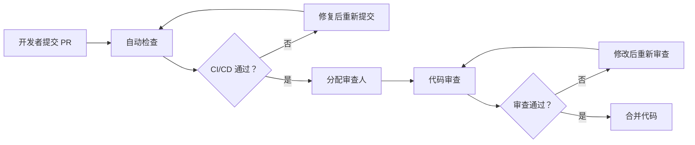

# 品牌诊断系统重构开发规范

**版本**: 1.0.0  
**制定日期**: 2026-02-27  
**适用范围**: 所有参与重构的开发人员、测试人员、运维人员  
**强制执行**: 本规范为强制性要求，所有代码提交必须遵守

---

## 目录

1. [核心原则](#1-核心原则)
2. [代码开发规范](#2-代码开发规范)
3. [Git 工作流规范](#3-git 工作流规范)
4. [测试规范](#4-测试规范)
5. [代码审查规范](#5-代码审查规范)
6. [API 设计规范](#6-api 设计规范)
7. [数据库变更规范](#7-数据库变更规范)
8. [安全规范](#8-安全规范)
9. [文档规范](#9-文档规范)
10. [部署与发布规范](#10-部署与发布规范)
11. [监控与告警规范](#11-监控与告警规范)
12. [违规处理](#12-违规处理)

---

## 1. 核心原则

### 1.1 用户第一原则

**规则 1.1.1**: 所有技术决策必须服务于"让用户获取真实品牌诊断报告"这一核心目标

**违规示例**:
```python
# ❌ 错误：为了技术炫技而添加无用的复杂功能
class OverEngineeredDiagnosis:
    def __init__(self):
        self.microservices = 10  # 过度设计
        self.cache_layers = 5    # 不必要的复杂度
```

**正确示例**:
```python
# ✅ 正确：简单直接地解决问题
class DiagnosisService:
    def generate_report(self, execution_id: str) -> Dict:
        """生成诊断报告 - 基于真实 API 数据"""
        return self._fetch_and_analyze(execution_id)
```

### 1.2 安全第一原则

**规则 1.2.1**: 宁可慢，不可乱，确保随时可以回滚

**具体要求**:
- 所有数据库变更必须向后兼容
- 所有 API 变更必须保留旧版本至少一个迭代周期
- 所有新功能必须通过特性开关控制
- 所有代码提交必须附带回滚方案说明

### 1.3 数据真实原则

**规则 1.3.1**: 禁止伪造、模拟诊断数据（测试环境除外）

**违规示例**:
```python
# ❌ 错误：伪造诊断数据
def get_diagnosis_data():
    return {
        'brand_distribution': {'品牌 A': 50, '品牌 B': 50},  # 硬编码假数据
        'sentiment': 'positive'
    }
```

**正确示例**:
```python
# ✅ 正确：基于真实 API 响应
def get_diagnosis_data(execution_id: str):
    api_calls = self._get_api_call_logs(execution_id)
    return self._analyze_real_data(api_calls)
```

### 1.4 渐进式交付原则

**规则 1.4.1**: 禁止"大爆炸"式重构，必须分阶段、小步快跑

**具体要求**:
- 每个 PR 不超过 500 行代码变更（不含测试）
- 每个功能必须可独立测试、独立部署
- 每个阶段必须有明确的验收标准

---

## 2. 代码开发规范

### 2.1 目录结构规范

**规则 2.1.1**: v2 重构代码必须放在指定目录

```
wechat_backend/
├── v2/                              # 重构代码根目录（必须）
│   ├── __init__.py
│   ├── state_machine/               # 状态机模块
│   │   ├── __init__.py
│   │   ├── diagnosis_state_machine.py
│   │   └── states.py
│   ├── services/                    # 服务层
│   │   ├── __init__.py
│   │   ├── diagnosis_service.py
│   │   ├── timeout_service.py
│   │   └── websocket_service.py
│   ├── repositories/                # 数据仓库层
│   │   ├── __init__.py
│   │   ├── diagnosis_repository.py
│   │   └── api_call_log_repository.py
│   ├── adapters/                    # AI 适配器层
│   │   ├── __init__.py
│   │   ├── ai_adapter_interface.py
│   │   ├── deepseek_adapter.py
│   │   └── doubao_adapter.py
│   ├── analytics/                   # 分析模块
│   │   ├── __init__.py
│   │   ├── brand_distribution.py
│   │   └── sentiment_analysis.py
│   ├── models/                      # 数据模型
│   │   ├── __init__.py
│   │   └── report_schema.py
│   └── cache/                       # 缓存模块
│       ├── __init__.py
│       └── report_cache.py
│
├── views/                           # 旧代码（禁止修改，仅保留）
├── services/                        # 旧代码（禁止修改，仅保留）
└── ...
```

**违规处理**: 发现 v2 代码放在错误目录，直接打回

### 2.2 命名规范

**规则 2.2.1**: 必须使用有意义的英文命名，禁止拼音、缩写

```python
# ❌ 错误：拼音命名
class ZhenduanService:
    def shengcheng_baogao(self):
        pass

# ❌ 错误：无意义缩写
def gen_rpt():
    pass

# ✅ 正确：有意义的英文
class DiagnosisService:
    def generate_report(self):
        pass
```

**规则 2.2.2**: 类名使用 PascalCase，函数名使用 snake_case

```python
# ✅ 正确
class DiagnosisStateMachine:
    def update_state(self):
        pass

class AIAdapterFactory:
    def get_adapter(self):
        pass
```

**规则 2.2.3**: 常量使用 UPPER_SNAKE_CASE

```python
# ✅ 正确
MAX_EXECUTION_TIME = 600
DEFAULT_TIMEOUT = 60
FEATURE_FLAGS = {...}
```

### 2.3 函数规范

**规则 2.3.1**: 函数必须有类型注解

```python
# ❌ 错误：无类型注解
def create_report(execution_id, user_id, config):
    pass

# ✅ 正确：有类型注解
def create_report(
    execution_id: str,
    user_id: str,
    config: Dict[str, Any]
) -> int:
    """创建诊断报告
    
    Args:
        execution_id: 执行 ID
        user_id: 用户 ID
        config: 诊断配置
        
    Returns:
        report_id: 报告 ID
        
    Raises:
        ValidationError: 参数验证失败
        DatabaseError: 数据库操作失败
    """
    pass
```

**规则 2.3.2**: 函数长度不超过 50 行（不含注释和空行）

**违规处理**: 超过 50 行的函数必须拆分

**规则 2.3.3**: 函数圈复杂度不超过 10

```python
# ❌ 错误：圈复杂度过高
def process_diagnosis(data):
    if condition1:
        if condition2:
            if condition3:
                ...
    elif condition4:
        ...
    # 嵌套过深，圈复杂度过高

# ✅ 正确：提前返回，降低复杂度
def process_diagnosis(data):
    if not condition1:
        return handle_case1()
    if not condition2:
        return handle_case2()
    return handle_normal_case()
```

### 2.4 异常处理规范

**规则 2.4.1**: 禁止空的 except 块

```python
# ❌ 错误：吞掉异常
try:
    dangerous_operation()
except:
    pass

# ✅ 正确：记录并处理异常
try:
    dangerous_operation()
except DatabaseError as e:
    logger.error(f"数据库操作失败：{e}")
    raise
except Exception as e:
    logger.error(f"未知错误：{e}")
    raise DiagnosticError(f"诊断失败：{e}")
```

**规则 2.4.2**: 必须使用自定义异常类

```python
# wechat_backend/v2/exceptions.py

class DiagnosisError(Exception):
    """诊断系统基础异常"""
    error_code = 'DIAGNOSIS_ERROR'
    status_code = 500

class DiagnosisTimeoutError(DiagnosisError):
    """诊断超时异常"""
    error_code = 'DIAGNOSIS_TIMEOUT'
    status_code = 408

class AIPlatformError(DiagnosisError):
    """AI 平台异常"""
    error_code = 'AI_PLATFORM_ERROR'
    status_code = 502

class DataValidationError(DiagnosisError):
    """数据验证异常"""
    error_code = 'DATA_VALIDATION_ERROR'
    status_code = 400
```

**规则 2.4.3**: 异常必须包含足够的上下文信息

```python
# ❌ 错误：异常信息不明确
raise Exception("操作失败")

# ✅ 正确：包含详细上下文
raise DiagnosisTimeoutError(
    f"诊断任务执行超时：execution_id={execution_id}, "
    f"elapsed_time={elapsed_time}s, "
    f"max_allowed={MAX_EXECUTION_TIME}s"
)
```

### 2.5 日志规范

**规则 2.5.1**: 必须使用结构化日志

```python
# ❌ 错误：非结构化日志
logger.info(f"用户 {user_id} 发起诊断，品牌 {brand_name}")

# ✅ 正确：结构化日志
logger.info("diagnosis_initiated", extra={
    'event': 'diagnosis_initiated',
    'user_id': user_id,
    'brand_name': brand_name,
    'execution_id': execution_id,
    'model_count': len(selected_models),
})
```

**规则 2.5.2**: 日志级别使用规范

| 级别 | 使用场景 | 示例 |
|------|---------|------|
| `DEBUG` | 调试信息，生产环境关闭 | API 请求/响应详情 |
| `INFO` | 正常业务流程 | 任务创建、完成 |
| `WARNING` | 可恢复的异常 | API 重试、降级 |
| `ERROR` | 需要关注的错误 | 数据库失败、AI 调用失败 |
| `CRITICAL` | 系统级严重错误 | 服务不可用 |

**规则 2.5.3**: 禁止记录敏感信息

```python
# ❌ 错误：记录敏感信息
logger.info(f"API Key: {api_key}")
logger.info(f"用户 OpenID: {openid}")

# ✅ 正确：脱敏处理
logger.info(f"API Key: {api_key[:4]}...{api_key[-4:]}")
logger.info(f"用户 OpenID: {openid[:8]}...")
```

### 2.6 特性开关规范

**规则 2.6.1**: 所有新功能必须通过特性开关控制

```python
# ✅ 正确：特性开关控制
from wechat_backend.v2.feature_flags import should_use_v2

def perform_diagnosis(request_data):
    if should_use_v2(request_data['user_id']):
        return self._perform_diagnosis_v2(request_data)
    else:
        return self._perform_diagnosis_v1(request_data)
```

**规则 2.6.2**: 特性开关必须集中管理

```python
# wechat_backend/v2/feature_flags.py

FEATURE_FLAGS = {
    'diagnosis_v2_enabled': False,
    'diagnosis_v2_state_machine': False,
    'diagnosis_v2_timeout': False,
    'diagnosis_v2_storage': False,
    'diagnosis_v2_statistics': False,
    'diagnosis_v2_websocket': False,
    'diagnosis_v2_gray_users': [],
    'diagnosis_v2_gray_percentage': 0,
    'diagnosis_v2_fallback_to_v1': True,
}

def should_use_v2(user_id: str) -> bool:
    """判断用户是否使用 v2 版本"""
    if not FEATURE_FLAGS['diagnosis_v2_enabled']:
        return False
    
    if user_id in FEATURE_FLAGS['diagnosis_v2_gray_users']:
        return True
    
    if random.randint(0, 99) < FEATURE_FLAGS['diagnosis_v2_gray_percentage']:
        return True
    
    return False
```

**规则 2.6.3**: 禁止硬编码特性开关值

```python
# ❌ 错误：硬编码
USE_V2 = True  # 禁止！

# ✅ 正确：从配置读取
from wechat_backend.v2.feature_flags import should_use_v2
```

---

## 3. Git 工作流规范

### 3.1 分支命名规范

**规则 3.1.1**: 必须使用指定的分支模型

```
main                              # 生产分支，禁止直接提交
  ├── develop                     # 开发分支
  │     ├── feature/阶段 X-功能名  # 功能分支
  │     ├── release/v2.0.0-phaseX # 发布分支
  │     └── hotfix/问题描述        # 热修复分支
```

**规则 3.1.2**: 分支命名格式

```bash
# ✅ 正确
feature/phase1-state-machine
feature/phase2-statistical-analysis
feature/phase3-websocket
release/v2.0.0-phase1
hotfix/fix-timeout-bug

# ❌ 错误
feature/test
feature/new-feature
fix-bug
```

### 3.2 提交信息规范

**规则 3.2.1**: 必须遵循 Conventional Commits 规范

```
<type>(<scope>): <subject>

<body>

<footer>
```

**Type 类型**:
| Type | 说明 | 示例 |
|------|------|------|
| `feat` | 新功能 | feat(diagnosis): 添加超时机制 |
| `fix` | Bug 修复 | fix(state): 修复状态同步问题 |
| `docs` | 文档更新 | docs(api): 更新 API 文档 |
| `style` | 代码格式 | style(format): 格式化代码 |
| `refactor` | 重构 | refactored(v2): 重构状态机 |
| `test` | 测试 | test(unit): 添加单元测试 |
| `chore` | 构建/工具 | chore(deps): 更新依赖 |

**规则 3.2.2**: 提交信息必须用英文

```bash
# ❌ 错误：中文提交
git commit -m "添加超时功能"

# ✅ 正确：英文提交
git commit -m "feat(timeout): add timeout mechanism for diagnosis tasks"
```

**规则 3.2.3**: 提交信息模板

```bash
feat(state-machine): implement diagnosis state machine

- Add DiagnosisStateMachine class
- Define state transitions
- Add timeout handling
- Add persistence layer

Closes #123
Refs: 2026-02-27-重构基线.md

---
Change-Id: I1234567890abcdef
Reviewed-by: reviewer@example.com
```

### 3.3 代码提交规范

**规则 3.3.1**: 禁止提交到 main 分支

```bash
# ❌ 错误：直接提交到 main
git checkout main
git commit -m "..."

# ✅ 正确：通过 PR 合并
git checkout -b feature/phase1-state-machine
git commit -m "..."
git push origin feature/phase1-state-machine
# 然后创建 Pull Request
```

**规则 3.3.2**: 每个 PR 必须有明确的目的

**PR 模板**:
```markdown
## 变更说明
简要描述本次变更的目的和内容

## 关联 Issue
- Closes #123
- Related to #456

## 测试计划
- [ ] 单元测试已添加
- [ ] 集成测试已添加
- [ ] 手动测试已完成

## 验收标准
- [ ] 代码审查通过
- [ ] 测试覆盖率 > 80%
- [ ] 无 P0/P1 Bug

## 回滚方案
描述如何回滚本次变更
```

**规则 3.3.3**: 禁止大提交

```bash
# ❌ 错误：一次性提交大量代码
git add .
git commit -m "完成阶段一"  # 变更 5000 行

# ✅ 正确：小步提交
git add state_machine/states.py
git commit -m "feat(state): add state definitions"

git add state_machine/transitions.py
git commit -m "feat(state): add state transitions"

git add state_machine/diagnosis_state_machine.py
git commit -m "feat(state): implement state machine core"
```

### 3.4 代码合并规范

**规则 3.4.1**: 必须通过 Pull Request 合并

- 所有代码必须通过 PR 合并到 develop 分支
- PR 必须经过至少 1 人 Review
- 关键代码必须经过 2 人 Review

**规则 3.4.2**: PR 合并前检查清单

```markdown
## PR 合并检查清单
- [ ] CI/CD 流水线通过
- [ ] 代码审查通过（至少 1 人）
- [ ] 测试覆盖率达标（>80%）
- [ ] 无 P0/P1 Bug
- [ ] 文档已更新
- [ ] 回滚方案已准备
```

---

## 4. 测试规范

### 4.1 测试覆盖要求

**规则 4.1.1**: 最低测试覆盖率要求

| 模块类型 | 覆盖率要求 | 检查方式 |
|---------|-----------|---------|
| 核心业务逻辑 | > 90% | pytest-cov |
| 服务层 | > 85% | pytest-cov |
| 数据仓库层 | > 80% | pytest-cov |
| API 层 | > 75% | pytest-cov |
| 工具函数 | > 70% | pytest-cov |

**规则 4.1.2**: 禁止无测试的代码提交

```bash
# ❌ 错误：无测试
git add v2/services/diagnosis_service.py
git commit -m "feat: add diagnosis service"

# ✅ 正确：附带测试
git add v2/services/diagnosis_service.py
git add tests/unit/test_diagnosis_service.py
git commit -m "feat: add diagnosis service with tests"
```

### 4.2 单元测试规范

**规则 4.2.1**: 测试文件命名

```
tests/
├── unit/
│   ├── test_diagnosis_service.py
│   ├── test_state_machine.py
│   └── test_analytics.py
├── integration/
│   ├── test_diagnosis_flow.py
│   └── test_storage.py
└── e2e/
    ├── test_full_diagnosis.py
    └── test_history.py
```

**规则 4.2.2**: 测试函数命名

```python
# ✅ 正确：测试函数清晰表达意图
class TestDiagnosisService:
    def test_create_report_with_valid_data(self):
        """测试使用有效数据创建报告"""
        pass
    
    def test_create_report_with_missing_brand(self):
        """测试品牌缺失时的处理"""
        pass
    
    def test_create_report_with_database_error(self):
        """测试数据库错误时的处理"""
        pass
```

**规则 4.2.3**: 测试必须独立

```python
# ❌ 错误：测试之间有依赖
def test_create_report():
    report_id = create_report(...)
    
def test_get_report():
    # 依赖 test_create_report 创建的报告
    report = get_report(report_id)

# ✅ 正确：测试独立，使用 fixture
@pytest.fixture
def sample_report():
    return create_report(...)

def test_get_report(sample_report):
    report = get_report(sample_report['id'])
```

### 4.3 集成测试规范

**规则 4.3.1**: 集成测试必须使用测试数据库

```python
# ✅ 正确：使用测试数据库
@pytest.fixture
def test_db():
    db_path = '/tmp/test_diagnosis.db'
    # 创建测试数据库
    setup_test_database(db_path)
    yield db_path
    # 清理测试数据库
    teardown_test_database(db_path)
```

**规则 4.3.2**: 集成测试后必须清理数据

```python
# ✅ 正确：测试后清理
def teardown_module():
    """测试结束后清理数据"""
    db.execute('DELETE FROM diagnosis_reports')
    db.execute('DELETE FROM diagnosis_results')
```

### 4.4 端到端测试规范

**规则 4.4.1**: E2E 测试必须模拟真实用户场景

```python
# ✅ 正确：完整用户流程
def test_full_diagnosis_flow():
    # 1. 创建诊断任务
    response = create_diagnosis_task({...})
    execution_id = response['execution_id']
    
    # 2. 轮询状态
    wait_for_completion(execution_id)
    
    # 3. 获取报告
    report = get_report(execution_id)
    
    # 4. 验证报告
    assert report['status'] == 'completed'
    assert len(report['results']) > 0
    assert 'brand_distribution' in report['analysis']
```

### 4.5 测试数据规范

**规则 4.5.1**: 禁止使用真实用户数据

```python
# ❌ 错误：使用真实数据
TEST_USER_ID = 'wx123456789'  # 真实用户 OpenID

# ✅ 正确：使用测试数据
TEST_USER_ID = 'test_user_001'
TEST_BRAND_NAME = '测试品牌 A'
```

**规则 4.5.2**: 测试数据必须可重复

```python
# ✅ 正确：确定性测试数据
@pytest.fixture
def sample_diagnosis_data():
    return {
        'brand_list': ['品牌 A', '品牌 B'],
        'selected_models': ['deepseek', 'doubao'],
        'custom_question': '测试问题',
    }
```

---

## 5. 代码审查规范

### 5.1 审查清单

**规则 5.1.1**: 所有代码必须经过审查

| 代码类型 | 审查人数 | 审查人要求 |
|---------|---------|-----------|
| 核心业务逻辑 | 2 人 | 架构师 + 高级开发 |
| 服务层 | 1 人 | 高级开发 |
| 工具函数 | 1 人 | 同级开发 |
| 测试代码 | 1 人 | 同级开发 |
| 文档 | 1 人 | 同级开发 |

**规则 5.1.2**: 审查检查清单

```markdown
## 代码审查清单

### 功能正确性
- [ ] 代码实现符合需求
- [ ] 边界条件已处理
- [ ] 异常处理完善

### 代码质量
- [ ] 命名清晰有意义
- [ ] 函数长度合理（<50 行）
- [ ] 圈复杂度合理（<10）
- [ ] 无重复代码

### 测试
- [ ] 单元测试已添加
- [ ] 测试覆盖率达标
- [ ] 测试用例覆盖边界条件

### 安全
- [ ] 无 SQL 注入风险
- [ ] 无敏感信息泄露
- [ ] 输入已验证

### 性能
- [ ] 无明显的性能问题
- [ ] 数据库查询已优化
- [ ] 缓存使用合理

### 文档
- [ ] 函数有 docstring
- [ ] 复杂逻辑有注释
- [ ] API 文档已更新
```

### 5.2 审查意见规范

**规则 5.2.1**: 审查意见必须具体明确

```markdown
# ❌ 错误：模糊的审查意见
- 这里需要优化
- 代码有问题

# ✅ 正确：具体的审查意见
- 第 45 行：函数 `process_data` 长度 80 行，建议拆分为多个小函数
- 第 78 行：缺少异常处理，如果 AI 调用失败会导致程序崩溃
- 第 120 行：SQL 查询有注入风险，建议使用参数化查询
```

**规则 5.2.2**: 审查意见必须可执行

```markdown
# ❌ 错误：不可执行的审查意见
- 代码质量需要提高

# ✅ 正确：可执行的审查意见
- 建议：提取常量 `MAX_EXECUTION_TIME = 600` 到配置模块
- 建议：添加类型注解 `def create_report(execution_id: str) -> int:`
- 建议：添加单元测试覆盖 `handle_timeout` 函数
```

### 5.3 审查流程



---

## 6. API 设计规范

### 6.1 API 版本规范

**规则 6.1.1**: API 必须版本化

```
# ✅ 正确：版本化 API
POST /api/v2/diagnostic/tasks
GET /api/v2/diagnostic/tasks/{taskId}/status
GET /api/v2/diagnostic/tasks/{taskId}/report

# ❌ 错误：无版本
POST /api/diagnostic/tasks
```

**规则 6.1.2**: 旧版本 API 必须保留至少一个迭代周期

```python
# ✅ 正确：保留旧版本
@wechat_bp.route('/api/perform-brand-test', methods=['POST'])
def perform_brand_test_v1():
    """v1 API - 保留用于向后兼容"""
    pass

@wechat_bp.route('/api/v2/diagnostic/tasks', methods=['POST'])
def create_diagnostic_task_v2():
    """v2 API - 新实现"""
    pass
```

### 6.2 请求响应规范

**规则 6.2.1**: 请求参数必须验证

```python
# ✅ 正确：参数验证
from pydantic import BaseModel, validator

class CreateDiagnosticTaskRequest(BaseModel):
    brand_list: List[str]
    selected_models: List[str]
    custom_question: str
    
    @validator('brand_list')
    def validate_brand_list(cls, v):
        if not v:
            raise ValueError('brand_list cannot be empty')
        if len(v) > 10:
            raise ValueError('brand_list cannot exceed 10 brands')
        return v
    
    @validator('custom_question')
    def validate_question(cls, v):
        if len(v) > 500:
            raise ValueError('question cannot exceed 500 characters')
        return v
```

**规则 6.2.2**: 响应格式必须统一

```python
# ✅ 正确：统一响应格式
{
    "status": "success",  # 或 "error"
    "data": {...},        # 成功时返回数据
    "error": {            # 失败时返回错误
        "code": "DIAGNOSIS_TIMEOUT",
        "message": "诊断任务执行超时",
        "details": {...}
    },
    "meta": {
        "request_id": "xxx",
        "timestamp": "2026-02-27T10:00:00Z"
    }
}
```

### 6.3 错误处理规范

**规则 6.3.1**: 必须使用标准 HTTP 状态码

| 状态码 | 使用场景 |
|--------|---------|
| 200 | 成功 |
| 400 | 请求参数错误 |
| 401 | 未授权 |
| 403 | 禁止访问 |
| 404 | 资源不存在 |
| 408 | 请求超时 |
| 429 | 请求频率超限 |
| 500 | 服务器内部错误 |
| 502 | AI 平台错误 |
| 503 | 服务不可用 |

**规则 6.3.2**: 错误响应必须包含足够信息

```json
{
    "status": "error",
    "error": {
        "code": "DIAGNOSIS_TIMEOUT",
        "message": "诊断任务执行超时",
        "details": {
            "execution_id": "xxx",
            "elapsed_time": 650,
            "max_allowed": 600
        }
    },
    "meta": {
        "request_id": "xxx",
        "timestamp": "2026-02-27T10:00:00Z"
    }
}
```

---

## 7. 数据库变更规范

### 7.1 变更原则

**规则 7.1.1**: 数据库变更必须向后兼容

```sql
-- ✅ 正确：添加新字段（向后兼容）
ALTER TABLE diagnosis_reports ADD COLUMN should_stop_polling BOOLEAN DEFAULT 0;

-- ❌ 错误：删除或修改现有字段
ALTER TABLE diagnosis_reports DROP COLUMN status;  -- 禁止！
ALTER TABLE diagnosis_reports MODIFY COLUMN status INT;  -- 禁止！
```

**规则 7.1.2**: 禁止在生产环境直接执行 DDL

```bash
# ❌ 错误：直接执行
sqlite3 production.db "ALTER TABLE ... "

# ✅ 正确：通过迁移脚本
python manage.py migrate --environment=production
```

### 7.2 迁移脚本规范

**规则 7.2.1**: 所有数据库变更必须有迁移脚本

```python
# migrations/001_add_timeout_fields.py

def upgrade():
    """升级迁移"""
    db.execute('''
        ALTER TABLE diagnosis_reports 
        ADD COLUMN should_stop_polling BOOLEAN DEFAULT 0
    ''')
    db.execute('''
        ALTER TABLE diagnosis_reports 
        ADD COLUMN timeout_at TIMESTAMP
    ''')

def downgrade():
    """降级迁移（回滚）"""
    # 注意：SQLite 不支持 DROP COLUMN，需要重建表
    # 这里记录回滚方案
    pass
```

**规则 7.2.2**: 迁移脚本必须可回滚

```python
# ✅ 正确：提供 downgrade 方法
def downgrade():
    """回滚迁移"""
    # 如果无法直接回滚，必须提供数据迁移方案
    migrate_data_back()
```

### 7.3 索引规范

**规则 7.3.1**: 查询频繁的字段必须添加索引

```sql
-- ✅ 正确：添加索引
CREATE INDEX idx_reports_execution_id ON diagnosis_reports(execution_id);
CREATE INDEX idx_reports_user_id ON diagnosis_reports(user_id);
CREATE INDEX idx_reports_status ON diagnosis_reports(status);
CREATE INDEX idx_results_execution_id ON diagnosis_results(execution_id);
```

**规则 7.3.2**: 禁止在频繁更新的表上创建过多索引

```sql
-- ❌ 错误：过多索引影响写入性能
CREATE INDEX idx_1 ON table(col1);
CREATE INDEX idx_2 ON table(col2);
CREATE INDEX idx_3 ON table(col3);
-- ... 10 个索引

-- ✅ 正确：只创建必要的索引
CREATE INDEX idx_execution_id ON table(execution_id);
CREATE INDEX idx_status ON table(status);
```

---

## 8. 安全规范

### 8.1 输入验证

**规则 8.1.1**: 所有用户输入必须验证

```python
# ✅ 正确：输入验证
from wechat_backend.security.input_validation import InputValidator

validator = InputValidator()

def create_diagnosis(data):
    # 验证品牌名称
    for brand in data['brand_list']:
        if not validator.is_safe_text(brand, max_length=100):
            raise ValidationError(f"Invalid brand name: {brand}")
    
    # 验证问题内容
    if not validator.is_safe_text(data['custom_question'], max_length=500):
        raise ValidationError("Invalid question content")
```

**规则 8.1.2**: 禁止信任前端传入的任何数据

```python
# ❌ 错误：信任前端数据
user_id = request.headers.get('X-User-ID')  # 可伪造

# ✅ 正确：从认证信息获取
user_id = get_current_user_id()  # 从 JWT token 解析
```

### 8.2 SQL 注入防护

**规则 8.2.1**: 必须使用参数化查询

```python
# ❌ 错误：SQL 注入风险
cursor.execute(f"SELECT * FROM reports WHERE id = {report_id}")

# ✅ 正确：参数化查询
cursor.execute("SELECT * FROM reports WHERE id = ?", (report_id,))
```

**规则 8.2.2**: 禁止拼接 SQL

```python
# ❌ 错误：拼接 SQL
query = f"SELECT * FROM {table_name} WHERE {column} = '{value}'"

# ✅ 正确：使用白名单
ALLOWED_TABLES = ['diagnosis_reports', 'diagnosis_results']
if table_name not in ALLOWED_TABLES:
    raise ValidationError("Invalid table name")
```

### 8.3 敏感信息保护

**规则 8.3.1**: 禁止硬编码敏感信息

```python
# ❌ 错误：硬编码 API Key
API_KEY = "sk-1234567890abcdef"

# ✅ 正确：从环境变量读取
API_KEY = os.getenv('DEEPSEEK_API_KEY')
```

**规则 8.3.2**: 禁止记录敏感信息

```python
# ❌ 错误：记录敏感信息
logger.info(f"API Key: {api_key}")
logger.info(f"User OpenID: {openid}")

# ✅ 正确：脱敏
logger.info(f"API Key: {api_key[:4]}...{api_key[-4:]}")
```

### 8.4 速率限制

**规则 8.4.1**: 所有 API 必须有限制

```python
# ✅ 正确：速率限制
from wechat_backend.security.rate_limiting import rate_limit

@wechat_bp.route('/api/v2/diagnostic/tasks', methods=['POST'])
@rate_limit(limit=5, window=60, per='user')  # 每用户每分钟 5 次
def create_task():
    pass
```

---

## 9. 文档规范

### 9.1 代码文档

**规则 9.1.1**: 所有公共函数必须有 docstring

```python
# ✅ 正确：完整的 docstring
def create_report(
    execution_id: str,
    user_id: str,
    config: Dict[str, Any]
) -> int:
    """创建诊断报告
    
    Args:
        execution_id: 执行 ID
        user_id: 用户 ID
        config: 诊断配置，包含 brand_name, selected_models 等
        
    Returns:
        report_id: 创建的报告 ID
        
    Raises:
        ValidationError: 参数验证失败
        DatabaseError: 数据库操作失败
        
    Example:
        >>> create_report('exec-123', 'user-456', {'brand_name': '品牌 A'})
        1
    """
    pass
```

### 9.2 API 文档

**规则 9.2.1**: 所有 API 必须有 OpenAPI 文档

```yaml
# docs/api/diagnosis.yaml
openapi: 3.0.0
info:
  title: 品牌诊断 API
  version: 2.0.0

paths:
  /api/v2/diagnostic/tasks:
    post:
      summary: 创建诊断任务
      tags: [Diagnostic]
      requestBody:
        required: true
        content:
          application/json:
            schema:
              $ref: '#/components/schemas/CreateTaskRequest'
      responses:
        '200':
          description: 成功
```

### 9.3 变更文档

**规则 9.3.1**: 所有变更必须记录 CHANGELOG

```markdown
# CHANGELOG

## [2.0.0-phase1] - 2026-02-28

### Added
- 诊断任务超时机制 (#123)
- API 调用日志持久化 (#124)
- 报告存根功能 (#125)

### Changed
- 重构状态机 (#120)
- 优化轮询逻辑 (#121)

### Fixed
- 修复诊断卡死问题 (#118)
- 修复历史记录为空问题 (#119)
```

---

## 10. 部署与发布规范

### 10.1 部署流程

**规则 10.1.1**: 禁止直接部署到生产环境

```
开发环境 → 测试环境 → 预发布环境 → 生产环境
```

**规则 10.1.2**: 生产环境部署必须经过审批

```markdown
## 部署审批清单
- [ ] 代码审查通过
- [ ] 测试通过（单元/集成/E2E）
- [ ] 预发布环境验证通过
- [ ] 回滚方案已准备
- [ ] 监控告警已配置
- [ ] 技术总监审批通过
```

### 10.2 灰度发布

**规则 10.2.1**: 新功能必须灰度发布

```
内部测试 → 种子用户 (5-10 人) → 1% → 10% → 50% → 100%
```

**规则 10.2.2**: 灰度期间必须密切监控

| 灰度阶段 | 监控时长 | 关键指标 | 通过标准 |
|---------|---------|---------|---------|
| 1% | 1 天 | 错误率 | < 5% |
| 10% | 2 天 | 错误率 | < 3% |
| 50% | 2 天 | 错误率 | < 2% |
| 100% | 持续 | 错误率 | < 1% |

---

## 11. 监控与告警规范

### 11.1 监控指标

**规则 11.1.1**: 必须监控以下核心指标

| 指标 | 采集频率 | 告警阈值 |
|------|---------|---------|
| 诊断成功率 | 1 分钟 | < 90% |
| 报告生成延迟 | 1 分钟 | P99 > 600s |
| API 错误率 | 1 分钟 | > 5% |
| 任务卡死率 | 5 分钟 | > 2% |
| 数据库连接池 | 1 分钟 | > 80% |

### 11.2 告警分级

**规则 11.2.1**: 告警必须分级

| 级别 | 响应时间 | 通知方式 |
|------|---------|---------|
| P0 - 致命 | < 5 分钟 | 电话 + 短信 + 微信 |
| P1 - 严重 | < 15 分钟 | 短信 + 微信 |
| P2 - 一般 | < 1 小时 | 微信 |
| P3 - 轻微 | < 4 小时 | 邮件 |

---

## 12. 违规处理

### 12.1 违规等级

| 等级 | 违规行为 | 处理方式 |
|------|---------|---------|
| **严重违规** | 直接提交 main、无测试提交、硬编码敏感信息 | 代码打回，团队通报，重新培训 |
| **一般违规** | 命名不规范、缺少注释、函数过长 | 代码审查指出，限期整改 |
| **轻微违规** | 格式问题、提交信息不规范 | 代码审查指出，立即整改 |

### 12.2 检查机制

**规则 12.2.1**: 自动化检查

- CI/CD 流水线自动检查测试覆盖率
- 代码提交自动检查格式规范
- 合并请求自动检查审查人数

**规则 12.2.2**: 人工检查

- 每周代码抽查
- 每月规范执行情况 review
- 每季度规范更新

---

## 附录

### A. 快速检查清单

**提交前检查**:
```markdown
- [ ] 代码符合命名规范
- [ ] 函数有类型注解和 docstring
- [ ] 已添加单元测试（覆盖率>80%）
- [ ] 无敏感信息硬编码
- [ ] 日志不包含敏感信息
- [ ] 特性开关已配置
- [ ] 提交信息符合规范
```

**审查前检查**:
```markdown
- [ ] CI/CD 流水线通过
- [ ] 测试覆盖率达标
- [ ] 无 P0/P1 Bug
- [ ] 文档已更新
- [ ] 回滚方案已准备
```

### B. 常用命令

```bash
# 运行测试
pytest tests/ -v --cov=wechat_backend/v2

# 检查代码格式
flake8 wechat_backend/v2/
black --check wechat_backend/v2/

# 检查类型
mypy wechat_backend/v2/

# 生成文档
pdoc --html wechat_backend/v2/ -o docs/

# 创建分支
git checkout -b feature/phase1-state-machine develop

# 提交代码
git add .
git commit -m "feat(scope): description"

# 推送分支
git push origin feature/phase1-state-machine
```

### C. 模板文件

- [PR 模板](templates/pr_template.md)
- [提交信息模板](templates/commit_template.txt)
- [代码审查清单](templates/review_checklist.md)
- [部署审批清单](templates/deployment_checklist.md)

---

**文档版本**: 1.0.0  
**最后更新**: 2026-02-27  
**下次审查**: 2026-03-27（每月审查更新）

**签字确认**:

| 角色 | 人员 | 签字 | 日期 |
|------|------|------|------|
| **首席架构师** | | ___________ | ___________ |
| **技术总监** | | ___________ | ___________ |
| **开发负责人** | | ___________ | ___________ |
| **测试负责人** | | ___________ | ___________ |

---

**本规范自发布之日起强制执行，所有参与重构的人员必须严格遵守。**

