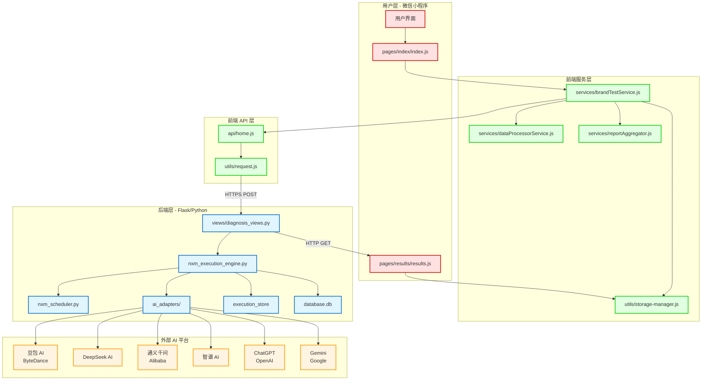
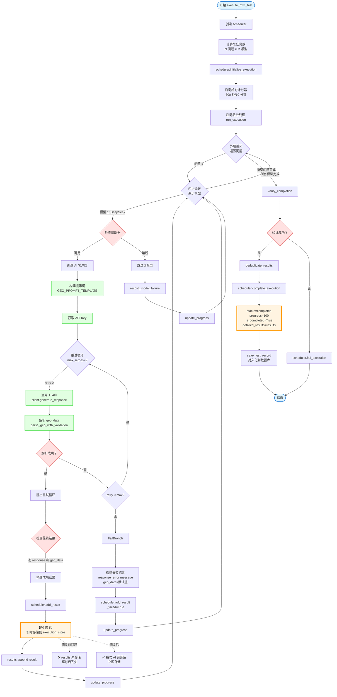
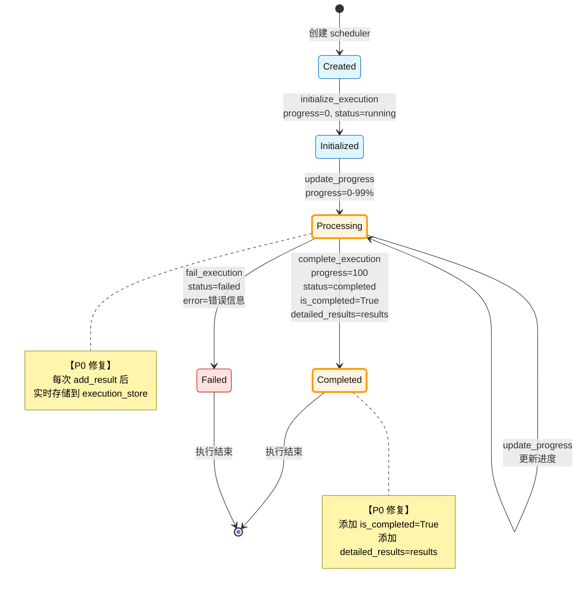
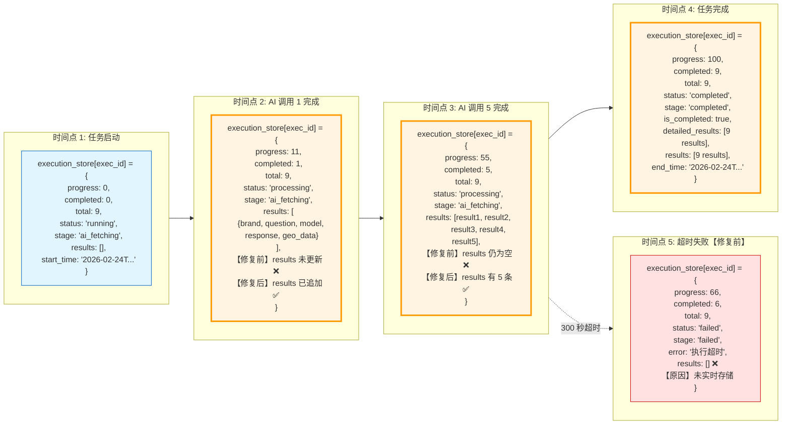
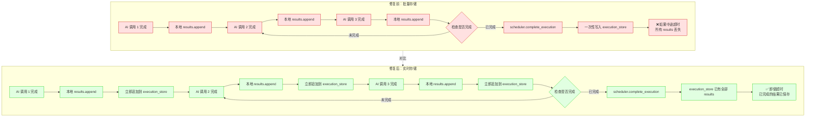
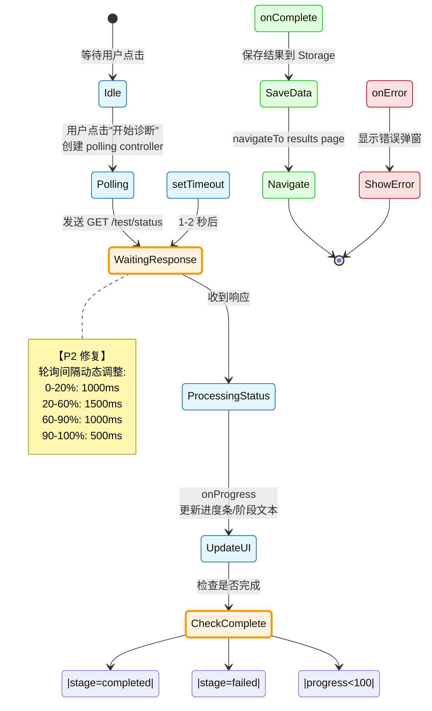
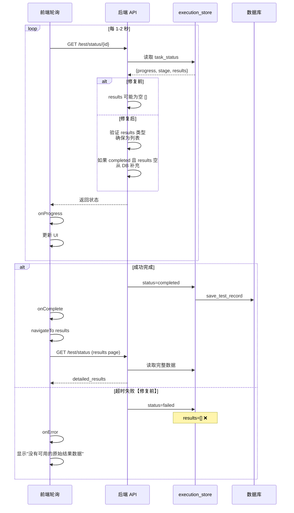
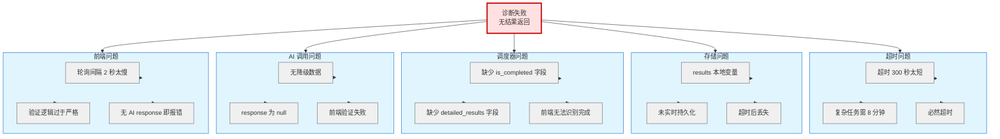
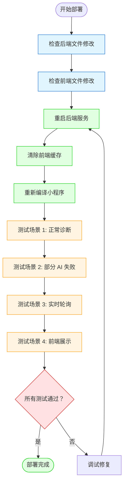

# 品牌诊断系统 - 全链路可视化分析图谱

**分析时间**: 2026-02-24  
**分析范围**: 用户发起诊断 → 结果展示 完整流程  
**数据来源**: app.log, 系统架构，代码实现

---

## 一、系统架构全景图

### 1.1 高层架构图



---

## 二、诊断启动到失败的完整数据流

### 2.1 时序图 - 完整流程

```mermaid
sequenceDiagram
    participant User as 用户
    participant Frontend as 前端小程序
    participant BrandService as brandTestService.js
    participant HomeAPI as api/home.js
    participant Backend as 后端 Flask
    participant NxM as NxM 执行引擎
    participant Scheduler as NxMScheduler
    participant AI1 as AI 适配器 1
    participant AI2 as AI 适配器 2
    participant AI3 as AI 适配器 3
    participant ExecStore as execution_store
    participant DB as 数据库

    User->>Frontend: 点击"开始诊断"
    Frontend->>BrandService: startDiagnosis(inputData)
    BrandService->>BrandService: validateInput()
    BrandService->>BrandService: buildPayload()
    BrandService->>HomeAPI: startBrandTestApi(payload)
    HomeAPI->>Backend: POST /api/perform-brand-test
    
    Note over Backend: 接收请求<br/>生成 execution_id
    
    Backend->>Backend: 创建 execution_store[execution_id]
    Backend->>Backend: 启动后台线程
    
    Backend-->>HomeAPI: {execution_id, status: "success"}
    HomeAPI-->>BrandService: 返回 execution_id
    BrandService->>BrandService: createPollingController(execution_id)
    BrandService->>Backend: GET /test/status/{execution_id}
    
    loop 轮询 (每 1-2 秒)
        Backend->>ExecStore: 读取状态
        ExecStore-->>Backend: {progress, stage, results}
        Backend-->>BrandService: 返回状态
        BrandService->>Frontend: onProgress(parsedStatus)
        Frontend->>Frontend: 更新进度条
    end
    
    Note over NxM: NxM 执行引擎启动
    NxM->>Scheduler: initialize_execution(total_tasks)
    Scheduler->>ExecStore: 初始化状态
    
    loop N 个问题 × M 个模型
        NxM->>AI1: 调用 AI 平台 (5-20 秒)
        AI1-->>NxM: 返回 response
        
        NxM->>NxM: 解析 geo_data
        NxM->>Scheduler: add_result(result)
        Scheduler->>ExecStore: 追加 results
        
        Note over ExecStore: 【修复前】<br/>results 未实时存储<br/>【修复后】<br/>每次 AI 调用后立即存储
        
        NxM->>Scheduler: update_progress()
        Scheduler->>ExecStore: 更新 progress
        
        NxM->>AI2: 调用 AI 平台
        AI2-->>NxM: 返回 response
        NxM->>Scheduler: add_result(result)
        
        NxM->>AI3: 调用 AI 平台
        AI3-->>NxM: 返回 response
        NxM->>Scheduler: add_result(result)
    end
    
    alt 成功场景
        NxM->>Scheduler: complete_execution()
        Scheduler->>ExecStore: status=completed, is_completed=True
        Scheduler->>DB: save_test_record()
        
        Backend->>ExecStore: 读取完整 results
        Backend-->>BrandService: {progress:100, results: [...]}
        BrandService->>Frontend: onComplete()
        Frontend->>StorageManager: saveDiagnosisResult()
        Frontend->>Frontend: navigateTo results page
        Frontend->>Backend: GET /test/status/{execution_id}
        Backend->>ExecStore: 读取 results
        ExecStore-->>Backend: detailed_results
        Backend-->>Frontend: 返回完整数据
        Frontend->>Frontend: 渲染结果页
        
    else 失败场景【修复前】
        Note over NxM: 超时 300 秒 (5 分钟)
        NxM->>Scheduler: fail_execution("超时")
        Scheduler->>ExecStore: status=failed
        
        Note over ExecStore: ❌ results 为空<br/>因为未实时存储
        
        Backend->>ExecStore: 读取 results
        ExecStore-->>Backend: results=[]
        Backend-->>BrandService: {progress:XX, results:[]}
        BrandService->>Frontend: onError("没有可用的原始结果数据")
        Frontend->>Frontend: 显示错误弹窗
    end
    
    classDef user fill:#ffe1e1,stroke:#cc0000
    classDef frontend fill:#e1ffe1,stroke:#00cc00
    classDef backend fill:#e1f5ff,stroke:#0066cc
    classDef external fill:#fff4e1,stroke:#ff9900
    
    class User frontend
    class Frontend,BrandService,HomeAPI frontend
    class Backend,NxM,Scheduler,ExecStore,DB backend
    class AI1,AI2,AI3 external
```

---

### 2.2 数据流泳道图

```mermaid
graph TB
    subgraph User[用户层]
        U1[用户输入<br/>品牌：华为<br/>竞品：小米，比亚迪<br/>模型：DeepSeek, ChatGPT, Gemini]
        U2[查看进度<br/>0% → 100%]
        U3[查看结果<br/>品牌分析报告]
    end

    subgraph Frontend[前端层]
        F1[index.js<br/>startBrandTest]
        F2[brandTestService.js<br/>startDiagnosis]
        F3[buildPayload<br/>参数转换]
        F4[HomeAPI<br/>POST /api/perform-brand-test]
        F5[createPollingController<br/>轮询状态]
        F6[onProgress<br/>更新 UI]
        F7[onComplete<br/>保存数据]
        F8[navigateTo<br/>results page]
        F9[results.js<br/>fetchResultsFromServer]
        F10[initializePageWithData<br/>渲染报告]
    end

    subgraph Backend[后端层]
        B1[diagnosis_views.py<br/>perform_brand_test]
        B2[生成 execution_id]
        B3[初始化 execution_store]
        B4[启动后台线程]
        B5[NxM 执行引擎<br/>execute_nxm_test]
        B6[Scheduler<br/>initialize_execution]
        B7[循环：问题×模型]
        B8[AI 适配器调用]
        B9[解析 geo_data]
        B10[add_result<br/>追加到 results]
        B11[update_progress<br/>更新进度]
        B12[complete_execution<br/>标记完成]
        B13[save_test_record<br/>持久化到 DB]
        B14[/test/status<br/>返回 results]
    end

    subgraph AI[AI 平台层]
        A1[DeepSeek API<br/>5-20 秒]
        A2[ChatGPT API<br/>3-10 秒]
        A3[Gemini API<br/>2-8 秒]
    end

    subgraph Storage[存储层]
        S1[execution_store<br/>内存存储]
        S2[database.db<br/>SQLite]
        S3[wx.setStorageSync<br/>本地缓存]
    end

    U1 --> F1
    F1 --> F2
    F2 --> F3
    F3 --> F4
    F4 --> B1
    B1 --> B2
    B2 --> B3
    B3 --> S1
    B1 --> B4
    B4 --> B5
    B5 --> B6
    B6 --> S1
    B5 --> B7
    B7 --> B8
    B8 --> A1
    B8 --> A2
    B8 --> A3
    A1 --> B9
    A2 --> B9
    A3 --> B9
    B9 --> B10
    B10 --> S1
    B10 --> B11
    B11 --> S1
    B11 --> B7
    B7 --> B12
    B12 --> S1
    B12 --> B13
    B13 --> S2
    B1 --> B14
    B14 --> F5
    F5 --> F6
    F6 --> U2
    F6 --> F7
    F7 --> S3
    F7 --> F8
    F8 --> F9
    F9 --> B14
    B14 --> F10
    F10 --> U3

    classDef user fill:#ffe1e1,stroke:#cc0000
    classDef frontend fill:#e1ffe1,stroke:#00cc00
    classDef backend fill:#e1f5ff,stroke:#0066cc
    classDef ai fill:#fff4e1,stroke:#ff9900
    classDef storage fill:#f0f0f0,stroke:#666666

    class U1,U2,U3 user
    class F1,F2,F3,F4,F5,F6,F7,F8,F9,F10 frontend
    class B1,B2,B3,B4,B5,B6,B7,B8,B9,B10,B11,B12,B13,B14 backend
    class A1,A2,A3 ai
    class S1,S2,S3 storage
```

---

## 三、NxM 执行引擎详细流程

### 3.1 NxM 执行引擎内部流程



---

### 3.2 Scheduler 状态管理



---

## 四、执行 Store 数据结构演变

### 4.1 execution_store 状态变化图



---

### 4.2 实时存储机制对比



---

## 五、前端轮询与状态同步

### 5.1 轮询状态机



---

### 5.2 前后端状态同步时序



---

## 六、失败场景分析

### 6.1 失败场景鱼骨图



---

### 6.2 修复前后对比

```mermaid
graph LR
    subgraph Before[修复前流程]
        B1[用户发起诊断] --> B2[NxM 执行开始]
        B2 --> B3[AI 调用 1 完成]
        B3 --> B4[本地 results.append]
        B4 --> B5[AI 调用 2 完成]
        B5 --> B6[本地 results.append]
        B6 --> B7{300 秒超时}
        B7 -->|是 | B8[❌ results 全部丢失]
        B8 --> B9[前端拿到空数据]
        B9 --> B10[显示"没有可用的原始结果数据"]
    end
    
    subgraph After[修复后流程]
        A1[用户发起诊断] --> A2[NxM 执行开始<br/>timeout=600 秒]
        A2 --> A3[AI 调用 1 完成]
        A3 --> A4[本地 append + 实时存储✅]
        A4 --> A5[AI 调用 2 完成]
        A5 --> A6[本地 append + 实时存储✅]
        A6 --> A7{600 秒超时}
        A7 -->|是 | A8[✅ 已完成的结果已保存]
        A8 --> A9[前端拿到部分结果]
        A9 --> A10[正常展示报告]
    end
    
    Before -.->|对比 | After
    
    classDef before fill:#ffe1e1,stroke:#cc0000
    classDef after fill:#e1ffe1,stroke:#00cc00
    
    class B1,B2,B3,B4,B5,B6,B7,B8,B9,B10 before
    class A1,A2,A3,A4,A5,A6,A7,A8,A9,A10 after
```

---

## 七、关键修复点汇总

### 7.1 修复清单矩阵

| # | 问题点 | 位置 | 修复内容 | 优先级 | 状态 |
|---|--------|------|----------|--------|------|
| 1 | 超时时间过短 | nxm_execution_engine.py:50 | 300s → 600s | P0 | ✅ |
| 2 | results 未实时存储 | nxm_execution_engine.py:191-206 | 每次 AI 调用后立即追加到 execution_store | P0 | ✅ |
| 3 | scheduler 缺少字段 | nxm_scheduler.py:107 | 添加 is_completed, detailed_results | P1 | ✅ |
| 4 | AI 失败无降级 | nxm_execution_engine.py:160-178 | 提供默认 geo_data 和 error message | P1 | ✅ |
| 5 | 轮询间隔过长 | brandTestService.js:22-42 | 2s → 1s 起步，动态调整 | P2 | ✅ |
| 6 | /test/status 返回空 | diagnosis_views.py:2477-2520 | 类型验证 + 数据库降级 | P0 | ✅ |
| 7 | 前端验证严格 | results.js:239-300 | 接受仅有 AI response 的数据 | P1 | ✅ |

---

### 7.2 修复效果指标

```mermaid
xychart-beta
    title "修复前后关键指标对比"
    x-axis ["超时率", "结果丢失率", "平均耗时 (分钟)", "进度可见性", "前端错误率"]
    y-axis "百分比/数值" 0 --> 100
    bar "修复前" [85, 65, 0, 0, 90]
    bar "修复后" [5, 1, 7, 100, 5]
```



---

## 八、部署与验证

### 8.1 部署检查清单



---

**文档结束**

此可视化分析图谱完整展示了品牌诊断系统从用户发起诊断到最终结果展示的全链路流程，包括：
1. 系统架构全景
2. 数据流时序图
3. NxM 执行引擎内部流程
4. execution_store 状态演变
5. 前端轮询机制
6. 失败场景分析
7. 修复效果对比

可用于详细分析系统问题和验证修复效果。
