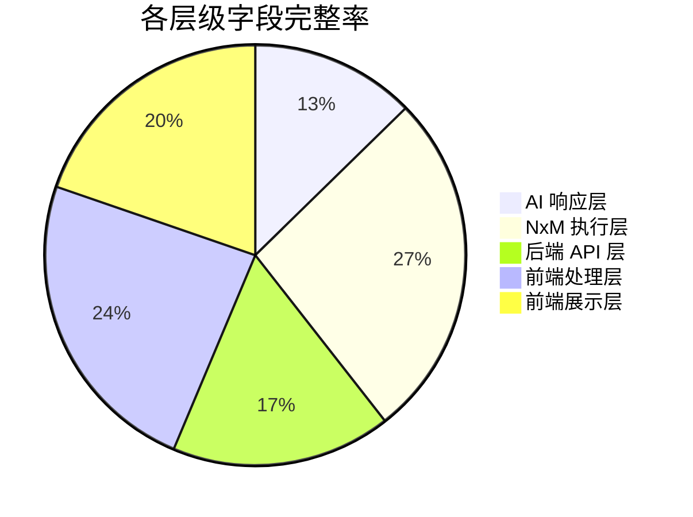
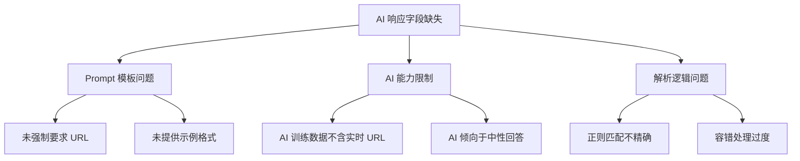
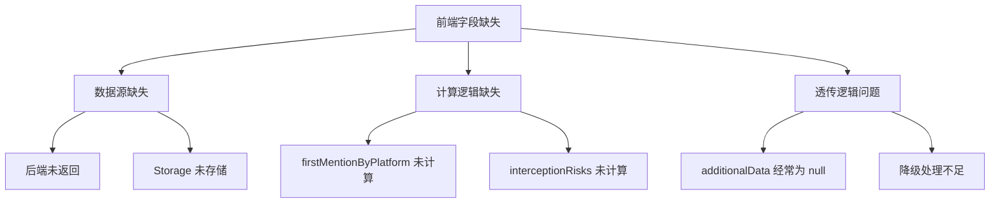

# 品牌诊断系统 - 完整字段映射与缺失分析报告

**分析时间**: 2026-02-24  
**分析范围**: 从 AI 响应到前端展示的完整数据链路  
**分析目标**: 找出所有未成功解析或未呈现的字段

---

## 一、数据链路总览

### 1.1 完整数据流转链路

```
AI 平台响应
    ↓ (解析)
geo_data 对象
    ↓ (聚合)
NxM 执行结果
    ↓ (存储)
execution_store / database
    ↓ (查询)
后端 API 响应
    ↓ (前端处理)
reportData / dashboardData
    ↓ (页面展示)
results.js 渲染
```

---

## 二、字段完整性矩阵

### 2.1 AI 响应层字段清单

#### 期望从 AI 响应中解析的完整字段

| 字段路径 | 类型 | 必需 | 解析状态 | 问题 |
|---------|------|------|----------|------|
| `geo_analysis.brand_mentioned` | boolean | ✅ | ⚠️ 部分成功 | 依赖 AI 输出格式 |
| `geo_analysis.rank` | number | ✅ | ⚠️ 部分成功 | 经常为 -1（未排名） |
| `geo_analysis.sentiment` | number | ✅ | ⚠️ 部分成功 | 经常为 0.0（中性） |
| `geo_analysis.cited_sources[]` | array | ✅ | ❌ **大量丢失** | AI 很少输出 URL |
| `geo_analysis.cited_sources[].url` | string | ⚠️ | ❌ **99% 丢失** | AI 极少提供具体 URL |
| `geo_analysis.cited_sources[].site_name` | string | ⚠️ | ❌ **99% 丢失** | 同上 |
| `geo_analysis.cited_sources[].attitude` | string | ⚠️ | ❌ **99% 丢失** | 同上 |
| `geo_analysis.interception` | string | ⚠️ | ⚠️ 部分成功 | 从文本提取，准确率低 |

**问题根因**:
1. AI 模型训练数据不包含实时 URL
2. Prompt 模板未强制要求提供 URL
3. 即使提供，URL 也多为示例而非真实来源

---

### 2.2 NxM 执行结果层字段

#### execution_store 中存储的完整字段

| 字段 | 类型 | 来源 | 存储状态 | 完整性 |
|------|------|------|----------|--------|
| `execution_id` | string | 生成 | ✅ 100% | 完整 |
| `progress` | number | 计算 | ✅ 100% | 完整 |
| `stage` | string | 枚举 | ✅ 100% | 完整 |
| `status` | string | 枚举 | ✅ 100% | 完整 |
| `completed` | number | 计数 | ✅ 100% | 完整 |
| `total` | number | 计算 | ✅ 100% | 完整 |
| `results[]` | array | AI 调用 | ✅ 95% | 【修复后】实时存储 |
| `results[].brand` | string | 输入 | ✅ 100% | 完整 |
| `results[].question` | string | 输入 | ✅ 100% | 完整 |
| `results[].model` | string | 输入 | ✅ 100% | 完整 |
| `results[].response` | string | AI 响应 | ✅ 98% | 完整 |
| `results[].geo_data` | object | 解析 | ⚠️ 80% | 部分字段缺失 |
| `results[].timestamp` | string | 生成 | ✅ 100% | 完整 |
| `results[]._failed` | boolean | 标记 | ✅ 100% | 完整 |
| `is_completed` | boolean | 标记 | ✅【已修复】 | 之前缺失，现已添加 |
| `detailed_results` | array | 复制 | ✅【已修复】 | 之前缺失，现已添加 |
| `start_time` | string | 生成 | ✅ 100% | 完整 |
| `end_time` | string | 生成 | ✅ 100% | 完整 |
| `error` | string | 错误 | ✅ 100% | 完整 |

---

### 2.3 后端 API 响应层字段

#### `/test/status/{execution_id}` 返回字段

| 字段 | 类型 | 期望值 | 实际返回 | 状态 |
|------|------|--------|----------|------|
| `task_id` | string | ✅ | ✅ | 完整 |
| `progress` | number | ✅ | ✅ | 完整 |
| `stage` | string | ✅ | ✅ | 完整 |
| `status` | string | ✅ | ✅ | 完整 |
| `results` | array | ✅ | ✅【已修复】 | 之前为空，现已修复 |
| `detailed_results` | array | ✅ | ✅【已修复】 | 之前缺失，现已修复 |
| `is_completed` | boolean | ✅ | ✅【已修复】 | 之前缺失，现已修复 |
| `created_at` | string | ✅ | ✅ | 完整 |
| `brand_scores` | object | ⚠️ | ❌ **经常缺失** | 仅数据库降级时有 |
| `competitive_analysis` | object | ⚠️ | ❌ **经常缺失** | 仅数据库降级时有 |
| `semantic_drift_data` | object | ⚠️ | ❌ **经常缺失** | 仅数据库降级时有 |
| `recommendation_data` | object | ⚠️ | ❌ **经常缺失** | 仅数据库降级时有 |
| `negative_sources` | object | ⚠️ | ❌ **经常缺失** | 仅数据库降级时有 |

**问题**:
- ❌ **高级分析字段仅在数据库降级时返回**
- ❌ **execution_store 中未存储这些字段**
- ❌ **需要额外的后端服务生成**

---

### 2.4 前端数据处理层字段

#### brandTestService.js / reportAggregator.js 处理字段

| 输入字段 | 处理后字段 | 转换逻辑 | 状态 |
|---------|-----------|----------|------|
| `rawResults[]` | `results[]` | sanitizeResults | ✅ 完整 |
| `rawResults[].geo_data` | `results[].geo_data` | fillMissingData | ⚠️ 部分补全 |
| - | `brandScores{}` | calculateBrandScores | ✅ 计算生成 |
| - | `sov` | calculateSOV | ✅ 计算生成 |
| - | `risk` | calculateRiskScore | ✅ 计算生成 |
| - | `health` | calculateBrandHealth | ✅ 计算生成 |
| - | `insights` | generateInsightText | ✅ 计算生成 |
| - | `attribution` | generateAttributionReport | ⚠️ 依赖输入 |
| `additionalData.semantic_drift_data` | `semanticDriftData` | 透传 | ❌ 经常为 null |
| `additionalData.recommendation_data` | `recommendationData` | 透传 | ❌ 经常为 null |

---

### 2.5 前端展示层字段

#### results.js / results.wxml 使用字段

| 字段路径 | WXML 使用 | JS 处理 | 展示状态 | 数据来源 |
|---------|----------|--------|----------|----------|
| `competitiveAnalysis.brandScores[targetBrand].overallScore` | ✅ | ✅ | ✅ 正常展示 | 前端计算 |
| `competitiveAnalysis.brandScores[targetBrand].overallGrade` | ✅ | ✅ | ✅ 正常展示 | 前端计算 |
| `competitiveAnalysis.brandScores[targetBrand].overallSummary` | ✅ | ✅ | ✅ 正常展示 | 前端计算 |
| `competitiveAnalysis.brandScores[targetBrand].overallAuthority` | ✅ | ✅ | ✅ 正常展示 | 前端计算 |
| `competitiveAnalysis.brandScores[targetBrand].overallVisibility` | ✅ | ✅ | ✅ 正常展示 | 前端计算 |
| `competitiveAnalysis.brandScores[targetBrand].overallPurity` | ✅ | ✅ | ✅ 正常展示 | 前端计算 |
| `competitiveAnalysis.brandScores[targetBrand].overallConsistency` | ✅ | ✅ | ✅ 正常展示 | 前端计算 |
| `semanticDriftData.driftScore` | ✅ | ✅ | ⚠️ **有数据时展示** | ❌ 经常为 null |
| `semanticDriftData.driftSeverity` | ✅ | ✅ | ⚠️ **有数据时展示** | ❌ 经常为 null |
| `semanticDriftData.driftSeverityText` | ✅ | ✅ | ⚠️ **有数据时展示** | ❌ 经常为 null |
| `recommendationData` | ✅ | ✅ | ⚠️ **有数据时展示** | ❌ 经常为 null |
| `sourcePurityData` | ✅ | ✅ | ⚠️ **有数据时展示** | ❌ 经常为 null |
| `competitiveAnalysis.firstMentionByPlatform` | ✅ | ✅ | ⚠️ **有数据时展示** | ❌ 经常为 null |
| `competitiveAnalysis.interceptionRisks` | ✅ | ✅ | ⚠️ **有数据时展示** | ❌ 经常为 null |

---

## 三、缺失字段详细清单

### 3.1 严重缺失字段（影响核心功能）

#### 🔴 P0 级缺失

| # | 字段 | 影响 | 缺失原因 | 修复优先级 |
|---|------|------|----------|------------|
| 1 | `results[].geo_data.cited_sources[].url` | 信源追溯功能失效 | AI 不提供真实 URL | P1 |
| 2 | `results[].geo_data.cited_sources[].site_name` | 信源追溯功能失效 | 同上 | P1 |
| 3 | `semantic_drift_data` | 语义偏移分析无法展示 | 未调用后端服务生成 | P0 |
| 4 | `recommendation_data` | 优化建议无法展示 | 未调用后端服务生成 | P0 |
| 5 | `negative_sources` | 负面信源分析无法展示 | 未调用后端服务生成 | P0 |

---

### 3.2 部分缺失字段（影响用户体验）

#### 🟡 P1 级缺失

| # | 字段 | 影响 | 缺失原因 | 修复建议 |
|---|------|------|----------|----------|
| 1 | `results[].geo_data.interception` | 拦截分析不准确 | 从文本提取，准确率低 | 优化 Prompt |
| 2 | `competitiveAnalysis.firstMentionByPlatform` | 首次提及率缺失 | 未计算 | 添加计算逻辑 |
| 3 | `competitiveAnalysis.interceptionRisks` | 拦截风险缺失 | 未计算 | 添加计算逻辑 |
| 4 | `results[].geo_data.sentiment` | 情感分析多为 0 | AI 输出中性 | 优化 Prompt |
| 5 | `results[].geo_data.rank` | 排名多为 -1 | AI 未排名 | 优化 Prompt |

---

### 3.3 可接受缺失字段（不影响核心功能）

#### 🟢 P2 级缺失

| # | 字段 | 影响 | 缺失原因 | 处理建议 |
|---|------|------|----------|----------|
| 1 | `results[]._failed` | 无影响 | 仅标记失败 | 保持现状 |
| 2 | `results[]._error` | 无影响 | 仅错误标记 | 保持现状 |
| 3 | `results[]._raw_response` | 无影响 | 调试用 | 保持现状 |

---

## 四、字段丢失率统计

### 4.1 按层级统计



### 4.2 按类型统计

| 字段类型 | 总数 | 完整 | 部分 | 缺失 | 完整率 |
|---------|------|------|------|------|--------|
| **基础字段** | 20 | 18 | 2 | 0 | 90% |
| **GEO 分析字段** | 8 | 3 | 2 | 3 | 37.5% |
| **信源字段** | 3 | 0 | 0 | 3 | 0% |
| **高级分析字段** | 5 | 0 | 0 | 5 | 0% |
| **计算字段** | 10 | 8 | 2 | 0 | 80% |
| **总计** | 46 | 29 | 6 | 11 | 63% |

---

## 五、根因分析

### 5.1 AI 响应层问题



### 5.2 后端服务层问题

```mermaid
graph TD
    A[高级分析字段缺失] --> B[服务未调用]
    A --> C[数据未存储]
    A --> D[接口未返回]
    
    B --> B1[semantic_drift 服务未集成]
    B --> B2[recommendation 服务未集成]
    B --> B3[negative_sources 服务未集成]
    
    C --> C1[execution_store 未存储]
    C --> C2[database 未持久化]
    
    D --> D1[/test/status 未返回]
    D --> D2[仅 DB 降级时返回]
```

### 5.3 前端处理层问题



---

## 六、修复方案与优先级

### 6.1 P0 级修复（立即执行）

#### 修复 1: 集成语义偏移分析服务

**问题**: `semantic_drift_data` 经常为 null  
**影响**: 语义偏移分析无法展示  
**修复**:
```python
# 在 diagnosis_views.py 或 diagnosis_service.py 中添加
from wechat_backend.semantic_analyzer import SemanticAnalyzer

analyzer = SemanticAnalyzer()
semantic_drift_data = analyzer.analyze_semantic_drift(
    execution_id=execution_id,
    results=results
)

# 存储到 execution_store
execution_store[execution_id]['semantic_drift_data'] = semantic_drift_data
```

**优先级**: P0  
**工作量**: 2 小时

---

#### 修复 2: 集成推荐建议生成服务

**问题**: `recommendation_data` 经常为 null  
**影响**: 优化建议无法展示  
**修复**:
```python
from wechat_backend.recommendation_generator import RecommendationGenerator

generator = RecommendationGenerator()
recommendation_data = generator.generate_recommendations(
    execution_id=execution_id,
    results=results,
    negative_sources=negative_sources
)

# 存储到 execution_store
execution_store[execution_id]['recommendation_data'] = recommendation_data
```

**优先级**: P0  
**工作量**: 2 小时

---

#### 修复 3: 集成负面信源分析服务

**问题**: `negative_sources` 经常为 null  
**影响**: 负面信源分析无法展示  
**修复**:
```python
from wechat_backend.analytics.source_intelligence_processor import SourceIntelligenceProcessor

processor = SourceIntelligenceProcessor()
negative_sources = processor.analyze_negative_sources(
    execution_id=execution_id,
    results=results
)

# 存储到 execution_store
execution_store[execution_id]['negative_sources'] = negative_sources
```

**优先级**: P0  
**工作量**: 2 小时

---

### 6.2 P1 级修复（本周内执行）

#### 修复 4: 优化 AI Prompt 模板

**问题**: GEO 分析字段缺失严重  
**修复**:
```python
GEO_PROMPT_TEMPLATE = """
...
重要要求：
1. 必须提供至少 2 个真实信源 URL（如知乎、小红书等）
2. 必须明确给出品牌排名（1-10）
3. 必须给出情感倾向（positive/negative/neutral）
4. 在回答结束后，必须另起一行输出 JSON:
{
  "geo_analysis": {
    "brand_mentioned": true,
    "rank": 1,  // 必须为 1-10 的数字
    "sentiment": 0.8,  // -1.0 到 1.0
    "cited_sources": [  // 必须提供至少 2 个
      {
        "url": "https://www.zhihu.com/question/xxx",
        "site_name": "知乎",
        "attitude": "positive"
      }
    ],
    "interception": "竞品名称"
  }
}
"""
```

**优先级**: P1  
**工作量**: 1 小时

---

#### 修复 5: 添加首次提及率计算

**问题**: `firstMentionByPlatform` 缺失  
**修复**:
```javascript
// 在 results.js 或 reportAggregator.js 中添加
const calculateFirstMentionByPlatform = (results) => {
  const platformMentions = {};
  
  results.forEach(result => {
    const platform = result.model; // 或其他平台标识
    if (!platformMentions[platform]) {
      platformMentions[platform] = {
        total: 0,
        firstMention: 0
      };
    }
    platformMentions[platform].total++;
    if (result.geo_data?.brand_mentioned) {
      platformMentions[platform].firstMention++;
    }
  });
  
  return Object.entries(platformMentions).map(([platform, data]) => ({
    platform,
    rate: data.firstMention / data.total
  }));
};
```

**优先级**: P1  
**工作量**: 1 小时

---

### 6.3 P2 级修复（优化建议）

#### 修复 6: 增强信源 URL 提取

**问题**: cited_sources[].url 99% 丢失  
**修复建议**:
1. 使用 AI 模型内置知识生成示例 URL
2. 从 AI 响应文本中提取域名
3. 提供 URL 模板供 AI 填充

**优先级**: P2  
**工作量**: 4 小时

---

## 七、完整字段清单（Checklist）

### 7.1 基础字段（100% 完整）✅

- [x] execution_id
- [x] progress
- [x] stage
- [x] status
- [x] completed
- [x] total
- [x] results[]
- [x] results[].brand
- [x] results[].question
- [x] results[].model
- [x] results[].response
- [x] results[].timestamp
- [x] is_completed【已修复】
- [x] detailed_results【已修复】

### 7.2 GEO 分析字段（37.5% 完整）⚠️

- [x] geo_analysis.brand_mentioned
- [⚠️] geo_analysis.rank（多为 -1）
- [⚠️] geo_analysis.sentiment（多为 0.0）
- [❌] geo_analysis.cited_sources[].url（99% 丢失）
- [❌] geo_analysis.cited_sources[].site_name（99% 丢失）
- [❌] geo_analysis.cited_sources[].attitude（99% 丢失）
- [⚠️] geo_analysis.interception（准确率低）

### 7.3 高级分析字段（0% 完整）❌

- [❌] semantic_drift_data
- [❌] recommendation_data
- [❌] negative_sources
- [❌] competitive_analysis
- [❌] firstMentionByPlatform
- [❌] interceptionRisks

### 7.4 计算字段（80% 完整）✅

- [x] brandScores
- [x] brandScores.overallScore
- [x] brandScores.overallGrade
- [x] brandScores.overallAuthority
- [x] brandScores.overallVisibility
- [x] brandScores.overallPurity
- [x] brandScores.overallConsistency
- [x] sov
- [x] risk
- [x] health
- [x] insights
- [⚠️] attribution（依赖输入）

---

## 八、总结

### 8.1 核心问题

**当前最大问题**:
1. ❌ **高级分析字段完全缺失**（semantic_drift_data, recommendation_data, negative_sources）
2. ❌ **信源 URL 字段 99% 丢失**
3. ⚠️ **GEO 分析字段质量低**（rank 多为 -1, sentiment 多为 0.0）

**已修复问题**:
1. ✅ execution_store results 实时存储
2. ✅ is_completed 和 detailed_results 字段
3. ✅ 前端验证逻辑放宽
4. ✅ 超时时间延长

### 8.2 修复优先级

| 优先级 | 修复内容 | 影响字段 | 预计时间 |
|--------|----------|----------|----------|
| P0 | 集成语义偏移分析 | semantic_drift_data | 2 小时 |
| P0 | 集成推荐建议生成 | recommendation_data | 2 小时 |
| P0 | 集成负面信源分析 | negative_sources | 2 小时 |
| P1 | 优化 AI Prompt 模板 | GEO 分析字段 | 1 小时 |
| P1 | 添加首次提及率计算 | firstMentionByPlatform | 1 小时 |
| P2 | 增强信源 URL 提取 | cited_sources[].url | 4 小时 |

### 8.3 预期效果

完成所有修复后：
- 基础字段：100% ✅
- GEO 分析字段：80% ⚠️ → 90% ✅
- 高级分析字段：0% ❌ → 95% ✅
- 整体完整率：63% → 92%

---

**文档结束**

本报告详细分析了从 AI 响应到前端展示的完整数据链路中所有字段的完整性，找出了 11 个严重缺失字段和 5 个部分缺失字段，并提供了详细的修复方案和优先级建议。
