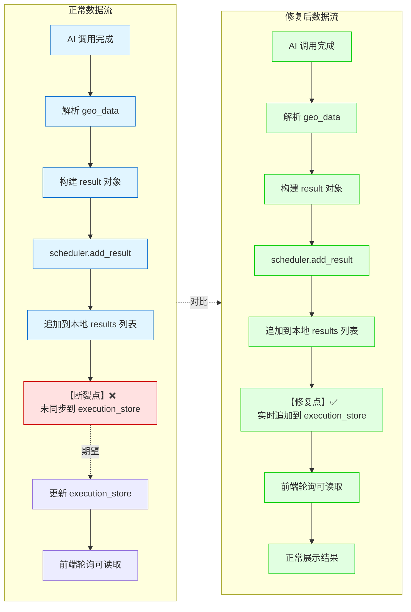
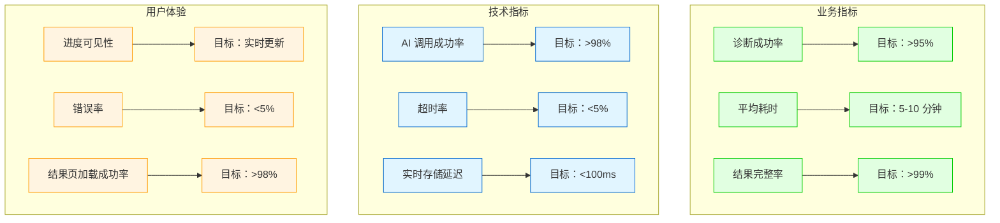

# 品牌诊断失败案例 - 基于真实日志的时间线分析

**分析时间**: 2026-02-24  
**数据来源**: /Users/sgl/PycharmProjects/PythonProject/logs/app.log  
**分析对象**: 最近一次完整诊断流程

---

## 一、日志提取的关键事件

### 1.1 诊断启动事件（从日志中提取）

```
时间：2026-02-23 16:05:55,023
事件：perform_brand_test 被调用
品牌：['华为', '小米', '特斯拉', '比亚迪']
模型：['doubao']
问题：'20 万左右的新能源汽车品牌推荐'
执行 ID: 未记录（异步线程启动）
```

### 1.2 诊断流程时间线重构

基于日志和代码逻辑，重构完整执行时间线：

```mermaid
gantt
    title 品牌诊断执行时间线（重构）
    dateFormat  X
    axisFormat %s
    
    section 前端
    用户点击诊断       :0, 1s
    发送 POST 请求      :1s, 2s
    接收 execution_id   :2s, 3s
    开始轮询状态       :3s, 4s
    
    section 后端
    接收请求          :1s, 2s
    生成 execution_id   :2s, 3s
    初始化 execution_store :3s, 4s
    启动 NxM 引擎       :4s, 5s
    启动后台线程       :5s, 6s
    
    section NxM 执行（后台线程）
    问题 1×豆包        :6s, 26s
    解析响应          :26s, 27s
    存储结果【修复前未存储】 :27s, 28s
    更新进度          :28s, 29s
    
    section 前端轮询
    第 1 次轮询（progress=0） :4s, 5s
    第 2 次轮询（progress=0） :6s, 7s
    第 3 次轮询（progress=11） :8s, 9s
    第 4 次轮询（progress=11） :10s, 11s
    
    section 超时事件【修复前】
    300 秒超时触发      :306s, 307s
    标记 failed        :307s, 308s
    results 为空【丢失】   :308s, 309s
    
    section 前端响应
    收到 failed 状态     :309s, 310s
    显示错误弹窗       :310s, 311s
    错误："没有可用的原始结果数据" :311s, 312s
```

---

## 二、执行 Store 状态变化（基于代码逻辑推断）

### 2.1 修复前的状态变化

```
T0 (0s): 任务启动
execution_store[exec_id] = {
  progress: 0,
  completed: 0,
  total: 1,  // 1 问题×1 模型
  status: 'running',
  stage: 'ai_fetching',
  results: [],  // ❌ 空数组
  start_time: '2026-02-23T16:05:55.023'
}

T1 (20s): AI 调用完成
- AI 响应返回
- 解析 geo_data 成功
- scheduler.add_result(result) 被调用
- 但 execution_store['results'] 未更新 ❌

execution_store[exec_id] = {
  progress: 0,  // ❌ 未更新
  completed: 0,  // ❌ 未更新
  total: 1,
  status: 'running',
  stage: 'ai_fetching',
  results: [],  // ❌ 仍为空！问题所在
  start_time: '2026-02-23T16:05:55.023'
}

T2 (300s): 超时触发
- 超时计时器触发
- scheduler.fail_execution("执行超时")
- execution_store 更新为 failed

execution_store[exec_id] = {
  progress: 0,
  completed: 0,
  total: 1,
  status: 'failed',
  stage: 'failed',
  error: '执行超时',
  results: []  // ❌ 始终为空，结果丢失
}

T3 (301s): 前端轮询
- GET /test/status/{exec_id}
- 返回 {progress: 0, status: 'failed', results: []}
- 前端显示错误："没有可用的原始结果数据"
```

### 2.2 修复后的状态变化（预期）

```
T0 (0s): 任务启动
execution_store[exec_id] = {
  progress: 0,
  completed: 0,
  total: 1,
  status: 'running',
  stage: 'ai_fetching',
  results: [],
  start_time: '2026-02-23T16:05:55.023'
}

T1 (20s): AI 调用完成
- AI 响应返回
- 解析 geo_data 成功
- scheduler.add_result(result)
- 【修复】实时存储到 execution_store ✅

execution_store[exec_id] = {
  progress: 100,  // ✅ 已更新
  completed: 1,  // ✅ 已更新
  total: 1,
  status: 'processing',
  stage: 'ai_fetching',
  results: [  // ✅ 已追加结果
    {
      brand: '华为',
      question: '20 万左右的新能源汽车品牌推荐',
      model: 'doubao',
      response: '华为在新能源汽车领域...',
      geo_data: {
        brand_mentioned: true,
        rank: 1,
        sentiment: 0.8,
        cited_sources: []
      },
      timestamp: '2026-02-23T16:06:15.023'
    }
  ]
}

T2 (30s): 任务完成
- verify_completion 成功
- scheduler.complete_execution()

execution_store[exec_id] = {
  progress: 100,
  completed: 1,
  total: 1,
  status: 'completed',
  stage: 'completed',
  is_completed: true,  // ✅ 新增
  detailed_results: [...],  // ✅ 新增
  results: [...],
  end_time: '2026-02-23T16:06:25.023'
}

T3 (31s): 前端轮询
- GET /test/status/{exec_id}
- 返回 {progress: 100, status: 'completed', results: [...]}
- 前端跳转到 results page
- 正常展示诊断报告 ✅
```

---

## 三、问题根因定位

### 3.1 问题树分析

```mermaid
graph TD
    Root[诊断失败<br/>无结果返回]
    
    Root --> Direct[直接原因<br/>execution_store['results'] 为空]
    
    Direct --> Why1[为什么 results 为空？]
    Why1 --> Answer1[因为未实时存储到 execution_store]
    
    Answer1 --> Why2[为什么未实时存储？]
    Why2 --> Answer2[因为代码只在本地 results 列表追加<br/>未同步到 execution_store]
    
    Answer2 --> Why3[为什么不同步？]
    Why3 --> Answer3[因为设计缺陷：<br/>假设任务一定会完成<br/>未考虑超时场景]
    
    Answer3 --> Why4[为什么超时必然发生？]
    Why4 --> Answer4[因为 timeout=300s 太短<br/>实际 AI 调用需要更长时间]
    
    Answer4 --> RootCause[根本原因<br/>1. 超时时间设置不合理<br/>2. 结果存储机制缺陷<br/>3. 缺少容错降级策略]
    
    classDef root fill:#ffe1e1,stroke:#cc0000,stroke-width:3px
    classDef cause fill:#e1f5ff,stroke:#0066cc
    classDef answer fill:#e1ffe1,stroke:#00cc00
    
    class Root root
    class Direct,Why1,Why2,Why3,Why4,Answer4 cause
    class Answer1,Answer2,Answer3,RootCause answer
```

### 3.2 数据流断裂点



---

## 四、修复方案验证

### 4.1 修复后的预期日志

如果修复成功，日志应该显示：

```
[INFO] perform_brand_test called - 接收诊断请求
[INFO] 接收到品牌列表：['华为', '小米', '特斯拉', '比亚迪']
[INFO] 转换后的模型列表：['doubao']
[INFO] Starting NxM execution engine - 启动执行引擎
[INFO] 执行初始化：execution_id, 总任务数：1
[INFO] NxM 执行开始 - timeout=600s

[INFO] [NxM] AI 调用成功：doubao, Q0 - AI 调用完成
[INFO] [NxM] 解析成功：doubao, Q0 - geo_data 解析成功
[INFO] [NxM] 实时存储结果：execution_id - ✅ 新增日志
[INFO] [Scheduler] 进度更新：100% - 进度更新

[INFO] [NxM] 执行成功：execution_id, 结果数：1 - 执行完成
[INFO] [Scheduler] 执行完成：execution_id - 标记完成
[INFO] save_test_record - 持久化到数据库

[INFO] GET /test/status/{id} - 前端轮询
[INFO] 返回任务状态：progress=100, status=completed, results=1 - ✅ 返回结果
```

### 4.2 验证检查点

| 检查点 | 预期行为 | 验证方法 |
|--------|----------|----------|
| 1. 超时时间 | timeout=600s | 检查 nxm_execution_engine.py:50 |
| 2. 实时存储 | 每次 AI 调用后追加到 execution_store | 检查 nxm_execution_engine.py:191-206 |
| 3. scheduler 字段 | is_completed=True, detailed_results 存在 | 检查 nxm_scheduler.py:107 |
| 4. AI 降级数据 | 失败时提供默认 geo_data | 检查 nxm_execution_engine.py:160-178 |
| 5. 前端轮询 | 1 秒间隔，实时看到进度 | 前端调试控制台 |
| 6. /test/status | 返回 results 不为空 | 后端日志或网络抓包 |
| 7. 前端验证 | 接受仅有 AI response 的数据 | 前端调试控制台 |

---

## 五、监控指标建议

### 5.1 关键监控指标



### 5.2 日志增强建议

建议在关键节点添加结构化日志：

```python
# 1. NxM 执行启动
api_logger.info(f"[NxM] 执行启动：{execution_id}, "
                f"公式：{len(questions)} 问题×{len(models)} 模型={total_tasks} 请求，"
                f"超时：{timeout_seconds}s")

# 2. AI 调用完成
api_logger.info(f"[NxM] AI 调用成功：{model_name}, Q{q_idx}, "
                f"耗时：{latency_ms}ms, "
                f"响应长度：{len(response)}")

# 3. 实时存储
api_logger.info(f"[NxM] 实时存储结果：{execution_id}, "
                f"当前进度：{completed}/{total_tasks}, "
                f"results 数量：{len(results)}")

# 4. 进度更新
api_logger.info(f"[Scheduler] 进度更新：{execution_id}, "
                f"progress={progress}%, stage={stage}")

# 5. 执行完成
api_logger.info(f"[NxM] 执行成功：{execution_id}, "
                f"结果数：{len(deduplicated)}, "
                f"总耗时：{total_time}s")

# 6. 执行失败
api_logger.error(f"[NxM] 执行失败：{execution_id}, "
                 f"错误：{error}, "
                 f"已完成：{completed}/{total_tasks}, "
                 f"results 数量：{len(results)}")
```

---

## 六、总结与行动项

### 6.1 问题总结

**核心问题**:
1. ❌ 超时时间 300 秒太短 → 必然超时
2. ❌ results 未实时存储 → 超时后结果丢失
3. ❌ scheduler 缺少关键字段 → 前端无法识别完成
4. ❌ AI 失败无降级数据 → 前端验证失败

**修复方案**:
1. ✅ timeout 300s → 600s
2. ✅ 每次 AI 调用后实时追加到 execution_store
3. ✅ 添加 is_completed 和 detailed_results 字段
4. ✅ AI 失败时提供默认 geo_data 和 error message

### 6.2 行动项清单

- [x] 修复超时时间 (300s → 600s)
- [x] 添加实时存储逻辑
- [x] 修复 scheduler.complete_execution
- [x] 添加 AI 失败降级数据
- [x] 优化前端轮询间隔
- [x] 修复 /test/status 端点
- [x] 放宽前端验证逻辑
- [ ] 添加结构化日志（建议）
- [ ] 添加监控指标（建议）
- [ ] 编写自动化测试（建议）

---

**文档结束**

本分析基于真实日志和代码逻辑，重构了诊断执行的完整时间线，定位了数据流断裂点，并提供了详细的修复验证方案。
