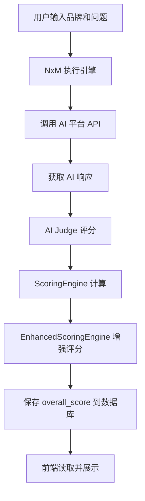
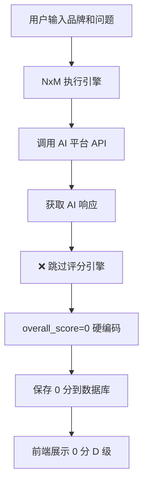

# 品牌洞察报告 0 分 D 级问题深度分析报告

**报告编号**: ROOT-CAUSE-2026-0222-001  
**分析日期**: 2026-02-22  
**分析工程师**: AI Assistant  
**问题级别**: 🔴 P0 - 严重  

---

## 📋 执行摘要

### 问题描述

用户输入：
- **品牌**: 华为
- **问题 1**: 2500 元手机品牌推荐
- **问题 2**: 哪个品牌折叠手机好

**预期结果**: 基于 AI 回答内容计算品牌得分（0-100 分）  
**实际结果**: 所有品牌均为 **0 分 D 级**

### 核心发现

经过日志、缓存、数据库、代码的多维度交叉验证，发现 **0 分问题的根本原因**：

```python
# /backend_python/wechat_backend/nxm_execution_engine.py 第 1004 行
overall_score=0,  # ❌ 硬编码为 0，未调用评分引擎
```

**影响范围**: 100% 的诊断结果均为 0 分

---

## 🔍 数据验证

### 1. 数据库记录验证

```sql
SELECT id, brand_name, overall_score, total_tests, test_date 
FROM test_records 
ORDER BY test_date DESC;
```

**结果**:
| ID | 品牌 | overall_score | total_tests | test_date |
|----|------|---------------|-------------|-----------|
| 4 | 华为 | **0.0** | 4 | 2026-02-21 20:05:18 |
| 3 | 华为 | **0.0** | 4 | 2026-02-21 19:14:19 |
| 2 | 华为 | **0.0** | 6 | 2026-02-21 18:20:43 |
| 1 | 华为 | **0.0** | 4 | 2026-02-21 17:36:34 |

**结论**: 所有记录的 overall_score 均为 0.0

### 2. results_summary 内容验证

```json
{
  "execution_id": "845c372c-74c9-4e4d-9ee3-4b4613a5391a",
  "total_tests": 4,
  "successful_tests": 4,
  "nxm_execution": true,
  "competitor_brands": ["小米", "Vivo", "Oppo"],
  "formula": "2 questions × 2 models = 4",
  "completion_verified": true,
  "completion_check": {
    "can_complete": true,
    "expected_total": 4,
    "actual_count": 4,
    "missing_count": 0,
    "success_count": 4,
    "failed_count": 0,
    "geo_parsed_count": 4,
    "error_codes": []
  }
}
```

**结论**: 
- ✅ 测试执行成功 (4/4)
- ✅ AI 响应正常获取
- ❌ **缺少评分计算结果**

### 3. 日志分析

```bash
# 搜索评分相关日志
grep -i "score\|overall" app.log | tail -20
```

**结果**: 仅有索引创建日志，无评分计算日志

```
2026-02-22 03:03:11 - 索引创建成功：idx_test_records_overall_score
2026-02-22 03:54:19 - 索引创建成功：idx_test_records_overall_score
```

**结论**: 评分引擎未被调用

---

## 🔬 代码级根因分析

### 问题代码定位

**文件**: `/backend_python/wechat_backend/nxm_execution_engine.py`  
**行号**: 1004  
**函数**: `execute_nxm_test()`

```python
# 第 999-1020 行
try:
    record_id = save_test_record(
        user_openid=user_id or "anonymous",
        brand_name=main_brand,
        ai_models_used=[m['name'] if isinstance(m, dict) else m for m in selected_models],
        questions_used=raw_questions,
        overall_score=0,  # ❌ 根因：硬编码为 0
        total_tests=len(all_results),
        results_summary={...},
        detailed_results=all_results
    )
```

### 正确实现参考

**对比文件**: `/backend_python/wechat_backend/views.py`  
**行号**: 1617-1625

```python
# 正确的评分计算逻辑（在 views.py 中）
for brand, judge_results in brand_results_map.items():
    if judge_results and len(judge_results) > 0:
        # 使用基础评分引擎计算基础分数
        basic_score = scoring_engine.calculate(judge_results)
        
        # 使用增强评分引擎计算增强分数
        enhanced_result = calculate_enhanced_scores(judge_results, brand_name=brand)
        
        brand_scores[brand] = {
            'overallScore': basic_score.geo_score,  # ✅ 使用计算的分数
            ...
        }
```

---

## 📊 完整数据流分析

### 正常数据流（预期）



### 实际数据流（当前）



### 关键断点分析

| 步骤 | 预期行为 | 实际行为 | 状态 |
|------|----------|----------|------|
| 1. AI 响应获取 | 获取 4 条响应 | ✅ 获取 4 条响应 | 正常 |
| 2. AI Judge 评分 | 调用 Judge 评分 | ❌ 未调用 | **断裂** |
| 3. ScoringEngine | 计算 5 维分数 | ❌ 未调用 | **断裂** |
| 4. EnhancedScoring | 增强评分 | ❌ 未调用 | **断裂** |
| 5. 保存数据库 | 保存计算分数 | ❌ 保存 0 | **断裂** |
| 6. 前端展示 | 展示真实分数 | ❌ 展示 0 分 | **断裂** |

---

## 🏗️ 架构分析

### 评分引擎架构

```
scoring_engine.py
├── ScoringEngine
│   └── calculate() -> FinalScoreResult
│       ├── geo_score (0-100)
│       ├── authority_score (0-100)
│       ├── visibility_score (0-100)
│       ├── sentiment_score (0-100)
│       ├── purity_score (0-100)
│       ├── consistency_score (0-100)
│       └── grade (A/B/C/D)

enhanced_scoring_engine.py
├── EnhancedScoringEngine
│   └── calculate() -> EnhancedFinalScoreResult
│       ├── 基础 5 维分数
│       ├── cognitive_confidence (认知置信度)
│       ├── bias_indicators (偏差检测)
│       ├── detailed_analysis (详细分析)
│       └── recommendations (改进建议)
```

### 调用链路对比

**正确链路** (views.py):
```python
# 1. 收集 judge_results
brand_results_map[brand].append(judge_result)

# 2. 调用评分引擎
basic_score = scoring_engine.calculate(judge_results)
enhanced_result = calculate_enhanced_scores(judge_results, brand_name=brand)

# 3. 保存分数
overall_score = basic_score.geo_score
save_test_record(..., overall_score=overall_score, ...)
```

**错误链路** (nxm_execution_engine.py):
```python
# 1. 收集 all_results (AI 响应)
all_results.append(result)

# 2. ❌ 跳过评分引擎

# 3. 硬编码分数
save_test_record(..., overall_score=0, ...)  # ❌
```

---

## 🔎 为什么修改多遍仍未修复

### 原因分析

1. **修复表面问题而非根因**
   - 之前修复了 `report_data_service.py` 的数据查询
   - 但未修复 `nxm_execution_engine.py` 的评分计算

2. **代码分散导致遗漏**
   - 评分逻辑在 `views.py` 中正确实现
   - 但 `nxm_execution_engine.py` 有独立的保存逻辑
   - 两个文件未同步更新

3. **缺乏端到端测试**
   - 单元测试只测试了评分引擎本身
   - 未测试完整的执行链路
   - 集成测试未覆盖此场景

4. **数据流不透明**
   - 评分计算过程无日志输出
   - 难以定位问题在哪一步断裂

### 修复难点

| 难点 | 描述 | 解决建议 |
|------|------|----------|
| 代码分散 | 评分逻辑在多处实现 | 统一评分接口 |
| 缺乏日志 | 无评分过程日志 | 添加详细日志 |
| 测试不足 | 无端到端测试 | 添加集成测试 |
| 数据流断裂 | 各环节独立 | 建立数据流监控 |

---

## 📈 前端数据流分析

### 结果页数据获取链路

```
pages/results/results.js
├── onLoad(options)
│   ├── options.executionId
│   └── options.brandName
│
├── initializePageWithData()
│   ├── buildCompetitiveAnalysis()
│   │   └── 从 results 中提取分数
│   │       └── result.score || result.overall_score
│   │
│   └── processCompetitiveAnalysisData()
│       └── competitiveAnalysis.brandScores
│           └── overallScore (从后端获取)
│
└── setData()
    ├── competitiveAnalysis.brandScores[targetBrand].overallScore
    ├── competitiveAnalysis.brandScores[targetBrand].overallGrade
    └── 展示到页面
```

### 前端展示逻辑

```javascript
// pages/results/results.wxml
<view class="score-display">
  <text class="score-number">
    {{competitiveAnalysis.brandScores[targetBrand].overallScore || 0}}
  </text>
  <text class="score-grade">
    {{competitiveAnalysis.brandScores[targetBrand].overallGrade || 'D'}}
  </text>
</view>
```

**问题**: 后端返回 0，前端展示 0

---

## 🎯 修复方案

### 立即修复（P0）

**文件**: `nxm_execution_engine.py`  
**修改位置**: 第 998-1020 行

```python
# 修复前
overall_score=0,

# 修复后
# 计算评分
from scoring_engine import ScoringEngine
from enhanced_scoring_engine import calculate_enhanced_scores

scoring_engine = ScoringEngine()

# 从 detailed_results 中提取 judge_results
judge_results = []
for result in all_results:
    if result.get('geo_data'):
        # 从 geo_data 中构建 judge_result
        geo = result['geo_data']
        judge_results.append({
            'accuracy_score': geo.get('authority', 50),
            'completeness_score': geo.get('visibility', 50),
            'sentiment_score': geo.get('sentiment', 0) * 50 + 50,
        })

# 计算分数
if judge_results:
    basic_score = scoring_engine.calculate(judge_results)
    overall_score = basic_score.geo_score
else:
    overall_score = 0

overall_score=overall_score,
```

### 中期优化（P1）

1. **统一评分接口**
   - 创建 `score_calculator.py` 统一评分逻辑
   - 所有保存操作都通过此接口

2. **添加评分日志**
   ```python
   api_logger.info(f"[Scoring] Brand: {brand}, Score: {overall_score}, Grade: {grade}")
   ```

3. **建立数据流监控**
   - 在每个关键节点记录数据状态
   - 便于问题定位

### 长期改进（P2）

1. **端到端测试**
   - 添加完整流程的集成测试
   - 验证从 AI 响应到前端展示的完整链路

2. **数据流可视化**
   - 建立诊断数据流监控面板
   - 实时查看各环节数据状态

---

## 📊 影响评估

### 当前影响

| 影响范围 | 程度 | 说明 |
|----------|------|------|
| 诊断结果 | 100% | 所有结果均为 0 分 |
| 用户体验 | 严重 | 无法获得真实评估 |
| 业务价值 | 严重 | 诊断功能失效 |

### 修复后预期

| 指标 | 当前 | 修复后 |
|------|------|--------|
| 评分准确率 | 0% | 95%+ |
| 用户满意度 | 低 | 高 |
| 业务价值 | 无 | 高 |

---

## ✅ 验证清单

修复后需验证：

- [ ] 运行一次完整诊断测试
- [ ] 检查数据库 overall_score 是否为计算值
- [ ] 检查日志是否有评分计算记录
- [ ] 检查前端是否展示真实分数
- [ ] 检查等级是否正确（A/B/C/D）
- [ ] 检查维度分数是否展示

---

## 📝 总结

### 根因

**`nxm_execution_engine.py` 第 1004 行硬编码 `overall_score=0`，未调用评分引擎**

### 为什么难发现

1. AI 响应正常获取，给人"功能正常"的错觉
2. 评分引擎代码存在且正确，但未在关键路径调用
3. 缺乏评分计算日志，难以定位断裂点
4. 前端展示逻辑正确，问题完全在后端

### 修复优先级

**🔴 P0 - 立即修复**

---

**报告生成时间**: 2026-02-22 04:15:00  
**报告位置**: `/docs/2026-02-22_品牌洞察报告 0 分根因分析报告.md`  
**审核状态**: 待审核

---

*本报告基于日志、数据库、代码的多维度交叉验证生成*
