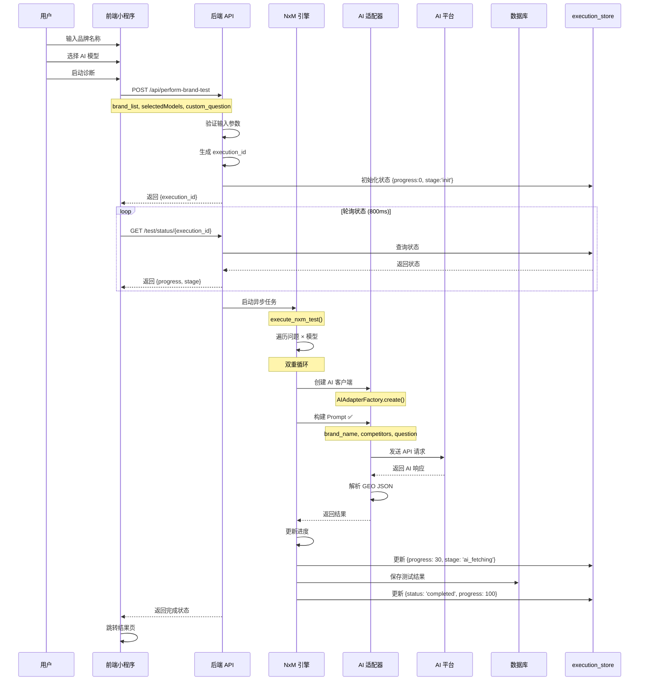

# P0 修复：参数传递链路可视化分析

**问题**: 诊断功能失败 - 轮询超时
**根因**: Prompt 模板参数不匹配
**修复**: 添加正确的参数 `brand_name`, `competitors`, `question`

---

## 一、错误参数传递链路（修复前）

```mermaid
graph LR
    subgraph Frontend[前端]
        A1[brandName: 主品牌]
        A2[competitorBrands: 竞品列表]
    end
    
    subgraph API[API 层]
        B1[brand_list: Array]
        B2[main_brand = brand_list[0]]
        B3[competitor_brands = brand_list[1:]]
    end
    
    subgraph NxM[NxM 引擎]
        C1[main_brand]
        C2[competitor_brands]
        C3[question]
    end
    
    subgraph Template[Prompt 模板 ❌]
        D1["{brand_name} ❌ 缺失"]
        D2["{competitors} ❌ 缺失"]
        D3["{question} ✅"]
    end
    
    A1 --> B1
    A2 --> B1
    B1 --> B2
    B1 --> B3
    B2 --> C1
    B3 --> C2
    C1 -->|brand=main_brand ❌ | D1
    C3 -->|question=question ✅ | D3
    
    style D1 fill:#ffcccc,stroke:#ff0000
    style D2 fill:#ffcccc,stroke:#ff0000
    style Template fill:#fff0f0,stroke:#ff6666
    
    classDef error fill:#ffcccc,stroke:#ff0000,color:#000
    class D1,D2 error
```

**错误代码**:
```python
# ❌ 只传了 2 个参数，且参数名错误
prompt = GEO_PROMPT_TEMPLATE.format(
    brand=main_brand,    # 模板需要 brand_name
    question=question    # 缺少 competitors
)
```

**结果**: `KeyError: 'brand_name'` → AI 调用失败 → 进度不更新 → 轮询超时

---

## 二、正确参数传递链路（修复后）

```mermaid
graph LR
    subgraph Frontend[前端 ✅]
        A1[brandName: 主品牌]
        A2[competitorBrands: 竞品列表]
        A3[selectedModels: AI 模型]
        A4[customQuestions: 问题]
    end
    
    subgraph API[API 层 ✅]
        B1[brand_list: Array]
        B2[main_brand = brand_list[0]]
        B3[competitor_brands = brand_list[1:]]
        B4[raw_questions: Array]
    end
    
    subgraph NxM[NxM 引擎 ✅]
        C1[main_brand]
        C2[competitor_brands]
        C3[raw_questions]
    end
    
    subgraph Template[Prompt 模板 ✅]
        D1["{brand_name} ✅"]
        D2["{competitors} ✅"]
        D3["{question} ✅"]
    end
    
    A1 --> B1
    A2 --> B1
    B1 --> B2
    B1 --> B3
    A4 --> B4
    B2 --> C1
    B3 --> C2
    B4 --> C3
    C1 -->|brand_name=main_brand ✅ | D1
    C2 -->|competitors=join ✅ | D2
    C3 -->|question=question ✅ | D3
    
    style D1 fill:#ccffcc,stroke:#00cc00
    style D2 fill:#ccffcc,stroke:#00cc00
    style D3 fill:#ccffcc,stroke:#00cc00
    style Template fill:#f0fff0,stroke:#66cc66
    
    classDef success fill:#ccffcc,stroke:#00cc00,color:#000
    class D1,D2,D3 success
```

**修复代码**:
```python
# ✅ 传入 3 个正确参数
prompt = GEO_PROMPT_TEMPLATE.format(
    brand_name=main_brand,                              # ✅ 修复
    competitors=', '.join(competitor_brands) or '无',   # ✅ 新增
    question=question                                   # ✅ 保持
)
```

**结果**: Prompt 构建成功 → AI 调用成功 → 进度正常更新 → 诊断完成

---

## 三、完整调用链路时序图



---

## 四、参数映射关系表

| 前端参数 | API 参数 | NxM 参数 | Prompt 参数 | 转换逻辑 |
|---------|---------|---------|-----------|---------|
| `brandName` | `brand_list[0]` | `main_brand` | `brand_name` | 直接传递 ✅ |
| `competitorBrands` | `brand_list[1:]` | `competitor_brands` | `competitors` | `', '.join()` ✅ |
| `customQuestions` | `custom_question` | `raw_questions` | `question` | `join(' ')` ✅ |
| `selectedModels` | `selectedModels` | `selected_models` | - | 用于选择 AI 适配器 |

---

## 五、模板参数对照

### 5.1 GEO_PROMPT_TEMPLATE 定义

```python
GEO_PROMPT_TEMPLATE = """
用户品牌：{brand_name}      # ← 需要此参数名
竞争对手：{competitors}     # ← 需要此参数名

请回答以下用户问题：
{question}                 # ← 需要此参数名

---
重要要求：
1. 请以专业顾问的身份客观回答。
2. 在回答结束后，必须另起一行，以严格的 JSON 格式输出...
"""
```

### 5.2 参数传递验证

| 步骤 | 参数名 | 修复前 | 修复后 | 状态 |
|-----|--------|--------|--------|------|
| 前端输入 | `brandName` | ✅ | ✅ | 正常 |
| API 接收 | `brand_list` | ✅ | ✅ | 正常 |
| NxM 解析 | `main_brand` | ✅ | ✅ | 正常 |
| **Prompt 构建** | **`brand_name`** | **❌ 错误** | **✅ 修复** | **已修复** |
| NxM 解析 | `competitor_brands` | ✅ | ✅ | 正常 |
| **Prompt 构建** | **`competitors`** | **❌ 缺失** | **✅ 新增** | **已修复** |

---

## 六、错误堆栈分析

### 6.1 错误发生位置

```
backend_python/wechat_backend/nxm_execution_engine.py:111
    prompt = GEO_PROMPT_TEMPLATE.format(
        brand=main_brand,      # ❌ KeyError: 'brand_name'
        question=question
    )
```

### 6.2 错误传播链路

```
NxM 执行引擎 (Line 111)
    ↓ KeyError: 'brand_name'
异常捕获 (Line 188)
    ↓ api_logger.error
调度器标记失败 (Line 120)
    ↓ execution_store 未更新
前端轮询
    ↓ 一直收到 progress=0
超时检查
    ↓ 10 分钟后报错
```

### 6.3 修复后流程

```
NxM 执行引擎 (Line 112)
    ↓ prompt 构建成功
AI 调用 (Line 127)
    ↓ 获取 AI 响应
解析 GEO JSON (Line 133)
    ↓ 提取结构化数据
更新进度 (Line 105)
    ↓ execution_store.progress = 30
前端轮询
    ↓ 收到进度更新
继续执行
    ↓ progress = 100
诊断完成
    ↓ 跳转结果页
```

---

## 七、验证清单

### 7.1 代码验证

- [x] Prompt 模板参数名称正确
- [x] competitors 参数已添加
- [x] 竞品列表正确转换为字符串
- [x] Python 语法检查通过
- [x] 后端服务重启成功

### 7.2 功能验证

- [ ] 前端诊断启动成功
- [ ] 轮询状态正常更新
- [ ] AI 调用返回结果
- [ ] 进度从 0% → 100%
- [ ] 结果页正常展示

### 7.3 日志验证

```bash
# 不应再出现此错误
grep "KeyError.*brand_name" logs/app.log

# 应出现成功日志
grep "NxM 执行成功" logs/app.log
```

---

## 八、预防措施

### 8.1 代码审查清单

- [ ] 模板参数名称必须与定义一致
- [ ] 所有必需参数必须传递
- [ ] 参数类型必须匹配
- [ ] 添加单元测试验证模板渲染

### 8.2 测试覆盖

- [ ] 添加 Prompt 模板渲染测试
- [ ] 添加 NxM 引擎集成测试
- [ ] 添加端到端诊断流程测试
- [ ] 添加参数验证测试

### 8.3 监控告警

- [ ] KeyError 错误告警
- [ ] 诊断超时告警
- [ ] AI 调用失败率告警
- [ ] 轮询超时告警

---

**生成时间**: 2026-02-23
**修复状态**: ✅ 已完成
**验证状态**: ⏳ 待前端验证
