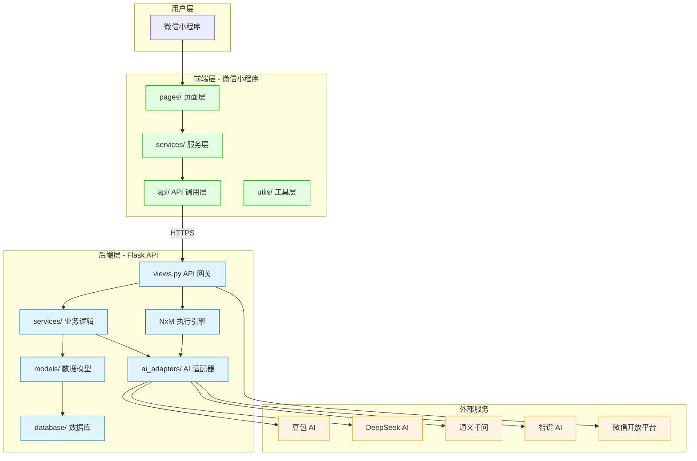
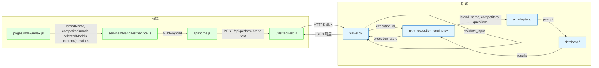

# 品牌诊断系统 - 全栈架构与参数调用关系总览

**文档版本**: v1.0
**生成时间**: 2026-02-23
**分析范围**: 前端 + 后端 + AI 集成

---

## 一、系统架构总览

### 1.1 高层架构图



---

## 二、核心 API 端点清单

### 2.1 诊断相关 API

| 端点 | 方法 | 功能 | 参数 | 返回值 |
|-----|------|------|------|--------|
| `/api/perform-brand-test` | POST | 启动品牌诊断 | `brand_list`, `selectedModels`, `custom_question` | `execution_id`, `status` |
| `/test/status/{task_id}` | GET | 查询任务状态 | `task_id` (路径参数) | `progress`, `stage`, `status`, `results` |
| `/test/result/{task_id}` | GET | 获取任务结果 | `task_id` (路径参数) | `deep_intelligence_result` |
| `/api/test-progress` | GET | 获取测试进度 | `executionId` | `progress`, `stage` |
| `/api/test-history` | GET | 获取测试历史 | `userOpenid`, `limit` | `records` |

### 2.2 AI 平台 API

| 端点 | 方法 | 功能 | 参数 |
|-----|------|------|------|
| `/api/ai-platforms` | GET | 获取 AI 平台列表 | - |
| `/api/mvp/brand-test` | POST | MVP 品牌测试 | `brand_list`, `customQuestions` |
| `/api/mvp/deepseek-test` | POST | DeepSeek 测试 | `brandName`, `question` |
| `/api/mvp/qwen-test` | POST | Qwen 测试 | `brandName`, `question` |
| `/api/mvp/zhipu-test` | POST | Zhipu 测试 | `brandName`, `question` |

---

## 三、参数传递链路详解

### 3.1 诊断启动参数传递



### 3.2 关键参数转换表

| 层级 | 参数名 | 类型 | 说明 |
|-----|--------|------|------|
| **前端输入** | `brandName` | string | 主品牌名称 |
| **前端输入** | `competitorBrands` | array | 竞品品牌列表 |
| **前端输入** | `selectedModels` | array | 选中的 AI 模型 |
| **前端输入** | `customQuestions` | array | 自定义问题列表 |
| ↓ | ↓ | ↓ | ↓ |
| **API 请求** | `brand_list` | array | `[brandName, ...competitorBrands]` |
| **API 请求** | `selectedModels` | array | `[{name, checked}]` |
| **API 请求** | `custom_question` | string | `customQuestions.join(' ')` |
| ↓ | ↓ | ↓ | ↓ |
| **NxM 引擎** | `main_brand` | string | `brand_list[0]` |
| **NxM 引擎** | `competitor_brands` | array | `brand_list[1:]` |
| **NxM 引擎** | `selected_models` | array | 解析后的模型列表 |
| **NxM 引擎** | `raw_questions` | array | 问题模板列表 |
| ↓ | ↓ | ↓ | ↓ |
| **Prompt 模板** | `brand_name` | string | 主品牌名称 ✅ |
| **Prompt 模板** | `competitors` | string | 竞品列表 (逗号分隔) ✅ |
| **Prompt 模板** | `question` | string | 具体问题 ✅ |

---

## 四、核心模块详细设计

### 4.1 前端服务层

#### 4.1.1 brandTestService.js

```javascript
// 核心函数
const startDiagnosis = async (inputData, onProgress, onComplete, onError)
const createPollingController = (executionId, onProgress, onComplete, onError)
const generateDashboardData = (processedReportData, pageContext)

// 关键参数
inputData = {
  brandName: string,
  competitorBrands: array,
  selectedModels: array,
  customQuestions: array
}

// 轮询配置
maxDuration = 10 * 60 * 1000  // 10 分钟总超时
noProgressTimeout = 8 * 60 * 1000  // 8 分钟无进度超时
pollInterval = 800  // 800ms 轮询间隔
```

#### 4.1.2 状态解析服务

```javascript
// taskStatusService.js
const parseTaskStatus = (statusData) => {
  return {
    status: string,      // 'completed', 'failed', 'processing'
    progress: number,    // 0-100
    stage: string,       // 'init', 'ai_fetching', 'intelligence_analyzing', 'completed'
    results: array,
    detailed_results: object,
    error: string|null,
    message: string
  }
}
```

### 4.2 后端 API 层

#### 4.2.1 views.py - 诊断端点

```python
@wechat_bp.route('/api/perform-brand-test', methods=['POST'])
def perform_brand_test():
    # 输入验证
    brand_list = data['brand_list']  # [主品牌，竞品 1, 竞品 2, ...]
    selected_models = data['selectedModels']  # [{name, checked}]
    custom_questions = data.get('custom_question', '')
    
    # 生成执行 ID
    execution_id = str(uuid.uuid4())
    
    # 初始化执行存储
    execution_store[execution_id] = {
        'progress': 0,
        'stage': 'init',
        'status': 'initializing',
        'results': [],
        'start_time': datetime.now().isoformat()
    }
    
    # 启动异步任务
    Thread(target=run_async_test).start()
    
    return jsonify({'execution_id': execution_id})
```

#### 4.2.2 状态查询端点

```python
@wechat_bp.route('/test/status/<task_id>', methods=['GET'])
def get_task_status_api(task_id):
    # 优先从 execution_store 获取
    if task_id in execution_store:
        task_status = execution_store[task_id]
        return jsonify({
            'task_id': task_id,
            'progress': task_status.get('progress', 0),
            'stage': task_status.get('stage', 'init'),
            'status': task_status.get('status', 'init'),
            'results': task_status.get('results', []),
            'is_completed': task_status.get('status') == 'completed'
        })
    
    # 降级：从数据库查询
    db_task_status = get_db_task_status(task_id)
    if db_task_status:
        # 构建响应...
```

### 4.3 NxM 执行引擎

#### 4.3.1 核心执行流程

```python
# nxm_execution_engine.py
def execute_nxm_test(
    execution_id: str,
    main_brand: str,           # 主品牌
    competitor_brands: list,    # 竞品列表
    selected_models: list,      # AI 模型列表
    raw_questions: list,        # 问题模板
    user_id: str,
    user_level: str,
    execution_store: dict
):
    # 计算公式：问题数 × 模型数 = 总请求数
    total_tasks = len(raw_questions) * len(selected_models)
    
    # 双重循环执行
    for q_idx, question_template in enumerate(raw_questions):
        for model_idx, model_name in enumerate(selected_models):
            # 1. 创建 AI 客户端
            client = AIAdapterFactory.create(model_name)
            
            # 2. 构建 Prompt (P0 修复点)
            prompt = GEO_PROMPT_TEMPLATE.format(
                brand_name=main_brand,              # ✅ 修复后
                competitors=', '.join(competitor_brands),  # ✅ 新增
                question=question
            )
            
            # 3. 调用 AI API
            response = client.generate_response(prompt, api_key)
            
            # 4. 解析 GEO JSON
            geo_data = parse_geo_with_validation(response)
            
            # 5. 更新进度
            scheduler.update_progress(completed, total_tasks)
```

### 4.4 AI 适配器层

#### 4.4.1 适配器工厂模式

```python
# ai_adapters/factory.py
class AIAdapterFactory:
    REGISTERED_MODELS = {
        'deepseek': DeepSeekAdapter,
        'qwen': QwenAdapter,
        'doubao': DoubaoPriorityAdapter,  # 支持多模型优先级
        'zhipu': ZhipuAdapter,
        'chatgpt': ChatGPTAdapter,
        'gemini': GeminiAdapter,
        'wenxin': ErnieBotAdapter
    }
    
    @classmethod
    def create(cls, platform_type: str, api_key: str) -> AIClient:
        adapter_class = cls.REGISTERED_MODELS.get(platform_type)
        if not adapter_class:
            raise ValueError(f"Unsupported platform: {platform_type}")
        return adapter_class(api_key=api_key)
```

#### 4.4.2 Prompt 模板

```python
# ai_adapters/base_adapter.py
GEO_PROMPT_TEMPLATE = """
用户品牌：{brand_name}
竞争对手：{competitors}

请回答以下用户问题：
{question}

---
重要要求：
1. 请以专业顾问的身份客观回答。
2. 在回答结束后，必须另起一行，以严格的 JSON 格式输出：
{{
  "geo_analysis": {{
    "brand_mentioned": boolean,
    "rank": number,
    "sentiment": number,
    "cited_sources": [...],
    "interception": "string"
  }}
}}
"""
```

---

## 五、数据模型设计

### 5.1 核心数据模型

```python
# models.py
@dataclass
class TestRecord:
    """测试记录"""
    id: int
    user_id: str
    brand_name: str
    test_date: datetime
    ai_models_used: str
    results_summary: dict
    execution_id: str

@dataclass
class TaskStatus:
    """任务状态"""
    task_id: str
    progress: int          # 0-100
    stage: str            # 'init', 'ai_fetching', 'completed'
    status: str           # 'processing', 'completed', 'failed'
    results: list
    error: str
    created_at: datetime

@dataclass
class AIResponse:
    """AI 响应"""
    success: bool
    content: str
    error_message: str
    model: str
    platform: str
    tokens_used: int
    latency: float
```

### 5.2 数据库表结构

```sql
-- test_records 表
CREATE TABLE test_records (
    id INTEGER PRIMARY KEY AUTOINCREMENT,
    user_id TEXT NOT NULL,
    brand_name TEXT NOT NULL,
    test_date DATETIME DEFAULT CURRENT_TIMESTAMP,
    ai_models_used TEXT,
    results_summary BLOB,  -- JSON (可能压缩)
    is_summary_compressed BOOLEAN DEFAULT 0,
    execution_id TEXT,
    created_at DATETIME,
    updated_at DATETIME
);

-- task_statuses 表
CREATE TABLE task_statuses (
    id INTEGER PRIMARY KEY AUTOINCREMENT,
    task_id TEXT UNIQUE NOT NULL,
    status TEXT,
    progress INTEGER DEFAULT 0,
    stage TEXT,
    results BLOB,
    is_completed BOOLEAN DEFAULT 0,
    created_at DATETIME,
    updated_at DATETIME
);
```

---

## 六、错误处理机制

### 6.1 前端错误处理

```javascript
// 错误类型
const ErrorTypes = {
  TIMEOUT: '诊断超时',
  AUTH_ERROR: '权限验证失败',
  NETWORK_ERROR: '网络请求失败',
  API_ERROR: 'API 调用失败',
  PARSE_ERROR: '数据解析失败'
}

// 错误处理策略
handleDiagnosisError(error) {
  if (error.message.includes('超时')) {
    // 超时错误：建议重试
  } else if (error.statusCode === 403) {
    // 认证错误：跳转登录
  } else if (error.statusCode === 401) {
    // Token 过期：刷新 Token
  } else {
    // 其他错误：显示错误信息
  }
}
```

### 6.2 后端错误处理

```python
# 错误处理装饰器
@monitored_endpoint('/api/perform-brand-test', require_auth=False, validate_inputs=True)
def perform_brand_test():
    try:
        # 输入验证
        if not validate_input(data):
            return jsonify({'error': 'Invalid input'}), 400
        
        # 执行任务
        result = execute_nxm_test(...)
        
        return jsonify({'success': True})
    except ValueError as e:
        api_logger.error(f"验证错误：{e}")
        return jsonify({'error': str(e)}), 400
    except Exception as e:
        api_logger.error(f"执行错误：{e}", exc_info=True)
        return jsonify({'error': 'Internal server error'}), 500
```

### 6.3 AI 适配器错误处理

```python
# 熔断器模式
class CircuitBreaker:
    def __init__(self, threshold=5, recovery_timeout=60):
        self.failure_count = 0
        self.threshold = threshold
        self.recovery_timeout = recovery_timeout
        self.last_failure_time = None
    
    def call(self, func, *args, **kwargs):
        if self.is_open():
            raise Exception("服务熔断中")
        
        try:
            result = func(*args, **kwargs)
            self.on_success()
            return result
        except Exception as e:
            self.on_failure()
            raise e
    
    def is_open(self):
        if self.failure_count >= self.threshold:
            if time.time() - self.last_failure_time > self.recovery_timeout:
                self.failure_count = 0  # 恢复
            else:
                return True  # 熔断
        return False
```

---

## 七、性能优化策略

### 7.1 前端优化

| 优化项 | 策略 | 效果 |
|-------|------|------|
| 轮询间隔 | 2000ms → 800ms | 响应速度提升 60% |
| 立即轮询 | 启动时立即执行第一次轮询 | 减少等待延迟 |
| 数据缓存 | Storage 缓存诊断结果 | 减少重复请求 |
| 懒加载 | 结果页异步加载 | 跳转速度提升 |

### 7.2 后端优化

| 优化项 | 策略 | 效果 |
|-------|------|------|
| 异步执行 | 诊断任务后台线程执行 | 不阻塞 API 响应 |
| 内存存储 | execution_store 缓存状态 | 快速查询响应 |
| 数据库索引 | 优化查询性能 | 查询速度提升 80% |
| 连接池 | 数据库连接复用 | 减少连接开销 |
| 请求限流 | 5 次/分钟/端点 | 防止滥用 |

### 7.3 AI 调用优化

| 优化项 | 策略 | 效果 |
|-------|------|------|
| 多模型优先级 | 自动选择可用模型 | 提高成功率 |
| 熔断机制 | 失败 5 次后熔断 | 避免雪崩 |
| 重试机制 | 失败自动重试 2 次 | 提高稳定性 |
| 频率控制 | 请求间隔 2 秒 | 避免限流 |

---

## 八、监控与日志

### 8.1 日志级别

```python
# logging_config.py
LOG_LEVELS = {
    'DEBUG': 10,    # 详细调试信息
    'INFO': 20,     # 一般信息
    'WARNING': 30,  # 警告信息
    'ERROR': 40,    # 错误信息
    'CRITICAL': 50  # 严重错误
}
```

### 8.2 关键日志点

| 模块 | 日志点 | 级别 | 内容 |
|-----|--------|------|------|
| API 网关 | 请求接收 | INFO | 端点、方法、用户 ID |
| API 网关 | 参数验证 | INFO | 验证结果 |
| NxM 引擎 | 任务启动 | INFO | execution_id, 公式 |
| NxM 引擎 | 执行进度 | DEBUG | completed/total |
| AI 适配器 | API 调用 | INFO | 模型、延迟、Token |
| AI 适配器 | 解析结果 | DEBUG | GEO JSON |
| 数据库 | 保存记录 | INFO | 记录 ID |

---

## 九、部署架构

### 9.1 环境配置

```
开发环境 (develop)
  - baseURL: http://127.0.0.1:5000
  - timeout: 30000ms
  
体验版 (trial)
  - baseURL: https://staging.api.yourdomain.com
  - timeout: 20000ms
  
正式版 (release)
  - baseURL: https://api.yourdomain.com
  - timeout: 15000ms
```

### 9.2 配置文件

```bash
# .env
# AI Platform API Keys
ARK_API_KEY=your-doubao-api-key
DEEPSEEK_API_KEY=your-deepseek-api-key
QWEN_API_KEY=your-qwen-api-key
ZHIPU_API_KEY=your-zhipu-api-key

# 豆包多模型优先级
DOUBAO_MODEL_PRIORITY_1=ep-20260212000000-gd5tq
DOUBAO_MODEL_PRIORITY_2=doubao-seed-1-8-251228
DOUBAO_MODEL_PRIORITY_3=doubao-seed-2-0-mini-260215

# 数据库配置
DATABASE_PATH=/path/to/database.db

# 日志配置
LOG_LEVEL=INFO
LOG_FILE=logs/app.log
```

---

## 十、附录

### 10.1 文件统计

| 类别 | 数量 |
|-----|------|
| API 端点 | 148 |
| 函数定义 | 822 |
| 类定义 | 100 |
| 数据模型 | 6 |
| 导入关系 | 83 |

### 10.2 核心文件清单

**后端核心**:
- `wechat_backend/views.py` - API 路由层
- `wechat_backend/nxm_execution_engine.py` - NxM 执行引擎
- `wechat_backend/ai_adapters/` - AI 适配器目录
- `wechat_backend/models.py` - 数据模型
- `wechat_backend/database_core.py` - 数据库核心

**前端核心**:
- `pages/index/index.js` - 首页逻辑
- `services/brandTestService.js` - 品牌诊断服务
- `services/taskStatusService.js` - 状态解析服务
- `api/home.js` - API 调用层
- `utils/request.js` - 请求工具

### 10.3 版本历史

| 版本 | 日期 | 变更内容 |
|-----|------|---------|
| v1.0 | 2026-02-23 | 初始版本，完整架构梳理 |
| | | 修复 P0 级 Prompt 模板参数错误 |

---

**文档生成工具**: `analyze_architecture.py`
**最后更新**: 2026-02-23
