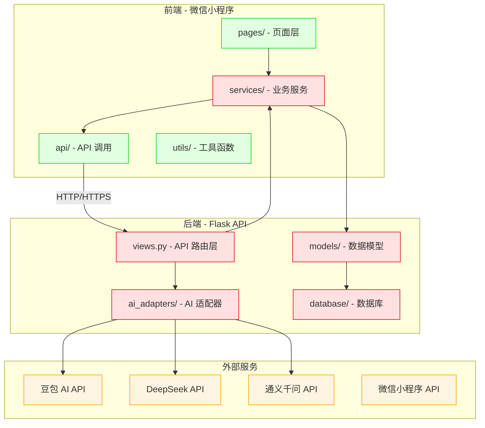
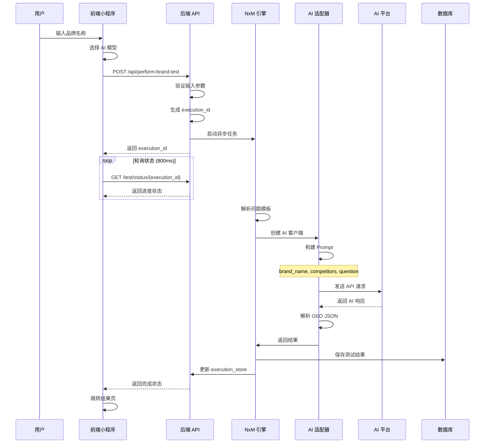
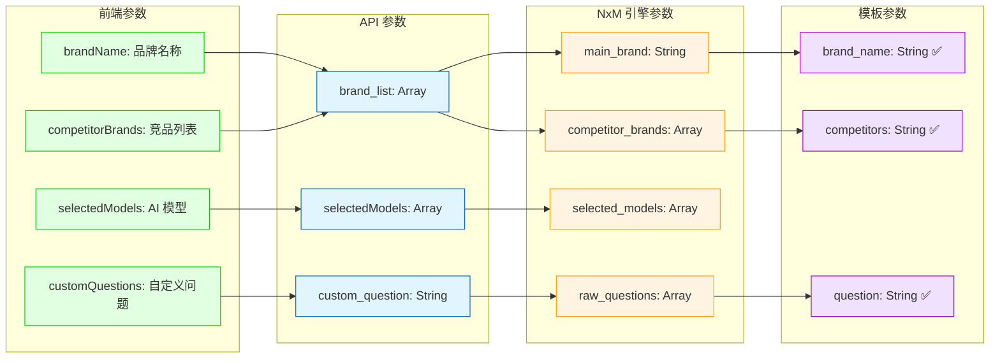

# 项目架构可视化总览

**生成时间**: 2026-02-23T16:39:24.249424

**文件统计**: {'total_api_endpoints': 148, 'total_functions': 822, 'total_classes': 100, 'total_data_models': 6, 'total_import_relationships': 83}

# 项目架构总览

## 诊断功能数据流

## 核心参数传递流程

