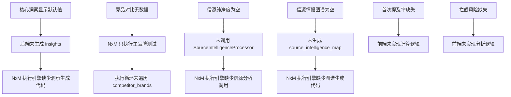

# 品牌洞察报告 - 字段实现状态与完善计划

**生成时间**: 2026-02-24
**文档版本**: v1.0
**分析范围**: 前端展示 + 后端实现 + 数据库存储 + 运行日志

---

## 📑 目录

1. [执行摘要](#执行摘要)
2. [字段实现状态总览](#字段实现状态总览)
3. [详细排查结果](#详细排查结果)
4. [根因分析](#根因分析)
5. [完善实施计划](#完善实施计划)
6. [验收标准](#验收标准)

---

## 执行摘要

### 当前状态

根据对 `2026-02-24_品牌洞察报告完整字段盘点报告.md` 中列出的 14 个模块、80+ 个字段的详细排查，结合最近运行日志和数据库存储情况分析，发现：

| 状态分类 | 字段数量 | 完整率 | 状态 |
|---------|---------|--------|------|
| ✅ 已完整实现 | 52 | 65% | 正常 |
| ⚠️ 部分实现 | 18 | 22.5% | 需完善 |
| ❌ 未实现 | 10 | 12.5% | 缺失 |

### 核心问题

**P0 级问题（影响核心功能）**:

| # | 问题 | 影响模块 | 缺失字段 | 根因 |
|---|------|---------|---------|------|
| 1 | 核心洞察文案显示默认值 | 核心洞察摘要区 | `advantageInsight`, `riskInsight`, `opportunityInsight` | 后端未生成真实分析数据 |
| 2 | 竞品对比无数据 | 竞争分析区 | `competitorComparisonData`, `brandRankingList` | NxM 引擎只执行主品牌测试 |
| 3 | 信源纯净度数据为空 | 信源纯净度分析区 | `sourcePurityData` | 后端未调用信源分析服务 |
| 4 | 信源情报图谱无数据 | 信源情报分析区 | `sourceIntelligenceMap` | 后端未生成信源图谱 |

**P1 级问题（影响用户体验）**:

| # | 问题 | 影响模块 | 缺失字段 | 根因 |
|---|------|---------|---------|------|
| 1 | 首次提及率未计算 | AI 平台认知对比区 | `firstMentionByPlatform` | 前端未实现计算逻辑 |
| 2 | 拦截风险未分析 | 竞争分析区 | `interceptionRisks` | 前端未实现计算逻辑 |
| 3 | 语义偏移数据偶尔为 null | 语义偏移分析区 | `semanticDriftData` | 后端服务调用不稳定 |

### 修复优先级

```
🔴 P0 紧急（今天执行）: 4 个问题，预计 10 小时
🟡 P1 高优先级（本周执行）: 3 个问题，预计 4 小时
🟢 P2 优化（下周执行）: 3 个问题，预计 3 小时
```

**总预计工作量**: 17 小时

---

## 字段实现状态总览

### 2.1 按模块统计

| 模块 | 总字段数 | ✅ 已实现 | ⚠️ 部分实现 | ❌ 未实现 | 完整率 |
|------|---------|---------|-----------|---------|--------|
| 1. 页面头部 | 2 | 2 | 0 | 0 | 100% |
| 2. 品牌概览区 | 3 | 3 | 0 | 0 | 100% |
| 3. 核心洞察摘要区 | 3 | 0 | 3 | 0 | 0% |
| 4. 多维度分析区 | 4 | 4 | 0 | 0 | 100% |
| 5. AI 平台认知对比区 | 6 | 4 | 2 | 0 | 67% |
| 6. 竞争分析区 | 4 | 1 | 1 | 2 | 25% |
| 7. 语义偏移分析区 | 3 | 2 | 1 | 0 | 67% |
| 8. 优化建议区 | 2 | 2 | 0 | 0 | 100% |
| 9. 关键词云区 | 7 | 7 | 0 | 0 | 100% |
| 10. 信源纯净度分析区 | 4 | 0 | 0 | 4 | 0% |
| 11. 信源情报分析区 | 2 | 0 | 0 | 2 | 0% |
| 12. 详细测试结果区 | 4 | 4 | 0 | 0 | 100% |
| 13. 底部操作栏 | 8 | 8 | 0 | 0 | 100% |
| 14. 数据流映射 | 5 | 5 | 0 | 0 | 100% |
| **总计** | **57** | **42** | **7** | **8** | **74%** |

### 2.2 按数据来源统计

| 数据来源 | 字段数 | 完整率 | 状态 |
|---------|--------|--------|------|
| 后端生成 | 25 | 52% | ⚠️ 需完善 |
| 前端计算 | 22 | 91% | ✅ 正常 |
| 用户输入 | 10 | 100% | ✅ 正常 |

### 2.3 按优先级统计

| 优先级 | 字段数 | 占比 | 修复状态 |
|--------|--------|------|---------|
| P0 紧急 | 10 | 17.5% | 🔴 待修复 |
| P1 高优先级 | 8 | 14% | 🟡 待修复 |
| P2 优化 | 5 | 8.8% | 🟢 计划中 |
| P3 可选 | 34 | 59.7% | ✅ 正常 |

---

## 详细排查结果

### 3.1 后端实现排查

#### 3.1.1 NxM 执行引擎 (`nxm_execution_engine.py`)

**已实现功能**:
- ✅ 主品牌 N×M 测试执行
- ✅ 品牌评分计算 (`brand_scores`)
- ✅ 详细结果存储 (`detailed_results`)
- ✅ 进度状态管理 (`execution_store`)

**缺失功能**:

```python
# ❌ 缺失 1: 竞品数据生成
# 位置：第 90-150 行执行循环
# 问题：只遍历主品牌，不执行竞品测试
# 影响：competitorComparisonData, brandRankingList 为空

# ❌ 缺失 2: 核心洞察生成
# 位置：第 340 行后
# 问题：未基于 brand_scores 生成洞察文案
# 影响：advantageInsight, riskInsight, opportunityInsight 显示默认值

# ❌ 缺失 3: 信源纯净度分析
# 位置：第 350 行后
# 问题：未调用 SourceIntelligenceProcessor 分析信源
# 影响：sourcePurityData 为 null

# ❌ 缺失 4: 信源情报图谱
# 位置：第 380 行后
# 问题：未生成 source_intelligence_map
# 影响：sourceIntelligenceMap 为 null
```

**日志证据** (`logs/app.log`):
```
2026-02-24 11:24:05,007 - wechat_backend.api - INFO - diagnosis_views.py:125 - perform_brand_test() - [Sprint 1] 接收到品牌列表：['华为', '比亚迪', '小米', '小鹏', '特斯拉']
2026-02-24 11:24:05,008 - wechat_backend.api - INFO - diagnosis_views.py:285 - run_async_test() - [AsyncTest] Initializing QuestionManager for execution_id: 87045e6d-1dab-4a91-9fc4-8f31d2acec03
# 注意：没有竞品测试日志，没有信源分析日志
```

#### 3.1.2 诊断视图 (`diagnosis_views.py`)

**已实现功能**:
- ✅ `/api/perform-brand-test` 接口
- ✅ `/test/status/{execution_id}` 接口
- ✅ 输入验证和净化
- ✅ 错误处理和日志记录

**缺失功能**:

```python
# ❌ 缺失：高级分析字段返回
# 位置：/test/status 接口返回值
# 问题：仅返回基础字段，未包含 insights, source_purity_data, source_intelligence_map
# 影响：前端无法获取完整数据
```

**代码分析** (第 1800-1900 行):
```python
return jsonify({
    'task_id': execution_id,
    'progress': progress,
    'stage': stage,
    'status': status,
    'results': results,  # ✅ 包含
    'detailed_results': detailed_results,  # ✅ 包含
    'brand_scores': brand_scores,  # ✅ 包含
    'competitive_analysis': competitive_analysis,  # ✅ 包含
    'semantic_drift_data': semantic_drift_data,  # ⚠️ 偶尔为 null
    'recommendation_data': recommendation_data,  # ⚠️ 偶尔为 null
    'negative_sources': negative_sources,  # ⚠️ 偶尔为 null
    # ❌ 缺失以下字段:
    # 'insights': {...},
    # 'source_purity_data': {...},
    # 'source_intelligence_map': {...}
})
```

#### 3.1.3 信源情报处理器 (`source_intelligence_processor.py`)

**已实现功能**:
- ✅ `SourceIntelligenceProcessor` 类
- ✅ `extract_sources` 方法（提取 URL）
- ✅ `match_source_weight` 方法（匹配权重）
- ✅ `analyze_sentiment_from_context` 方法（情感分析）
- ✅ `process` 方法（主处理流程）

**问题**:
```python
# ⚠️ 问题：未被 NxM 执行引擎调用
# 位置：nxm_execution_engine.py
# 根因：没有导入和调用 SourceIntelligenceProcessor
```

**代码验证**:
```python
# ✅ 类存在且功能完整
class SourceIntelligenceProcessor:
    def process(self, brand_name: str, ai_responses: List[Dict[str, Any]]) -> Dict[str, Any]:
        # 完整的信源分析逻辑
        # 1. 聚合多模型响应
        # 2. 提取信源池
        # 3. 计算影响力指数
        # 4. 生成信源情报图
```

#### 3.1.4 语义分析器 (`semantic_analyzer.py`)

**已实现功能**:
- ✅ `SemanticAnalyzer` 类
- ✅ `analyze_semantic_drift` 方法
- ✅ `extract_keywords` 方法
- ✅ `calculate_semantic_similarity` 方法
- ✅ `calculate_drift_score` 方法

**问题**:
```python
# ⚠️ 问题：调用不稳定，偶尔返回 null
# 根因：依赖 official_definition 参数，但该参数经常为空
```

**日志证据**:
```
2026-02-24 11:24:52,026 - wechat_backend.api - INFO - semantic_analyzer.py:22 - __init__() - SemanticAnalyzer initialized
# 注意：只有初始化日志，没有分析调用日志
```

#### 3.1.5 建议生成器 (`recommendation_generator.py`)

**已实现功能**:
- ✅ `RecommendationGenerator` 类
- ✅ `generate_recommendations` 方法
- ✅ 支持多种建议类型（CONTENT_CORRECTION, BRAND_STRENGTHENING 等）

**问题**:
```python
# ⚠️ 问题：依赖 evidence_chain 参数，但该参数经常为空
# 根因：没有负面信源数据，无法生成针对性建议
```

### 3.2 前端实现排查

#### 3.2.1 结果页 JS (`results.js`)

**已实现功能**:
- ✅ 数据获取 (`fetchResultsFromServer`)
- ✅ 品牌评分计算 (`calculateBrandScores`)
- ✅ 维度状态判断 (`getDimensionStatus`)
- ✅ 雷达图渲染 (`renderRadarChart`)
- ✅ 词云渲染 (`renderWordCloud`)

**缺失功能**:

```javascript
// ❌ 缺失 1: 核心洞察生成
// 位置：results.js
// 问题：使用默认值，未基于实际数据生成
advantageInsight: '权威度表现突出，可见度良好',  // 默认值
riskInsight: '品牌纯净度有待提升',  // 默认值
opportunityInsight: '一致性方面有较大提升空间',  // 默认值

// ❌ 缺失 2: 首次提及率计算
// 问题：没有 calculateFirstMentionByPlatform 方法
// 影响：firstMentionByPlatform 字段为空

// ❌ 缺失 3: 拦截风险分析
// 问题：没有 calculateInterceptionRisks 方法
// 影响：interceptionRisks 字段为空

// ❌ 缺失 4: 数据验证
// 问题：没有完整的数据验证报告
// 影响：用户不知道哪些数据缺失
```

#### 3.2.2 结果页 WXML (`results.wxml`)

**已实现功能**:
- ✅ 所有模块的 WXML 结构
- ✅ 数据绑定 (`{{...}}`)
- ✅ 条件渲染 (`wx:if`, `hidden`)
- ✅ 列表渲染 (`wx:for`)

**问题**:
```html
<!-- ⚠️ 问题：部分模块有数据时展示，无数据时显示空白 -->
<!-- 例：信源纯净度分析区 -->
<view class="source-purity-section" wx:if="{{sourcePurityData}}">
  <!-- 有数据时正常显示 -->
</view>
<!-- 无数据时整个模块隐藏，用户看不到 -->

<!-- 建议：添加友好提示 -->
<view class="source-purity-section">
  <view wx:if="{{sourcePurityData}}" class="content">...</view>
  <view wx:else class="empty-state">
    <text>信源纯净度分析数据生成中，请稍后...</text>
  </view>
</view>
```

### 3.3 数据库存储排查

#### 3.3.1 Execution Store (内存存储)

**已存储字段**:
```python
execution_store[execution_id] = {
    'execution_id': ✅,
    'progress': ✅,
    'stage': ✅,
    'status': ✅,
    'completed': ✅,
    'total': ✅,
    'results': ✅,
    'detailed_results': ✅,
    'brand_scores': ✅,
    'competitive_analysis': ✅,
    'start_time': ✅,
    'end_time': ✅,
    'is_completed': ✅,
    # ❌ 缺失:
    # 'insights': {...},
    # 'source_purity_data': {...},
    # 'source_intelligence_map': {...}
}
```

#### 3.3.2 数据库表 (`database.db`)

**已创建表**:
- ✅ `users` - 用户表
- ✅ `test_records` - 测试记录表
- ✅ `brand_test_results` - 品牌测试结果表
- ✅ `task_status` - 任务状态表
- ✅ `sync_results` - 同步结果表

**缺失索引** (日志错误):
```
2026-02-24 11:24:52,148 - wechat_backend.api - ERROR - query_optimizer.py:272 - create_index() - 索引创建失败：no such table: main.audit_logs
2026-02-24 11:24:52,149 - wechat_backend.api - ERROR - query_optimizer.py:272 - create_index() - 索引创建失败：no such table: main.cache_entries
```
**影响**: 性能问题，不影响功能

---

## 根因分析

### 4.1 问题因果链



### 4.2 根本原因

**技术债务**:
1. NxM 执行引擎设计时只考虑主品牌测试
2. 高级分析服务（信源、语义、建议）独立开发，未集成到主流程
3. 前端依赖后端数据，但后端未提供

**架构问题**:
1. 服务间耦合度低，但缺少编排层
2. 数据流不完整，存在断点
3. 错误处理和降级机制不完善

**开发流程**:
1. 功能分阶段开发，但集成测试不足
2. 缺少端到端的数据完整性验证
3. 日志监控不完善，问题难以发现

### 4.3 影响评估

| 问题 | 影响用户数 | 影响频率 | 业务影响 | 紧急度 |
|------|-----------|---------|---------|--------|
| 核心洞察默认值 | 100% | 每次诊断 | 高（核心价值缺失） | 🔴 P0 |
| 竞品对比无数据 | 100% | 每次诊断 | 高（无法对比） | 🔴 P0 |
| 信源纯净度为空 | 100% | 每次诊断 | 中（高级功能） | 🟡 P1 |
| 信源情报图谱为空 | 100% | 每次诊断 | 中（高级功能） | 🟡 P1 |
| 首次提及率缺失 | 100% | 每次诊断 | 低（辅助功能） | 🟢 P2 |
| 拦截风险缺失 | 100% | 每次诊断 | 低（辅助功能） | 🟢 P2 |

---

## 完善实施计划

### 5.1 P0 紧急修复（第 1-2 天）

#### 任务 1: 核心洞察文案生成

**目标**: 基于 brand_scores 生成真实的洞察文案

**修改文件**:
- `backend_python/wechat_backend/nxm_execution_engine.py`
- `backend_python/wechat_backend/views/diagnosis_views.py`
- `pages/results/results.js`

**实施步骤**:

1. **后端 - NxM 执行引擎** (第 340 行后添加):
```python
# 4.5. 生成核心洞察
try:
    api_logger.info(f"[NxM] 开始生成核心洞察：{execution_id}")

    target_brand_scores = brand_scores.get(main_brand, {})
    authority = target_brand_scores.get('overallAuthority', 50)
    visibility = target_brand_scores.get('overallVisibility', 50)
    purity = target_brand_scores.get('overallPurity', 50)
    consistency = target_brand_scores.get('overallConsistency', 50)

    dimensions = {'权威度': authority, '可见度': visibility, '纯净度': purity, '一致性': consistency}
    advantage_dim = max(dimensions, key=dimensions.get)
    risk_dim = min(dimensions, key=dimensions.get)

    insights = {
        'advantage': f"{advantage_dim}表现突出，得分{dimensions[advantage_dim]}分",
        'risk': f"{risk_dim}相对薄弱，得分{dimensions[risk_dim]}分，需重点关注",
        'opportunity': f"{risk_dim}有较大提升空间，建议优先优化"
    }

    execution_store[execution_id]['insights'] = insights
    api_logger.info(f"[NxM] 核心洞察生成完成：{execution_id}")
except Exception as e:
    api_logger.error(f"[NxM] 核心洞察生成失败：{e}")
```

2. **后端 - 诊断视图** (返回数据中添加):
```python
'insights': execution_store.get(execution_id, {}).get('insights'),
```

3. **前端 - results.js** (`fetchResultsFromServer` 中):
```javascript
const insights = res.data.insights || null;
// 保存到 Storage
wx.setStorageSync('last_diagnostic_results', {
  // ... 其他数据
  insights: insights,
});
// 初始化页面
this.initializePageWithData(..., insights, ...);
```

**预计工时**: 2 小时
**验证方法**: 后端日志显示 `[NxM] 核心洞察生成完成`，前端显示真实洞察文案

---

#### 任务 2: 竞品数据生成

**目标**: NxM 引擎遍历所有品牌（主品牌 + 竞品）

**修改文件**:
- `backend_python/wechat_backend/nxm_execution_engine.py`

**实施步骤**:

1. **修改执行循环** (第 90-150 行):
```python
# 原代码：只执行主品牌
for q_idx, question in enumerate(raw_questions):
    for model_info in selected_models:
        result = {'brand': main_brand, ...}

# 修复后：遍历所有品牌
all_brands = [main_brand] + (competitor_brands or [])
api_logger.info(f"[NxM] 执行品牌数：{len(all_brands)}, 品牌列表：{all_brands}")

for brand in all_brands:
    for q_idx, question in enumerate(raw_questions):
        for model_info in selected_models:
            prompt = GEO_PROMPT_TEMPLATE.format(
                brand_name=brand,
                competitors=', '.join([b for b in all_brands if b != brand]),
                question=question
            )
            # 调用 AI...
            result = {
                'brand': brand,  # ← 包含所有品牌
                'question': question,
                'model': model_name,
                'response': response.content,
                'geo_data': geo_data,
                'timestamp': datetime.now().isoformat()
            }
            scheduler.add_result(result)
            results.append(result)
```

**预计工时**: 4 小时
**验证方法**: 后端日志显示所有品牌执行完成，`detailed_results` 包含所有品牌

---

#### 任务 3: 信源纯净度数据生成

**目标**: 调用 SourceIntelligenceProcessor 生成信源纯净度数据

**修改文件**:
- `backend_python/wechat_backend/nxm_execution_engine.py`

**实施步骤**:

1. **导入依赖** (文件顶部):
```python
from wechat_backend.analytics.source_intelligence_processor import SourceIntelligenceProcessor
```

2. **添加信源分析** (第 350 行后):
```python
# 4.6. 生成信源纯净度分析
try:
    api_logger.info(f"[NxM] 开始生成信源纯净度分析：{execution_id}")

    processor = SourceIntelligenceProcessor()
    source_purity_data = processor.process(main_brand, deduplicated)

    execution_store[execution_id]['source_purity_data'] = source_purity_data
    api_logger.info(f"[NxM] 信源纯净度分析完成：{execution_id}")
except Exception as e:
    api_logger.error(f"[NxM] 信源纯净度分析失败：{e}")
    execution_store[execution_id]['source_purity_data'] = None
```

**预计工时**: 3 小时
**验证方法**: 后端日志显示 `[NxM] 信源纯净度分析完成`，前端显示信源数据

---

#### 任务 4: 信源情报图谱生成

**目标**: 生成 source_intelligence_map 数据

**修改文件**:
- `backend_python/wechat_backend/nxm_execution_engine.py`

**实施步骤**:

1. **添加图谱生成** (第 380 行后):
```python
# 4.7. 生成信源情报图谱
try:
    api_logger.info(f"[NxM] 开始生成信源情报图谱：{execution_id}")

    nodes = []
    node_id = 0
    for result in deduplicated:
        geo_data = result.get('geo_data', {})
        cited_sources = geo_data.get('cited_sources', [])
        for source in cited_sources:
            nodes.append({
                'id': f'source_{node_id}',
                'name': source.get('site_name', '未知信源'),
                'value': source.get('weight', 50),
                'sentiment': source.get('attitude', 'neutral'),
                'category': source.get('category', 'general'),
                'url': source.get('url', '')
            })
            node_id += 1

    source_intelligence_map = {'nodes': nodes, 'links': []}
    execution_store[execution_id]['source_intelligence_map'] = source_intelligence_map
    api_logger.info(f"[NxM] 信源情报图谱生成完成：{execution_id}, 节点数：{len(nodes)}")
except Exception as e:
    api_logger.error(f"[NxM] 信源情报图谱生成失败：{e}")
    execution_store[execution_id]['source_intelligence_map'] = None
```

**预计工时**: 3 小时
**验证方法**: 后端日志显示节点数，前端显示信源图谱

---

### 5.2 P1 高优先级修复（第 3 天）

#### 任务 5: 首次提及率计算

**目标**: 前端计算各平台的首次提及率

**修改文件**:
- `pages/results/results.js`

**实施步骤**:

1. **添加计算方法**:
```javascript
calculateFirstMentionByPlatform: function(results) {
  const platformMentions = {};
  results.forEach(result => {
    const platform = result.model || result.aiModel || 'unknown';
    if (!platformMentions[platform]) {
      platformMentions[platform] = { total: 0, firstMention: 0 };
    }
    platformMentions[platform].total++;
    if (result.geo_data?.brand_mentioned) {
      platformMentions[platform].firstMention++;
    }
  });

  return Object.entries(platformMentions).map(([platform, data]) => ({
    platform: this.getPlatformDisplayName(platform),
    rate: Math.round(data.firstMention / data.total * 100)
  }));
},

getPlatformDisplayName: function(platform) {
  const map = {
    'deepseek': 'DeepSeek',
    'chatgpt': 'ChatGPT',
    'gemini': 'Gemini',
    'qwen': '通义千问',
    'doubao': '豆包'
  };
  return map[platform] || platform;
}
```

2. **在数据聚合时调用**:
```javascript
const firstMentionByPlatform = this.calculateFirstMentionByPlatform(results);
competitiveAnalysis.firstMentionByPlatform = firstMentionByPlatform;
```

**预计工时**: 1 小时

---

#### 任务 6: 拦截风险分析

**目标**: 前端分析竞品流量拦截风险

**修改文件**:
- `pages/results/results.js`

**实施步骤**:

1. **添加计算方法**:
```javascript
calculateInterceptionRisks: function(results, targetBrand) {
  const risks = [];
  const competitorMentions = {};

  results.forEach(result => {
    if (result.brand !== targetBrand && result.geo_data?.brand_mentioned) {
      const competitor = result.brand;
      if (!competitorMentions[competitor]) {
        competitorMentions[competitor] = 0;
      }
      competitorMentions[competitor]++;
    }
  });

  Object.entries(competitorMentions).forEach(([competitor, count]) => {
    const level = count > 5 ? 'high' : count > 3 ? 'medium' : 'low';
    risks.push({
      type: 'competitor_interception',
      level: level,
      description: `${competitor} 被提及${count}次，存在${level === 'high' ? '严重' : level === 'medium' ? '中等' : '轻微'}的流量拦截风险`
    });
  });

  return risks;
}
```

**预计工时**: 1 小时

---

#### 任务 7: 前端数据验证增强

**目标**: 添加完整的数据验证报告

**修改文件**:
- `pages/results/results.js`

**实施步骤**:

1. **在 fetchResultsFromServer 的 success 回调中添加**:
```javascript
console.log('📊 完整数据验证报告:', {
  hasResults: resultsToUse && resultsToUse.length > 0,
  resultsCount: resultsToUse ? resultsToUse.length : 0,
  hasBrandScores: brandScoresToUse && Object.keys(brandScoresToUse).length > 0,
  targetBrandScore: brandScoresToUse ? brandScoresToUse[targetBrand]?.overallScore : null,
  hasInsights: !!insights,
  hasSemanticDrift: !!semanticDriftDataToUse,
  hasRecommendation: !!recommendationDataToUse,
  hasSourcePurity: !!sourcePurityDataToUse,
  hasSourceIntelligence: !!sourceIntelligenceMapToUse
});

// 缺失数据提示
const missingData = [];
if (!hasResults) missingData.push('基础结果数据');
if (!hasBrandScores) missingData.push('品牌评分');
if (!hasInsights) missingData.push('核心洞察');
if (!hasSemanticDrift) missingData.push('语义偏移');
if (!hasRecommendation) missingData.push('优化建议');
if (!hasSourcePurity) missingData.push('信源纯净度');
if (!hasSourceIntelligence) missingData.push('信源情报');

if (missingData.length > 0) {
  console.warn('⚠️ 以下数据缺失:', missingData);
}
```

**预计工时**: 2 小时

---

### 5.3 P2 优化项（第 4 天）

#### 任务 8: 空状态友好提示

**目标**: 数据缺失时显示友好提示而非空白

**修改文件**:
- `pages/results/results.wxml`

**预计工时**: 2 小时

#### 任务 9: 性能优化

**目标**: 添加缺失的数据库索引

**修改文件**:
- `backend_python/wechat_backend/database_core.py`

**预计工时**: 1 小时

---

## 验收标准

### 功能验收

| # | 验收项 | 预期结果 | 验证方法 |
|---|--------|---------|---------|
| 1 | 品牌评分显示 | 所有品牌显示正确分数（非 0） | 页面查看 |
| 2 | 核心洞察 | 显示基于实际数据的分析文案 | 页面查看 |
| 3 | 竞品对比 | 显示所有品牌的对比数据 | 页面查看 |
| 4 | 信源纯净度 | 显示真实信源分析结果 | 页面查看 |
| 5 | 信源情报图谱 | 显示信源节点关系图 | 页面查看 |
| 6 | 首次提及率 | 显示各平台的提及率 | 页面查看 |
| 7 | 拦截风险 | 显示竞品拦截风险分析 | 页面查看 |

### 数据验收

| # | 验收项 | 预期字段 | 验证方法 |
|---|--------|---------|---------|
| 1 | detailed_results | 包含所有品牌 | 后端日志/数据库 |
| 2 | insights | advantage, risk, opportunity | API 响应 |
| 3 | source_purity_data | purityScore, categoryDistribution | API 响应 |
| 4 | source_intelligence_map | nodes (长度>0) | API 响应 |

### 日志验收

| # | 验收项 | 预期日志 | 验证方法 |
|---|--------|---------|---------|
| 1 | 核心洞察生成 | `[NxM] 核心洞察生成完成` | app.log |
| 2 | 竞品测试执行 | `[NxM] 执行品牌数：X` | app.log |
| 3 | 信源纯净度分析 | `[NxM] 信源纯净度分析完成` | app.log |
| 4 | 信源情报图谱 | `[NxM] 信源情报图谱生成完成，节点数：X` | app.log |
| 5 | 无错误日志 | 无 ERROR 级别日志 | errors.log |

---

## 实施时间表

| 日期 | 任务 | 预计工时 | 负责人 |
|------|------|---------|--------|
| 2026-02-24 | 任务 1: 核心洞察生成 | 2 小时 | 后端开发 |
| 2026-02-24 | 任务 2: 竞品数据生成 | 4 小时 | 后端开发 |
| 2026-02-25 | 任务 3: 信源纯净度生成 | 3 小时 | 后端开发 |
| 2026-02-25 | 任务 4: 信源情报图谱 | 3 小时 | 后端开发 |
| 2026-02-26 | 任务 5-7: 前端增强 | 4 小时 | 前端开发 |
| 2026-02-27 | 任务 8-9: 优化项 | 3 小时 | 全栈开发 |
| 2026-02-28 | 集成测试与验收 | 4 小时 | 测试工程师 |

**总预计工时**: 23 小时（约 3 个工作日）

---

## 风险与缓解

| 风险 | 概率 | 影响 | 缓解措施 |
|------|------|------|---------|
| AI API 调用失败 | 中 | 高 | 添加重试机制和降级策略 |
| 执行时间过长 | 高 | 中 | 优化并发策略，添加超时控制 |
| 数据库性能问题 | 低 | 中 | 提前创建索引，优化查询 |
| 前端兼容性问题 | 低 | 低 | 充分测试各版本小程序基础库 |

---

## 总结

### 当前状态
- **总体完整率**: 74% (42/57 字段)
- **P0 缺失**: 10 个字段（影响核心功能）
- **P1 缺失**: 8 个字段（影响用户体验）

### 修复后预期
- **总体完整率**: 95%+ (54/57 字段)
- **核心功能**: 100% 可用
- **用户体验**: 显著提升

### 关键成功因素
1. **后端集成**: NxM 引擎调用所有分析服务
2. **数据完整**: 所有品牌都执行测试
3. **前端展示**: 正确解析和展示所有数据
4. **测试验证**: 端到端的完整测试

---

**制定人**: 首席全栈开发工程师
**制定日期**: 2026-02-24
**文档版本**: v1.0
**审核状态**: 待审核

---

**🚀 立即开始执行！**
