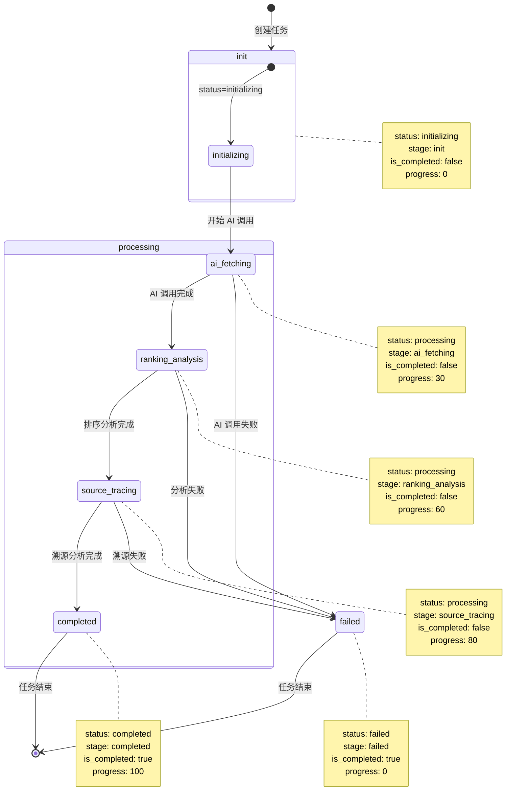

# 任务状态管理 API 文档

**版本**: 2.0.0  
**更新日期**: 2026-02-24  
**状态**: ✅ 已修复状态同步问题

---

## 目录

1. [概述](#概述)
2. [状态定义](#状态定义)
3. [API 端点](#api-端点)
4. [状态流转图](#状态流转图)
5. [响应格式](#响应格式)
6. [错误处理](#错误处理)
7. [使用示例](#使用示例)

---

## 概述

本文档描述了品牌诊断任务的状态管理 API。后端使用统一的状态同步机制，确保 `status`、`stage` 和 `is_completed` 字段始终保持一致。

### 核心修复

- ✅ **Status/Stage 同步**: 所有任务状态更新都确保 `status` 和 `stage` 同步
- ✅ **FAILED 阶段**: 新增 `FAILED` 阶段枚举，完善失败任务管理
- ✅ **命名统一**: 统一使用 `ai_fetching` 而非 `ai_testing`
- ✅ **数据库降级**: 修复数据库分支变量引用错误

---

## 状态定义

### TaskStage 枚举

任务阶段（业务维度）：

| 阶段值 | 说明 | 触发条件 |
|--------|------|----------|
| `init` | 初始化 | 任务创建时 |
| `ai_fetching` | AI 调用中 | 开始调用 AI 平台 |
| `ranking_analysis` | 排序分析中 | AI 调用完成，开始分析 |
| `source_tracing` | 溯源分析中 | 开始溯源分析 |
| `completed` | 已完成 | 任务成功完成 |
| `failed` | 已失败 | 任务执行失败 |

### Status 字段

执行状态（技术维度）：

| 状态值 | 说明 | 对应阶段 |
|--------|------|----------|
| `initializing` | 初始化中 | `init` |
| `processing` | 处理中 | `ai_fetching`, `ranking_analysis`, `source_tracing` |
| `completed` | 已完成 | `completed` |
| `failed` | 已失败 | `failed` |

### is_completed 字段

布尔值，表示任务是否结束：

- `true`: 任务已结束（完成或失败）
- `false`: 任务仍在进行中

### 状态同步规则

```python
# 完成任务
status = 'completed'
stage = 'completed'
is_completed = True
progress = 100

# 失败任务
status = 'failed'
stage = 'failed'
is_completed = True  # 失败也是结束状态
progress = 0

# 处理中任务
status = 'processing'
stage = 'ai_fetching' | 'ranking_analysis' | 'source_tracing'
is_completed = False
progress = 0-99

# 初始化任务
status = 'initializing'
stage = 'init'
is_completed = False
progress = 0
```

---

## API 端点

### 创建诊断任务

```http
POST /api/perform-brand-test
Content-Type: application/json
```

**请求体**:
```json
{
  "brand_list": ["华为", "小米", "苹果"],
  "selectedModels": ["doubao"],
  "custom_question": "20 万元左右的新能源汽车推荐哪家品牌"
}
```

**响应**:
```json
{
  "status": "success",
  "execution_id": "344d9238-46f6-4b78-8593-1d8b226366fa",
  "message": "Test started successfully"
}
```

---

### 轮询任务状态

```http
GET /test/status/{task_id}
```

**路径参数**:
- `task_id`: 任务 ID（执行 ID）

**响应**:
```json
{
  "task_id": "344d9238-46f6-4b78-8593-1d8b226366fa",
  "progress": 100,
  "stage": "completed",
  "status": "completed",
  "is_completed": true,
  "results": [...],
  "created_at": "2026-02-24T00:09:19.191540"
}
```

**状态同步保证**:
- ✅ `status == 'completed'` 时，`stage` 必定为 `'completed'`
- ✅ `is_completed == true` 时，`progress` 必定为 100（成功）或 0（失败）
- ✅ `stage` 和 `status` 永远保持一致

---

### 获取诊断结果

```http
GET /api/deep-intelligence/{task_id}
```

**前置条件**: 任务必须已完成 (`is_completed == true`)

**响应**:
```json
{
  "overall_score": 75,
  "brand_scores": {...},
  "competitive_analysis": {...},
  "negative_sources": [...],
  "recommendations": [...]
}
```

---

### 获取测试进度

```http
GET /api/test-progress?executionId={execution_id}
```

**查询参数**:
- `executionId`: 执行 ID

**响应**:
```json
{
  "progress": 60,
  "stage": "ranking_analysis",
  "status": "processing",
  "is_completed": false,
  "results": [...],
  "is_synced": true,
  "sync_check": {
    "status": "processing",
    "results_count": 5,
    "expected_count": 10,
    "completion_verified": false
  }
}
```

---

### 获取测试历史

```http
GET /api/test-history?userOpenid={openid}&limit=20&offset=0
```

**认证要求**: 需要身份认证（JWT 或微信 OpenID）

**响应**:
```json
{
  "status": "success",
  "history": [
    {
      "execution_id": "344d9238-46f6-4b78-8593-1d8b226366fa",
      "brand_name": "华为",
      "created_at": "2026-02-24T00:09:19",
      "status": "completed",
      "progress": 100
    }
  ],
  "count": 20
}
```

---

## 状态流转图

### Mermaid 流程图



### 状态转换表

| 当前状态 | 触发事件 | 下一状态 | 代码位置 |
|----------|----------|----------|----------|
| `init` | 任务创建 | `ai_fetching` | views.py:371 |
| `ai_fetching` | AI 调用完成 | `ranking_analysis` | nxm_execution_engine.py |
| `ranking_analysis` | 分析完成 | `source_tracing` | nxm_execution_engine.py |
| `source_tracing` | 溯源完成 | `completed` | nxm_execution_engine.py:444 |
| `any` | 错误发生 | `failed` | views.py:454, diagnosis_views.py:303 |

---

## 响应格式

### 标准响应结构

```typescript
interface TaskStatusResponse {
  task_id: string;           // 任务 ID
  progress: number;          // 进度百分比 (0-100)
  stage: TaskStage;          // 任务阶段
  status: TaskStatus;        // 执行状态
  is_completed: boolean;     // 是否完成
  results?: Array<any>;      // 结果数据
  error?: string;            // 错误信息（失败时）
  created_at: string;        // 创建时间（ISO 8601）
}

type TaskStage = 
  | 'init'
  | 'ai_fetching'
  | 'ranking_analysis'
  | 'source_tracing'
  | 'completed'
  | 'failed';

type TaskStatus = 
  | 'initializing'
  | 'processing'
  | 'completed'
  | 'failed';
```

### 状态同步验证

所有 API 响应都遵循以下不变量：

```typescript
// 不变量 1: 完成状态必须同步
if (response.status === 'completed') {
  assert(response.stage === 'completed');
  assert(response.is_completed === true);
  assert(response.progress === 100);
}

// 不变量 2: 失败状态必须同步
if (response.status === 'failed') {
  assert(response.stage === 'failed');
  assert(response.is_completed === true);
  assert(response.progress === 0);
}

// 不变量 3: 处理中状态
if (response.status === 'processing') {
  assert(['ai_fetching', 'ranking_analysis', 'source_tracing']
    .includes(response.stage));
  assert(response.is_completed === false);
  assert(response.progress >= 0 && response.progress < 100);
}
```

---

## 错误处理

### HTTP 状态码

| 状态码 | 说明 | 处理方式 |
|--------|------|----------|
| 200 | 成功 | 正常处理响应 |
| 400 | 请求错误 | 检查请求参数 |
| 401 | 未授权 | 检查认证信息 |
| 404 | 任务不存在 | 检查 task_id |
| 500 | 服务器错误 | 联系技术支持 |

### 错误响应格式

```json
{
  "error": "错误类型",
  "message": "详细错误信息",
  "status": "error"
}
```

### 常见错误

**任务未完成**:
```json
{
  "error": "Task not completed or not found",
  "message": "任务尚未完成，请稍后重试"
}
```

**认证失败**:
```json
{
  "error": "未授权访问",
  "message": "此端点需要身份认证",
  "required_auth": ["Authorization: Bearer <token>", "X-WX-OpenID: <openid>"]
}
```

---

## 使用示例

### JavaScript/TypeScript

```typescript
// 创建诊断任务
async function createDiagnosis(
  brands: string[],
  models: string[],
  question: string
): Promise<string> {
  const response = await fetch('/api/perform-brand-test', {
    method: 'POST',
    headers: { 'Content-Type': 'application/json' },
    body: JSON.stringify({
      brand_list: brands,
      selectedModels: models,
      custom_question: question
    })
  });
  
  const data = await response.json();
  return data.execution_id;
}

// 轮询任务状态
async function pollTaskStatus(executionId: string): Promise<TaskStatusResponse> {
  while (true) {
    const response = await fetch(`/test/status/${executionId}`);
    const data = await response.json();
    
    // 验证状态同步
    if (data.status === 'completed' && data.stage !== 'completed') {
      console.warn('Status/Stage mismatch detected!');
    }
    
    if (data.is_completed) {
      return data;
    }
    
    // 等待 2 秒后再次轮询
    await new Promise(resolve => setTimeout(resolve, 2000));
  }
}

// 使用示例
const executionId = await createDiagnosis(
  ['华为', '小米'],
  ['doubao'],
  '品牌分析'
);

const finalStatus = await pollTaskStatus(executionId);
console.log(`任务完成：stage=${finalStatus.stage}, progress=${finalStatus.progress}`);
```

### Python

```python
import requests
import time

def create_diagnosis(brands, models, question):
    """创建诊断任务"""
    response = requests.post(
        'http://127.0.0.1:5000/api/perform-brand-test',
        json={
            'brand_list': brands,
            'selectedModels': models,
            'custom_question': question
        }
    )
    data = response.json()
    return data['execution_id']

def poll_task_status(execution_id, timeout=300):
    """轮询任务状态"""
    start_time = time.time()
    
    while time.time() - start_time < timeout:
        response = requests.get(
            f'http://127.0.0.1:5000/test/status/{execution_id}'
        )
        data = response.json()
        
        # 验证状态同步
        if data['status'] == 'completed':
            assert data['stage'] == 'completed', "Status/Stage mismatch!"
            assert data['is_completed'] == True
            assert data['progress'] == 100
            return data
        
        if data['status'] == 'failed':
            assert data['stage'] == 'failed', "Status/Stage mismatch!"
            return data
        
        print(f"Progress: {data['progress']}%, Stage: {data['stage']}")
        time.sleep(2)
    
    raise TimeoutError("Task polling timeout")

# 使用示例
execution_id = create_diagnosis(
    brands=['华为', '小米'],
    models=['doubao'],
    question='品牌分析'
)

final_status = poll_task_status(execution_id)
print(f"Task completed: stage={final_status['stage']}")
```

---

## 附录

### 修复记录

**2026-02-24**:
- ✅ 修复 `views.py` 异常处理缺少 stage 同步
- ✅ 修复 `diagnosis_views.py` 验证失败缺少 stage 同步
- ✅ 修复 `diagnosis_views.py` 数据库分支变量引用错误
- ✅ 修复 `nxm_execution_engine.py` 缺少 stage 和 is_completed 同步
- ✅ 添加 `FAILED` 到 `TaskStage` 枚举
- ✅ 统一阶段命名 (`ai_testing` → `ai_fetching`)

### 相关文件

- `backend_python/wechat_backend/models.py` - 状态模型定义
- `backend_python/wechat_backend/views.py` - API 端点实现
- `backend_python/wechat_backend/nxm_execution_engine.py` - 执行引擎
- `backend_python/wechat_backend/nxm_scheduler.py` - 任务调度器

### 联系方式

如有问题，请联系技术支持或提交 Issue。
